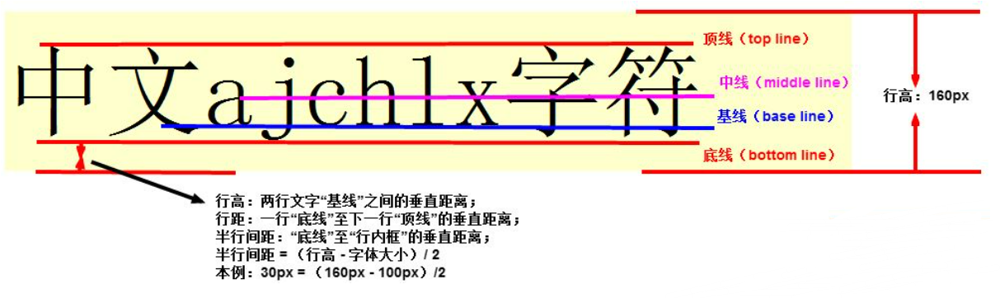

---

title:  CSS 基础

date: 2022/6/22 20:00:00

tags: 

 - css

categories: 

 - Web前端

---

# CSS 基础

> Cascading Style Sheets 通常称CSS样式表，以HTML为基础，提供了丰富的功能，如字体、样式、背景的控制及整体排版等，而且可以针对不同的浏览器设置不同的样式。


## CSS基本使用


### CSS 规则

- `选择器 {属性: 值;[其他属性和值]}`

```css
h1 {
    color: red;
    font-style: italic;
}
```

### CSS 注释

```css
/* 这是CSS注释 */
```


## CSS 引入


### 1. 行内样式（内联样式）

通过标签的`style` 属性来设置元素的样式；缺点是只能控制当前标签以及嵌套在其中的字标签，没有实现样式和结构分离

```html
<h1 style="属性1:值1; 属性2:值2; 属性3:值3;">标签内容</h1>
```


### 2.内嵌样式

也称为内嵌式，将CSS代码集中写在HTML文档的`head` 标签中，并且用 `style` 标签定义；缺点是只能控制当前页面，没有彻底分离样式和结构

```html
<head>
    <style>
        选择器（选择标签） {
            属性1:值1; 
            属性2:值2; 
            属性3:值3;
        }
    </style>
</head>
```


### 3.外部样式（外链式）

将所有的样式放在一个或多个以 `.css` 为扩展名结尾的外部样式表文件中，通过 `link` 标签将外部样式表文件链接到HTML文档中

- `rel` : 定义当前文档与被链接文档之间的关系，在这里需要指定为 `stylesheet` ，表示被链接的文档是一个样式表文件
- `href` : 定义所链接外部样式表文件的 URL，可以是相对路径也可以是绝对路径

```html
<link  rel="stylesheet" href="/css/main.css" />
```


## CSS 基础选择器


### 1. 标签选择器

用HTML标签名作为选择器，按标签名称分类，为页面中某一类标签指定统一的CSS样式

- 优点：快速为网页中同类型标签统一样式
- 缺点：不能设计差异化样式

```css
/* 语法 */
标签名 {
    属性1:值1; 
    属性2:值2; 
    属性3:值3;
}
/* 示例 */
h1 {
    color: red;
    font-style: italic;
}
```


### 2. 类选择器

使用 `.`  进行标识，后面紧跟我们自定义的类名，可以为元素对象定义单独或相同样式，可以选择一个或多个标签；这里需注意类名的命名：

- 使用英文小写字母，长名称或词组中间使用短横线 `-` 拼接
- 多类名选择器各个类名用空格分割开

```css
/* 定义类名 */
<p class="类名A"></p>
/* 语法 */
.类名A .类名B {
    属性1:值1; 
    属性2:值2; 
    属性3:值3;
}
/* 示例 */
.myclass-head .myclass-foot {
    color: red;
    font-style: italic;
}
```


### 3. id 选择器

id选择器使用 `#` 进行标识，后面紧跟id名；元素的id值是唯一的，只能对应于文档中某一个具体的元素，应尽量减少使用

```css
/* 定义类名 */
<p id="id1"></p>
/* 语法 */
#id名 {
    属性1:值1; 
    属性2:值2; 
    属性3:值3;
}
/* 示例 */
#id1 {
    color: red;
    font-style: italic;
}
```


### 4. 通配符选择器

通配符选择器用 `*` 进行标识，意为选择所有标签，能够匹配页面的所有元素，会降低页面响应速度，不建议随便使用

```css
/* 语法及示例 */
* {
    color: red;
    font-style: italic;
}
```


### 5. 基础选择器总结

| 选择器       | 作用                          | 缺点                     | 使用情况   | 用法                   |
| :----------- | :---------------------------- | :----------------------- | :--------- | :--------------------- |
| 标签选择器   | 可以选出所有相同的标签，比如p | 不能差异化选择           | 较多       | `p { color：red;}`     |
| 类选择器     | 可以选出1个或者多个标签       | 可以根据需求选择         | 非常多     | `.nav { color: red; }` |
| id选择器     | 一次只能选择器1个标签         | 只能使用一次             | 不推荐使用 | `#nav {color: red;}`   |
| 通配符选择器 | 选择所有的标签                | 选择的太多，有部分不需要 | 不推荐使用 | `* {color: red;}`      |


## CSS 复合选择器


### 1. 后代选择器

又称包含选择器，用来选择元素或元素组的子孙后代，其写法就是把外层标签写在前面，内层标签写在后面，中间用空格分割，当标签发生嵌套时，内层标签就成为外层标签的后代

```css
/* 定义类名 */
<p class="parent"><h1>hello</h1></p>
/* 语法 */
父级类选择器 子级标签选择器 {
    属性1:值1; 
    属性2:值2; 
    属性3:值3;
}
/* 示例 */
.parent h1 {
    color: red;
    font-style: italic;
}
```


### 2. 子元素选择器

子元素选择器只能选择作为某元素子元素的元素，且只包含儿子，不包含孙子之类，其写法就是把父级标签写在前面，子级标签写在后面，中间跟一个`>` 进行连接

```css
/* 定义类名 */
<p class="parent"><h1>hello</h1></p>
/* 语法 */
父级类选择器 子级标签选择器{
    属性1:值1; 
    属性2:值2; 
    属性3:值3;
}
/* 示例 */
.parent>h1 {
    color: red;
    font-style: italic;
}
```


### 3. 交集选择器

选择既符合类又符合标签的元素，中间通过 `.` 连接，且不能有空格

```css
/* 定义类名 */
<p class="one">hello</p>
/* 语法 */
标签选择器 类选择器{
    属性1:值1; 
    属性2:值2; 
    属性3:值3;
}
/* 示例 */
p.one {
    color: red;
    font-style: italic;
}
```


### 4. 并集选择器

如果某些选择器定义的相同样式，可通过 `,` 连接，用于集体声明，任何选择器都可以作为并集选择器的一部分

```css
/* 示例 */
.parent, p, #id1 {
    color: red;
    font-style: italic;
}
```


### 5. 链接伪类选择器

用于向某些选择器添加特殊的效果，写的时候尽量按照`l-v-h-a` 的顺序，否则可能引起错位

- `a : link` ：未访问的链接
- `a : visited` ：已访问的链接
- `a : hover` ：鼠标悬浮于链接上
- `a : active` ：点击链接

```css
a:hover {
    color: blue;
}
```


### 6. 复合选择器总结

| 选择器         | 作用                     | 特征                 | 使用情况 | 隔开符号及用法                          |
| :------------- | :----------------------- | :------------------- | :------- | :-------------------------------------- |
| 后代选择器     | 用来选择元素后代         | 是选择所有的子孙后代 | 较多     | 符号是空格 `.nav a`                     |
| 子代选择器     | 选择 最近一级元素        | 只选亲儿子           | 较少     | 符号是> `.nav>p`                        |
| 交集选择器     | 选择两个标签交集的部分   | 既是 又是            | 较少     | 没有符号 `p.one`                        |
| 并集选择器     | 选择某些相同样式的选择器 | 可以用于集体声明     | 较多     | 符号是逗号 `.nav, .header`              |
| 链接伪类选择器 | 给链接更改状态           |                      | 较多     | 重点记住 a{} 和 `a:hover`实际开发的写法 |


## 字体样式


### 1. font-size

- `font-size` ：用于设置字体字号
- 主流五大浏览器默认文字大小为 `16px` ，一般给 body 指定整个页面的文字大小

```css
p {font-size: 20px;}
```

#### 单位

| 相对长度单位 | 说明                         |
| ------------ | ---------------------------- |
| em           | 相对于当前对象文本的字体尺寸 |
| px           | 像素，最常用，推荐           |
| **绝对长度单位** | **说明** |
| in           | 英寸 |
| cm           | 厘米 |
| mm           | 毫米 |
| pt           | 点   |

### 2. font-family

- `font-family` ：用于设置字体种类
- 指定多个字体，若浏览器不支持第一个就会尝试下一个；如果都没有，以电脑默认字体为准
- 虽然 css 支持中文字体名称，但在老系统xp中是不支持类似微软雅黑的中文的，所以推荐使用英文字体名称，或使用unicode

```css
p {font-family: Arial,"Microsoft Yahei";}
```

### 3. font-weight

- `font-weight` ：用于设置字体粗细

```css
p {font-weight: bold;}
```

| 属性值  | 描述                                 |
| ------- | ------------------------------------ |
| normal  | 默认值                               |
| bold    | 加粗                                 |
| 100~900 | 400 等同于 normal ，而700等同于 bold |

### 4. font-style

- `font-style` ：用于定义字体风格，是否斜体

```css
p {font-style: italic;}
```

| 属性值 | 作用                           |
| ------ | ------------------------------ |
| normal | 默认值，浏览器显示标准字体样式 |
| italic | 斜体                           |

### 5. font

- `font` ：用于综合设置字体样式
- 必须按照以下顺序书写 ，不能更改顺序，各个属性以空格隔开，不需要的属性可以忽略，但必须保留 `font-size` 和 `font-family` 的值，否则该属性不生效

```css
选择器 {font: font-style font-weight font-size font-family;}
/* 实例 */
p {font: italic bold 11px Arial}
```

### 6. font 总结

| 属性        | 表示     | 注意点                                                       |
| :---------- | :------- | :----------------------------------------------------------- |
| font-size   | 字号     | 我们通常用的单位是px 像素，一定要跟上单位                    |
| font-family | 字体     | 实际工作中按照团队约定来写字体                               |
| font-weight | 字体粗细 | 记住加粗是 700 或者 bold 不加粗 是 normal 或者 400 记住数字不要跟单位 |
| font-style  | 字体样式 | 记住倾斜是 italic 不倾斜 是 normal 工作中我们最常用 normal   |
| font        | 字体连写 | 1. 字体连写是有顺序的 不能随意换位置 2. 其中字号 和 字体 必须同时出现 |


## CSS 外观属性


### 1. color

- `color` ：用于定义文本颜色

```css
p {color: #FF0000;}
```

取值方式有三种， 实际工作中用 16进制 的写法是最多的，且我们更喜欢简写方式比如 #f0 代表红色 

| 表示           | 属性值                        |
| :------------- | :---------------------------- |
| 预定义的颜色值 | red，green，blue，pink        |
| 十六进制       | #FF0000，#FF6600，#29D794     |
| RGB代码        | rgb(255,0,0)或rgb(100%,0%,0%) |

### 2. text-align

- `text-align` ：用于设置 文本内容 的水平对齐方式，相当于html中的align属性
- 注意是让盒子里面的文本内容水平居中 ，而不是让盒子居中对齐

```css
p {text-align: center;}
```

| 属性   | 解释             |
| :----- | :--------------- |
| left   | 左对齐（默认值） |
| right  | 右对齐           |
| center | 居中对齐         |

### 3. line-height

- `line-height` ：用于设置行间距，即字符之间的垂直距离，一般称为行高
-  常用的属性值单位有三种，分别为 `像素px` ，`相对值em` 和 `百分比%` ，实际工作中使用最多的是像素px 

#### 行高



- 行高：指相邻文本行`基线` 之间的距离，基线并不是指汉字的下端沿，而是指英文字母 `x` 的下端沿。

行高我们利用最多的一个地方：让单行文本在盒子中 `垂直居中`  对齐

```css
/* 一般行间距比字号大7-8像素左右就可以了 */
/* line-height 要设置在 font 属性下，否则无效 */
p {
    height: 40px;
    text-align: center
    font: normal bold 30px "宋体";
    line-height: 40px;
}
```

行高与高度的关系

- 行高 `line-height` = 高度 `height` ，文字垂直居中
- 行高 >  高度，文字偏下
- 行高 <  高度，文字偏上

也可以使用以下方式让文字水平垂直居中

```css
p {
    display: flex;
    align-items: center; /* 侧轴对齐方式 */
    justify-content: center; /* 主轴对齐方式 */
}
```

### 4. text-indent

- `text-indent` ：用于设置首行文本的缩进
- 常用的属性值有 字符宽度`em` 和 相对于浏览器窗口的百分比 `%` ，建议使用 `em` ，1em 就是一个汉字的宽度

```css
p {text-indent: 1em;}
```

### 5. text-decoration

- `text-decoration` ：用于给链接修改装饰效果

```css
p {text-decoration: underline;}
```

| 值           | 描述                                                  |
| :----------- | :---------------------------------------------------- |
| none         | 默认。定义标准的文本。取消下划线（最常用）            |
| underline    | 定义文本下的一条线。下划线 也是我们链接自带的（常用） |
| overline     | 定义文本上的一条线。（不用）                          |
| line-through | 定义穿过文本下的一条线。（不常用）                    |

### 6. 外观属性总结

| 属性            | 表示     | 注意点                                                |
| :-------------- | :------- | :---------------------------------------------------- |
| color           | 颜色     | 我们通常用 十六进制 比如 而且是简写形式 #fff          |
| line-height     | 行高     | 控制行与行之间的距离                                  |
| text-align      | 水平对齐 | 可以设定文字水平的对齐方式                            |
| text-indent     | 首行缩进 | 通常我们用于段落首行缩进2个字的距离 text-indent: 2em; |
| text-decoration | 文本修饰 | 记住 添加 下划线 underline 取消下划线 none            |


## 标签显示模式

标签以什么方式进行显示，HTML标签一般分为 `块标签` 和 `行内标签` 两种类型，它们也称 `块元素` 和 `行内元素` 。


### 1. 块元素（block-level）


#### 常见块元素

 `<h1>~<h6>` ，`<p>`， `<div>`， `<ul>`， `<ol>`， `<li>` 等，其中 `<div>` 标签是最典型的块元素

#### 块元素特点

- 独占一行
- 高度、宽度、外边距以及内边距都可以控制
- 宽度默认是容器的100%，里面可以放行内或者块级元素
- 文字类块级标签（`h1` ，`p` ，`dt`）里面不能放块级元素，特别是 `p`  里不能放 `div` 


### 2. 行内元素（inline-level）


#### 常见行内元素

`<a>` ，`<strong>`，`<b>`， `<em>`， `<span>` 等，其中 `<span>` 是最典型的行内（内联）元素

#### 行内元素的特点

- 一行可以显示多个行内元素
- 高度、宽度直接设置是无效的
- 默认高度就是它本身内容的宽度
- 行内元素只能容纳文本或其他行内元素
- 链接里面不能再放链接，特殊情况下 `a` 里面可以放块级元素，但是最好是给 `a` 转换成块级模式最安全


### 3. 行内块元素（inline-block）


在行内元素中有几个特殊标签 `` ，`<input>`，`<td>` 

- 不独占一行
- 可以直接设置高度、宽度、行高、外边距以及内边距


### 三种模式总结

|            |                        |                        |                  |                          |
| :--------- | :--------------------- | :--------------------- | :--------------- | :----------------------- |
| 元素模式   | 元素排列               | 设置样式               | 默认宽度         | 包含                     |
| 块级元素   | 一行只能放一个块级元素 | 可以设置宽度高度       | 容器的100%       | 容器级可以包含任何标签   |
| 行内元素   | 一行可以放多个行内元素 | 不可以直接设置宽度高度 | 它本身内容的宽度 | 容纳文本或则其他行内元素 |
| 行内块元素 | 一行放多个行内块元素   | 可以设置宽度和高度     | 它本身内容的宽度 |                          |


### 标签显示模式转换 display

- 块转行内：`display:inline;`
- 行内转块：`display:block;`
- 块、行内元素转换为行内块：`display:inline-block;` 


> 参考文章： [CSS基础详解](https://www.jb51.net/css/793626.html) | [CSS中什么是行高 ](https://www.gxlcms.com/qianduan-468878.html) 


