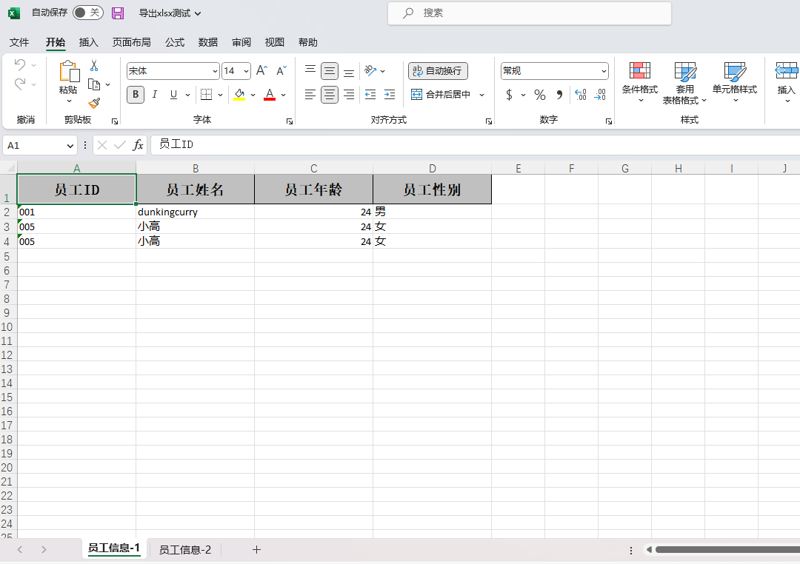

> 前提：引入 EasyExcel 依赖

```xml
<!-- easyexcel组件 -->
<dependency>
    <groupId>com.alibaba</groupId>
    <artifactId>easyexcel</artifactId>
    <version>3.1.3</version>
</dependency>
```

# 1. 导出Excel

## 1.1 导出的实体类

在该类中定义需要导出的内容，其中

> `@HeadRowHeight` ：指定导出行高
>
> `@ExcelProperty(value='标题名称', index=0)` ：指定导出列的名称以及顺序
>
> `@ColumnWidth` ： 指定导出列的宽度

```java
/**
 * 职工信息表
 * @TableName staff_info
 */
@TableName(value ="staff_info")
@HeadRowHeight(value = 30)
@Data
public class StaffInfo implements Serializable {
    /**
     * 职工编号
     */
    @ExcelProperty(value = "员工ID", index = 0)
    @ColumnWidth(value = 20)
    private String staffId;

    /**
     * 职工姓名
     */
    @ExcelProperty(value = "员工姓名", index = 1)
    @ColumnWidth(value = 20)
    private String staffName;

    /**
     * 年龄
     */
    @ExcelProperty(value = "员工年龄", index = 2)
    @ColumnWidth(value = 20)
    private Integer staffAge;

    /**
     * 性别
     */
    @ExcelProperty(value = "员工性别", index = 3)
    @ColumnWidth(value = 20)
    private String staffSex;
}
```

## 1.2 按模板导出Excel

支持多`sheet` 页导出，在获取 `sheet` 对象时指定 `sheet` 页的顺序及名称即可。

```java
public void easyExcelExport(HttpServletResponse response) {
    response.setContentType("application/vnd.ms-excel");
    response.setCharacterEncoding("utf-8");
    try {
        String fileName = URLEncoder.encode("导出xlsx测试", "UTF-8");
        response.setHeader("Content-disposition", "attachment;filename=" + fileName + ".xlsx");
        //新建ExcelWriter
        ExcelWriter excelWriter = EasyExcel.write(response.getOutputStream()).build();
        //获取sheet0对象
        WriteSheet sheet0 = EasyExcel.writerSheet(0, "员工信息-1").head(StaffInfo.class).build();
        //获取模型信息,向sheet0写入数据
        List<StaffInfo> staffInfos = staffInfoMapperl.selectAllByStaffAge(24);
        excelWriter.write(staffInfos, mainSheet);
        //获取sheet1对象
        WriteSheet sheet1 = EasyExcel.writerSheet(1, "员工信息-2").head(StaffInfo.class).build();
        //获取模型信息,向sheet1写入数据
        List<StaffInfo> staffInfos1 = staffInfoMapperl.selectAllByStaffAge(24);
        excelWriter.write(staffInfos1, secondSheet);
        //关闭流
        excelWriter.finish();
    } catch (Exception e) {
        logger.error("导出异常{}", e.getMessage());
    }
}
```
在浏览器中测试导出接口，获取导出的Excel文件如下




# 2. 导入Excel

## 2.1 导入的实体类

导入实体类可参考导出实体类，核心注解为 

> @ExcelProperty(value="标题名称")

其中标题名称需要与导入的标题名称对应，才能正确解析

## 2.2 ExcelListener 监视器类

继承自`EasyExcel`的`AnalysisEventListener`类，用于解析`Excel`数据，其中`datas`为解析内容的`List`。

```java
/**
 * excel表格读取监视器
 */
public class ExcelListener extends AnalysisEventListener{
    private final Logger logger = LoggerFactory.getLogger(ExcelListener.class);

    private static int dataCount = 0;
    
    List<Object> list = new ArrayList<>();

    @Override
    public void invoke(Object o, AnalysisContext analysisContext) {
        logger.info("成功解析到一条数据:{}", JSONObject.toJSONString(o));
        dataCount ++;
        list.add(o);
    }
    
    @Override
    public void doAfterAllAnalysed(AnalysisContext analysisContext) {
        logger.info(("成功读取共"+dataCount+"条数据"));
    }
    
    public List<Object> getDatas() {
        return datas;
    }

    public void setDatas(List<Object> datas) {
        this.datas = datas;
    }
}
```

## 2.3 导入解析Excel

支持导入多 `sheet` 页的数据，示例中 `staffinfos`  为拿到的解析内容。

```java
@RequestMapping("/import")
public RetDataBean easyExcelImport(@RequestParam("xlsxFile") MultipartFile multipartFile){
    RetDataBean<Object> retDataBean = new RetDataBean<>(RetcodeEnum.SUCCESS.getCode(), RetcodeEnum.SUCCESS.getMsg());
    try {
        //输入流
        InputStream inputStream = multipartFile.getInputStream();
        //监视器
        ExcelListener listener = new ExcelListener();
        ExcelReader excelReader = EasyExcel.read(inputStream, listener).build();
        // 第一个sheet读取类型
        ReadSheet readSheet1 = EasyExcel.readSheet(0).head(StaffInfo.class).build();
        // 开始读取第一个sheet
        excelReader.read(readSheet1);
        //excel sheet0 信息
        List<Object> list = listener.getDatas();
        List<StaffInfo> staffInfos = new ArrayList<>();
        //List object for 转换 实体类
        for (Object o : list) {
            StaffInfo staffInfo = (StaffInfo) o;
            staffInfos.add(staffInfo);
        }
        // 清空之前的数据
        listener.getDatas().clear();
        // 开始读取第二个sheet 复制以上步骤
        ReadSheet readSheet2 = EasyExcel.readSheet(1).head(StaffInfo.class).build();
        excelReader.read(readSheet2);
        //关闭流
        excelReader.close();
    } catch (Exception e) {
        logger.error("导入异常",e);
        retDataBean.setRetCode(RetcodeEnum.Fail.getCode());
        retDataBean.setRetMsg(RetcodeEnum.Fail.getMsg());
    };
    return retDataBean;
}
```

