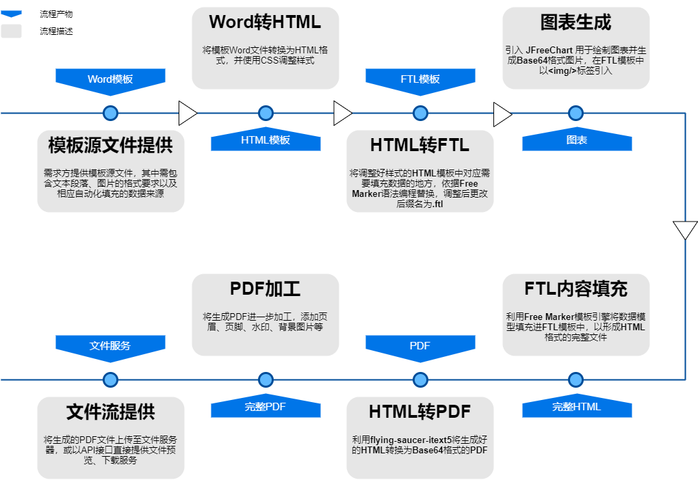
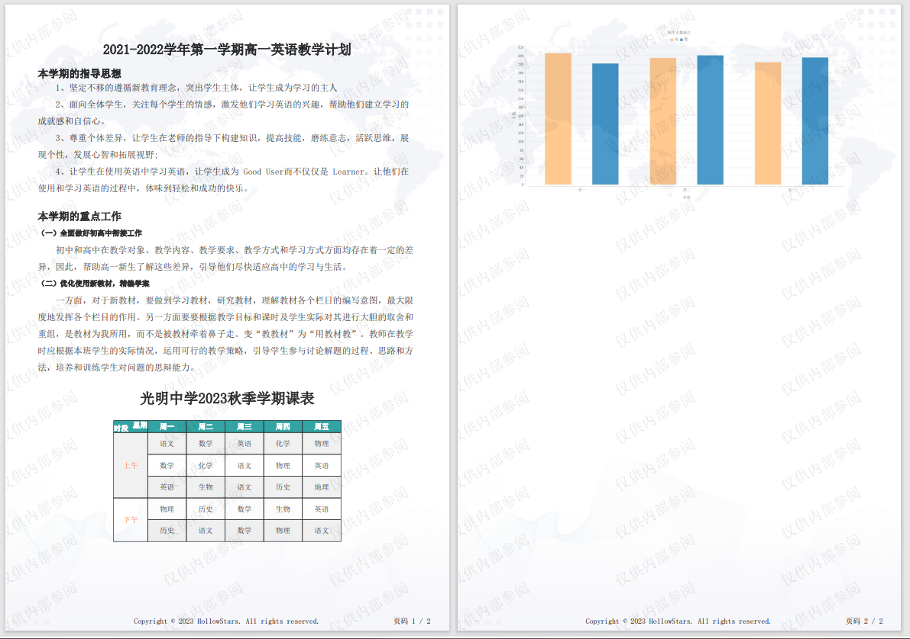
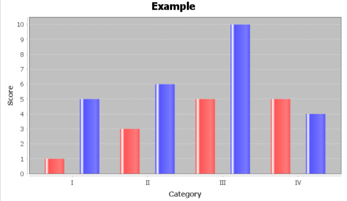
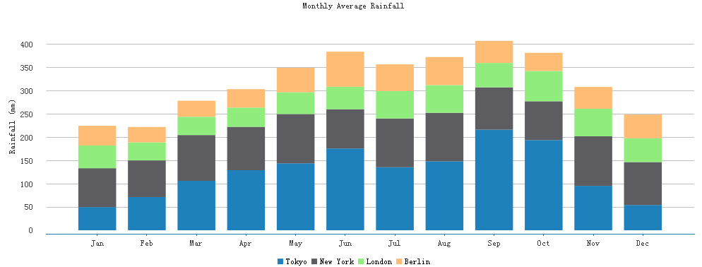

# 前言

本文将阐述一种纯Java后端实现**按模板自动化生成**`PDF`的方法，适用于**周期性报表**、**数据分析报告**生成等场景。

## 方案设计



## Demo示例




# 一、使用FreeMarker按模板生成HTML

拿到需求方提供的模板文件后，我们首先需要将模板转换为 `Free Marker` 能够识别的`FTL`模板。

## 1.1 什么是 `FreeMarker`

`FreeMarker`是一款模板引擎： 即一种基于模板和要改变的数据， 并用来生成输出文本(HTML网页，电子邮件，配置文件，源代码等)的通用工具。 是一个Java类库。

> 详细概述及语法请参考：[FreeMarker详细介绍](https://blog.csdn.net/weixin_44454512/article/details/109877418?ops_request_misc=%257B%2522request%255Fid%2522%253A%2522169189879016800186523127%2522%252C%2522scm%2522%253A%252220140713.130102334..%2522%257D&request_id=169189879016800186523127&biz_id=0&utm_medium=distribute.pc_search_result.none-task-blog-2~all~top_positive~default-1-109877418-null-null.142^v92^koosearch_v1&utm_term=FreeMarker&spm=1018.2226.3001.4187)

## 1.2 依赖引入

```xml
<!-- free marker 模板-->
<dependency>
    <groupId>org.freemarker</groupId>
    <artifactId>freemarker</artifactId>
</dependency>
```

## 1.3 模板文件准备

> 该流程需读者掌握`HTML`、`CSS`及`FTL`的基础知识

在该步骤中， 需将模板源文件（`WORD`，`PDF`等格式）依据`FreeMarker`语法转换为`FTL`模板前置`HTML`格式，示例模板 `cover.ftl` 如下：

```html
<!DOCTYPE html>
<html lang="en">
<head>
    <meta charset="utf-8"/>
    <title></title>
    <style>
        * {
            margin: 0;
            padding: 0;
            box-sizing: border-box;
        }

        body {
            font-family: SimSun, fangsong;
        }

        section {
            display: block;
            margin: 20px 10px;
        }

        .title {
            text-align: center;
        }

        p {
            line-height: 30px;
            text-indent: 2em;
        }

        section h1 h2 h3 h4 h5 h6{
            line-height: 30px;
        }

        table {
            border-right: 1px solid #000000;
            border-bottom: 1px solid #000000;
            border-collapse: collapse;
            text-align: center;
            width: 100%;
            font-size: 13px;
            /* 表格分页直接换到下一页*/
            /*page-break-before: always;*/
        }

        table caption {
            font-size: 2em;
            font-weight: bold;
            margin: 1em 0;
        }

        table th {
            border-left: 1px solid #000000;
            border-top: 1px solid #000000;
            border-collapse: collapse;
        }

        table td {
            border-left: 1px solid #000000;
            border-top: 1px solid #000000;
            border-collapse: collapse;
            height: 40px;
        }

        table thead tr {
            background-color: #008c8c;
            color: #fff;
        }

        table tbody tr:nth-child(odd) {
            background-color: #eee;
        }

        table tbody tr:hover {
            background-color: #ccc;
        }

        table tfoot tr td {
            text-align: right;
            padding-right: 20px;
            /*分页时表格行换行*/
            page-break-inside: avoid !important;
        }

        tr {
            /* 表格分页,只有行换到下一页 */
            page-break-inside: avoid !important;
        }

        #period {
            color: #f40;
        }

        #schoolTimeTable {
            width: 60%;
            margin-left: 20%;
            margin-right: 20%;
        }


    </style>
</head>
<body>
<section>
    <h2 style="text-align: center">2021-2022学年第一学期高一英语教学计划</h2>
</section>
<section>
    <h3>本学期的指导思想</h3>
    <p>
        1、坚定不移的遵循新教育理念，突出学生主体，让学生成为学习的主人</p>
    <p>

        2、面向全体学生，关注每个学生的情感，激发他们学习英语的兴趣，帮助他们建立学习的成就感和自信心。</p>
    <p>

        3、尊重个体差异，让学生在老师的指导下构建知识，提高技能，磨练意志，活跃思维，展现个性，发展心智和拓展视野;</p>
    <p>

        4、让学生在使用英语中学习英语，让学生成为 Good User而不仅仅是 Learner。让他们在使用和学习英语的过程中，体味到轻松和成功的快乐。
    </p>
</section>
<section>
    <h3 style="line-height: 30px">本学期的重点工作</h3>
    <h5 style="line-height: 30px">（一）全面做好初高中衔接工作</h5>
    <p>
        初中和高中在教学对象、教学内容、教学要求、教学方式和学习方式方面均存在着一定的差异，因此，帮助高一新生了解这些差异，引导他们尽快适应高中的学习与生活。</p>
    <h5 style="line-height: 30px">（二）优化使用新教材，精编学案</h5>
    <p>
        一方面，对于新教材，要做到学习教材，研究教材，理解教材各个栏日的编写意图，最大限度地发挥各个栏目的作用。另一方面要要根据教学目标和课时及学生实际对其进行大胆的取舍和重组，是教材为我所用，而不是被教材牵着鼻子走。变“教教材”为“用教材教”。教师在教学时应根据本班学生的实际情况，运用可行的教学策略，引导学生参与讨论解题的过程、思路和方法，培养和训练学生对问题的思辩能力。</p>
</section>
<section>
    <table id="schoolTimeTable">
        <caption style="text-align: center">光明中学2023秋季学期课表</caption>
        <thead>
        <tr>
            <th width="15%">
                <span style="float:left;margin-top:10%;margin-left:10%">时段</span>
                <span style="float:right;margin-bottom:10%;margin-right:10%">星期</span>
            </th>
            <th width="17%">周一</th>
            <th width="17%">周二</th>
            <th width="17%">周三</th>
            <th width="17%">周四</th>
            <th width="17%">周五</th>
        </tr>
        </thead>
        <tbody>
        <#list schoolTimetable as tab>
            <#list tab.weekLessons as weekLessons>
                <tr>
                    <#--xml循环第一个元素,需要合并单元格-->
                    <#if weekLessons?is_first>
                        <td id="period" rowspan="${tab.lessonsSize}">${tab.period}</td>
                    </#if>
                    <td>${weekLessons.mon}</td>
                    <td>${weekLessons.tue}</td>
                    <td>${weekLessons.wed}</td>
                    <td>${weekLessons.thu}</td>
                    <td>${weekLessons.fri}</td>
                </tr>
            </#list>
        </#list>
        </tbody>
    </table>
</section>
<section>
    
</section>
</body>
</html>
```


# 二、图表生成

看板业务需求中，在前端展示使用`Echarts`将数据绘制为折线图、饼状图等是非常常见的。同样地，我们也可以借助`JFreeChart` 将需要将数据模型转换为图表添加到生成的模板文件中。

## 2.1 什么是 `JFreeChart`

`JFreeChart` 由 David Gilbert 于 2000 年创立。如今，`JFreeChart` 是 Java 开发人员中使用最广泛的图表库。

`JFreeChart` 允许创建各种交互式和非交互式图表；可以广泛地定制； 它允许修改图表项目的颜色和绘制，图例，线条或标记的样式。 它会自动绘制轴刻度和图例。可以创建折线图，条形图，面积图，散点图，饼图，甘特图和各种专用图，例如风向图或气泡图。它支持多种输出格式，包括 `PNG`，`JPEG`，`PDF` 和 `SVG`。

> 各类图表的详细绘制教程可参考： [Java绘图库JFreeChart的详细使用教程](https://blog.csdn.net/hfy1237/article/details/126693786?ops_request_misc=%7B%22request%5Fid%22%3A%22169372606516800188510194%22%2C%22scm%22%3A%2220140713.130102334..%22%7D&request_id=169372606516800188510194&biz_id=0&utm_medium=distribute.pc_search_result.none-task-blog-2~all~top_positive~default-1-126693786-null-null.142^v93^koosearch_v1&utm_term=Jfreechart&spm=1018.2226.3001.4187) 

## 2.2 依赖引入

```xml
<!-- JfreeCharts -->
<dependency>
    <groupId>org.jfree</groupId>
    <artifactId>jfreechart</artifactId>
    <version>1.5.4</version>
</dependency>
```

## 2.3 图表美化

> 该部分参考： [Jfreechart绘制漂亮的图表](https://blog.csdn.net/weixin_41663412/article/details/105015098?ops_request_misc=&request_id=8f56629d6efa4640aea31a8e764421d8&biz_id=&utm_medium=distribute.pc_search_result.none-task-blog-2~all~koosearch~default-7-105015098-null-null.142^v93^koosearch_v1&utm_term=Jfreechart美化&spm=1018.2226.3001.4187) 

我们知道原生`JFreeChart`自带的图表绘制并不尽如人意，通过自定义主题可以更接近当前主流`Echarts` 、`Highcharts` 的绘图风格。

原生图表风格：



 美化后图表风格： 

美化工具类`ChartConfUtils.java`：

```java
public class ChartConfUtils {
    private static final String NO_DATA_MSG = "数据加载失败";
    private static final Font FONT = new Font("宋体", Font.PLAIN, 12);
    // 颜色
    public static Color[] CHART_COLORS = {
            new Color(255,188,117),new Color(31,129,188), new Color(92,92,97), new Color(144,237,125),
            new Color(153,158,255), new Color(255,117,153), new Color(253,236,109), new Color(128,133,232),
            new Color(158,90,102),new Color(255, 204, 102) };

    static {
        setChartTheme();
    }

    public ChartConfUtils() {
    }

    /**
     * 中文主题样式 解决乱码
     */
    public static void setChartTheme() {
        // 设置中文主题样式 解决乱码
        StandardChartTheme chartTheme = new StandardChartTheme("CN");
        // 设置标题字体
        chartTheme.setExtraLargeFont(FONT);
        // 设置图例的字体
        chartTheme.setRegularFont(FONT);
        // 设置轴向的字体
        chartTheme.setLargeFont(FONT);
        chartTheme.setSmallFont(FONT);
        chartTheme.setTitlePaint(new Color(51, 51, 51));
        chartTheme.setSubtitlePaint(new Color(85, 85, 85));

        chartTheme.setLegendBackgroundPaint(Color.WHITE);// 设置标注
        chartTheme.setLegendItemPaint(Color.BLACK);//
        chartTheme.setChartBackgroundPaint(Color.WHITE);

        Paint[] OUTLINE_PAINT_SEQUENCE = new Paint[] { Color.WHITE };
        // 绘制器颜色源
        DefaultDrawingSupplier drawingSupplier = new DefaultDrawingSupplier(CHART_COLORS, CHART_COLORS, OUTLINE_PAINT_SEQUENCE,
                DefaultDrawingSupplier.DEFAULT_STROKE_SEQUENCE, DefaultDrawingSupplier.DEFAULT_OUTLINE_STROKE_SEQUENCE,
                DefaultDrawingSupplier.DEFAULT_SHAPE_SEQUENCE);
        chartTheme.setDrawingSupplier(drawingSupplier);

        chartTheme.setPlotBackgroundPaint(Color.WHITE);// 绘制区域
        chartTheme.setPlotOutlinePaint(Color.WHITE);// 绘制区域外边框
        chartTheme.setLabelLinkPaint(new Color(8, 55, 114));// 链接标签颜色
        chartTheme.setLabelLinkStyle(PieLabelLinkStyle.CUBIC_CURVE);

        chartTheme.setAxisOffset(new RectangleInsets(5, 12, 5, 12));
        chartTheme.setDomainGridlinePaint(new Color(192, 208, 224));// X坐标轴垂直网格颜色
        chartTheme.setRangeGridlinePaint(new Color(192, 192, 192));// Y坐标轴水平网格颜色

        chartTheme.setBaselinePaint(Color.WHITE);
        chartTheme.setCrosshairPaint(Color.BLUE);// 不确定含义
        chartTheme.setAxisLabelPaint(new Color(51, 51, 51));// 坐标轴标题文字颜色
        chartTheme.setTickLabelPaint(new Color(67, 67, 72));// 刻度数字
        chartTheme.setBarPainter(new StandardBarPainter());// 设置柱状图渲染
        chartTheme.setXYBarPainter(new StandardXYBarPainter());// XYBar 渲染

        chartTheme.setItemLabelPaint(Color.black);
        chartTheme.setThermometerPaint(Color.white);// 温度计

        ChartFactory.setChartTheme(chartTheme);
    }

    /**
     * 必须设置文本抗锯齿
     */
    public static void setAntiAlias(JFreeChart chart) {
        chart.setTextAntiAlias(false);

    }

    /**
     * 设置图例无边框，默认黑色边框
     */
    public static void setLegendEmptyBorder(JFreeChart chart) {
        LegendTitle legend = chart.getLegend();// 图例对象
        legend.setFrame(new BlockBorder(Color.WHITE));
        legend.setPosition(RectangleEdge.TOP);// 图例所在位置(上、下、左、右)
        legend.setVisible(true);// 是否显示图例
        legend.setItemFont(FONT);// 图例大小
    }
}
```

## 2.4 图表生成

### 图表生成

工具类`JfreeChartUtil` 用于根据数据集生成图表并保存图片至相对路径`template/img`下

```java
/**
 * JFreeChart 图表绘制工具类
 * @author : DunkingCurry
 * @createTime : 2023/8/8 21:47
 */
public class JfreeChartUtil {

    /**
     * 图片保存的相对路径地址
     */
    public static final String IMG_PATH = "template/img";

    /**
     * 依据数据生成图表并导出图片至classpath路径
     */
    public static void generateChartsAndExportJpg(String title,
                                                  String xAxisLabel,
                                                  String yAxisLabel,
                                                  DefaultCategoryDataset dataset,
                                                  String outputJpgName) {

        // 主题样式设置
        ChartConfUtils.setChartTheme();
        // 创建JFreeChart对象
        JFreeChart chart = ChartFactory.createBarChart(
                // 图标题
                title,
                // x轴标题
                xAxisLabel,
                // y轴标题
                yAxisLabel,
                //数据集
                dataset,
                //图表方向
                PlotOrientation.VERTICAL,
                true, true, false);
        // 设置图例
        ChartConfUtils.setLegendEmptyBorder(chart);


        //将生成的图片保存到本地
        String contextPath = Objects.requireNonNull(JfreeChartUtil.class.getClassLoader().getResource(IMG_PATH)).getPath();
        String filePath = contextPath + "/"+outputJpgName;
        File lineChart = new File(filePath);
        //生成文件
        try {
            ChartUtils.saveChartAsJPEG(lineChart, chart,1080,540);
        } catch (IOException e) {
            e.printStackTrace();
            throw new RuntimeException("保存图片"+outputJpgName+"异常");
        }
    }


}
```

### 图表引入模板

要在HTML中使用``标签插入图片一般有两种方式

1. 指定图片文件路径`URL`

```html

```

2. 指定图片以`Base64` 格式插入

```html

```

对于前端展示页面，通常使用第一种方式，渲染更快速也更直观；然而在生成模板过程中我们需要用到第二种方式。在`HTML` 转`PDF` 的过程中，` flying-saucer`无法识别图片路径，因此我们需要将图片转为`base64`格式 。

图片转`base64` 工具类 `ImgBase64Util`

```java
/**
 * ImgBase64Util 图片转Base64 工具类
 * @author DunkingCurry
 */
public class ImgBase64Util {

    public final static String IMG_PRE = "data:image/jpg;base64,";

    /**
     * 本地图片转换成base64字符串
     * @param imgFile 图片本地路径
     */
    public static String imageToBase64ByLocal(String imgFile) {// 将图片文件转化为字节数组字符串，并对其进行Base64编码处理


        InputStream fis = null;
        byte[] data = null;

        // 读取图片字节数组
        try {
            fis = new FileInputStream(imgFile);
            //新的 byte 数组输出流，缓冲区容量1024byte
            ByteArrayOutputStream bos = new ByteArrayOutputStream(1024);
            //缓存
            byte[] b = new byte[1024];
            int n;
            while ((n = fis.read(b)) != -1) {
                bos.write(b, 0, n);
            }
            fis.close();
            //改变为byte[]
            data = bos.toByteArray();

        } catch (IOException e) {
            e.printStackTrace();
        } finally {
            try {
                if (fis != null) {
                    fis.close();
                }
            } catch (IOException e) {
                e.printStackTrace();
            }
        }

        return IMG_PRE+DatatypeConverter.printBase64Binary(data);
    }

    /**
     * base64字符串转换成图片
     * @param imgStr      base64字符串
     * @param imgFilePath 图片存放路径
     */
    public static boolean base64ToImage(String imgStr, String imgFilePath) { // 对字节数组字符串进行Base64解码并生成图片

        if (StringUtils.isEmpty(imgStr)) {
            // 图像数据为空
            return false;
        }

        OutputStream out = null;
        try {

            byte[] b = DatatypeConverter.parseBase64Binary(imgStr);
            for (int i = 0; i < b.length; ++i) {
                if (b[i] < 0) {
                    // 调整异常数据
                    b[i] += 256;
                }
            }

            out = new FileOutputStream(imgFilePath);
            out.write(b);
            out.flush();
            return true;
        } catch (Exception e) {
            return false;
        } finally {
            try {
                if (out != null) {
                    out.close();
                }
            } catch (Exception e) {
                e.printStackTrace();
            }
        }
    }

    /**
     * 数据集转base64图片链接
     * @param title 图标题
     * @param xAxisLabel x轴
     * @param yAxisLabel y轴
     * @param dataset 数据集
     * @param jpgName 图名称.jpg
     * @return 图片的base64链接
     */
    public static String genBase64ImageByChart(String title,
                                               String xAxisLabel,
                                               String yAxisLabel,
                                               DefaultCategoryDataset dataset,
                                               String jpgName){
        // 生成图表并保存图片至本地路径
        JfreeChartUtil.generateChartsAndExportJpg(title,xAxisLabel,yAxisLabel,dataset,jpgName);
        // 获取图表jpg相对路径
        String imgRetPath = JfreeChartUtil.IMG_PATH +"/"+ jpgName;
        // 获取图表jpg绝对路径
        String imgAbsPath = Objects.requireNonNull(ImgBase64Util.class.getClassLoader().getResource(imgRetPath)).getPath();
        // 将图片转为base64返回
        return imageToBase64ByLocal(imgAbsPath);
    }

}
```

### 调用示例

图表在`FTL` 模板中的示例：

```html
<section>
    
</section>
```

在`java`中的调用示例：

```java
HashMap<String, Object> dataMap = new HashMap<>();
// 创建数据
DefaultCategoryDataset dataset = new DefaultCategoryDataset();
dataset.addValue(306, "女", "高一");
dataset.addValue(295, "女", "高二");
dataset.addValue(285, "女", "高三");
dataset.addValue(282, "男", "高一");
dataset.addValue(301, "男", "高二");
dataset.addValue(296, "男", "高三");
// 获取生成的图表
String recruitStudentImg = ImgBase64Util.genBase64ImageByChart("招生人数统计", "年份", "人数", dataset, "recruit_student.jpg");
dataMap.put("recruitStudentImg",recruitStudentImg);
```


# 三、使用 Flying-saucer-itext5 生成 PDF

## 3.1 什么是 `Flying-saucer-itext5`

 `iText`是著名的开放源码站点`sourceforge`的一个项目，是用于生成`PDF`文档的一个`Java`类库。通过`iText`不仅可以生成`PDF`或`RTF`的文档，而且可以将`XML`、`HTML`文件转化为`PDF`文件。  `flying sauser` 基于`iText`并做了封装，能进一步解析`HTML`和`CSS`。 

## 3.2 依赖引入

```xml
<!-- html转PDF -->
<dependency>
    <groupId>org.xhtmlrenderer</groupId>
    <artifactId>flying-saucer-pdf-itext5</artifactId>
    <version>9.1.22</version>
</dependency>
```

## 3.3 HTML转PDF

这里使用到工具类 `HtmlToPDFUtil`

```java
/**
 * HtmlToPdfUtil 转换pdf工具类
 * @author DunkingCurry
 */
@Component
public class HtmlToPDFUtil {

    /**
     * 使用 freemarker 渲染 HTML
     *
     * @param templateFileName HTML模板路径
     * @param data   渲染的参数
     * @return 返回渲染后的html代码
     */
    public static String render(String templateFileName, Object data) throws Exception {
        Configuration cfg = new Configuration(Configuration.DEFAULT_INCOMPATIBLE_IMPROVEMENTS);
        // 指定FreeMarker模板文件的位置
        cfg.setClassForTemplateLoading(PdfTemplateUtil.class,"/template");
        Template template = cfg.getTemplate(templateFileName, "UTF-8");
        StringWriter writer = new StringWriter();

        // 将数据输出到html中
        template.process(data, writer);
        writer.flush();
        return writer.toString();
    }

    /**
     * 根据html生成pdf的base64格式
     */
    public static String getPDFBase64ByHtml(String html) throws Exception {
        //构建字节输出流
        ByteArrayOutputStream baos = new ByteArrayOutputStream();
        ITextRenderer renderer = new ITextRenderer();
        // 解决base64图片支持问题
        SharedContext sharedContext = renderer.getSharedContext();
        sharedContext.setReplacedElementFactory(new B64ImgReplacedElementFactory());
        sharedContext.getTextRenderer().setSmoothingThreshold(0);
        ITextFontResolver fontResolver = renderer.getFontResolver();
        // html中设置的字体样式需要参考此处debug后fontResolver的fontFamily的数据的key
        //指定文件字体添加到PDF库，指定字体不作为内部字体，而是外部字体被加载
        fontResolver.addFont("/template/font/simsun.ttc,0", BaseFont.IDENTITY_H, BaseFont.NOT_EMBEDDED);
        renderer.setDocumentFromString(html);
        renderer.layout();
        renderer.createPDF(baos);

        return Base64.encodeBytes(baos.toByteArray());
    }


    /**
     * 根据pdf的base64格式和路径生成pdf文件
     *  @param base64 pdf的base64格式
     */
    public static ByteArrayOutputStream base64ToPDF(String base64) {
        byte[] bytes = Base64.decode(base64);
        ByteArrayOutputStream out = new ByteArrayOutputStream();
        try {
            out.write(bytes);
            out.flush();
        } catch (IOException e) {
            e.printStackTrace();
        }

        return out;
    }


    /**
     * 合并添加水印 页眉和页脚 水印的方法 (可根据需求自行改动封装)
     *
     * @param pdfBase64        PDF的Base64格式
     * @param isAddWatermark   是否添加水印
     * @param waterMarkName    水印文字
     * @param isAddPageNumbers 是否添加页眉
     * @param headerText       页眉名称
     * @param isAddLogoImg     是否添加Logo
     * @param logoPath         logo图片路径
     * @param newWidth         图片大小宽度如 141
     * @param newHeight        图片大小高度如30
     * @param absoluteX        图片相对位置 如20
     * @param absoluteY        图片相对位置 如-30
     */
    public static String pdfAddWaterHeaderLogo(String pdfBase64
            , boolean isAddWatermark, String waterMarkName
            , boolean isAddPageNumbers, String headerText
            , boolean isAddLogoImg, String logoPath, float newWidth, float newHeight, float absoluteX, float absoluteY
            , boolean isAddWatermarkLogo, String watermarkLogoPath
            , boolean isAddBgImage, String bgImagePath
    ) {
        try {
            byte[] bytes = Base64.decode(pdfBase64);
            /**
             * PdfReader是iText库中的PDF解析器，用于读取和解析PDF文件。通过PdfReader对象，可以获取PDF文件的各种属性和内容，
             * 如总页数、页面尺寸、文本内容等。它提供了方法来打开和关闭PDF文件，并可以从文件路径、InputStream或字节数组等多种方式加载PDF文件。
             *
             * PdfStamper是iText库中的PDF编辑器，用于修改和编辑PDF文件。通过PdfStamper对象，
             * 可以在PDF文件中添加文本、图片、表单域等元素，修改页面内容、添加注释、加密文档等操作。它基于已解析的PdfReader对象，可以将修改后的内容写入新的PDF文件或覆盖原始文件。
             */
            PdfReader reader = new PdfReader(bytes);
            ByteArrayOutputStream bos = new ByteArrayOutputStream();
            PdfStamper stamper = new PdfStamper(reader, bos);

            int total = reader.getNumberOfPages();

            if (isAddBgImage) {
                addBackgroundImage(stamper, reader, bgImagePath);
            }

            if (isAddLogoImg) {
                addLogoImg(stamper, reader, logoPath, newWidth, newHeight, absoluteX, absoluteY);
            }


            if (isAddPageNumbers) {
                addPageNumbers(stamper, reader, headerText);
            }

            // 添加水印放到最后执行 否则会将页眉页脚进行透明度设置
            if (isAddWatermark) {
                addWatermark(stamper, reader, waterMarkName);
            }

            if (isAddWatermarkLogo) {
                addWatermarkImage(stamper, reader, watermarkLogoPath);
            }


            stamper.close();
            reader.close();
            return Base64.encodeBytes(bos.toByteArray());
        } catch (IOException | DocumentException e) {
            e.printStackTrace();
        }
        return null;
    }

    /**
     * 添加水印
     *
     * @param stamper       PdfStamper对象
     * @param reader        PdfReader对象
     * @param waterMarkName 水印文字
     */
    private static void addWatermark(PdfStamper stamper, PdfReader reader, String waterMarkName) throws DocumentException, IOException {
        BaseFont baseFont = BaseFont.createFont("/template/font/simsun.ttc,0", BaseFont.IDENTITY_H, BaseFont.NOT_EMBEDDED);
        Rectangle pageRect;
        PdfGState gs = new PdfGState();
        // 填充的透明度
        gs.setFillOpacity(0.1f);
        // 描边的透明度
        gs.setStrokeOpacity(0.1f);

        JLabel label = new JLabel();
        FontMetrics metrics;
        int textH = 0;
        int textW = 0;
        label.setText(waterMarkName);
        metrics = label.getFontMetrics(label.getFont());
        textH = metrics.getHeight();
        textW = metrics.stringWidth(label.getText());

        PdfContentByte under;
        for (int i = 1; i <= reader.getNumberOfPages(); i++) {
            pageRect = reader.getPageSizeWithRotation(i);
            under = stamper.getOverContent(i);
            under.saveState();
            under.setGState(gs);
            under.beginText();
            under.setFontAndSize(baseFont, 20);
            //水印颜色
            under.setColorFill(BaseColor.BLACK);

            // 水印文字成30度角倾斜
            for (int height = -5 + textH; height < pageRect.getHeight(); height = height + textH * 4) {
                for (int width = -5 + textW; width < pageRect.getWidth() + textW; width = width + textW * 3) {
                    under.showTextAligned(Element.ALIGN_LEFT, waterMarkName, width - textW, height - textH, 30);
                }
            }
            // 添加水印文字
            under.endText();
        }
    }

    /**
     * 添加页眉 (页脚)
     *
     * @param stamper PdfStamper对象
     * @param reader  PdfReader对象
     * @throws DocumentException
     * @throws IOException
     */
    private static void addPageNumbers(PdfStamper stamper, PdfReader reader, String headerText) throws DocumentException, IOException {
        int total = reader.getNumberOfPages();
        for (int i = 1; i <= total; i++) {
            Rectangle pageRect = reader.getPageSizeWithRotation(i);
            PdfContentByte content = stamper.getOverContent(i);

            BaseFont baseFont = BaseFont.createFont("/template/font/simsun.ttc,0", BaseFont.IDENTITY_H, BaseFont.NOT_EMBEDDED);
            content.setFontAndSize(baseFont, 20);

            ColumnText.showTextAligned(content, Element.ALIGN_CENTER, new Phrase(headerText, new Font(baseFont, 10)),
                    pageRect.getWidth() / 2, pageRect.getTop() - 20, 0);

            ColumnText.showTextAligned(content, Element.ALIGN_CENTER, new Phrase("页码 " + i + " / " + total, new Font(baseFont, 10)),
                    pageRect.getRight()-50, pageRect.getBottom() + 10, 0);

            ColumnText.showTextAligned(content, Element.ALIGN_CENTER, new Phrase("Copyright © 2023 HollowStars. All rights reserved.", new Font(baseFont, 10)),
                    (pageRect.getLeft() + pageRect.getRight()) / 2, pageRect.getBottom() + 10, 0);

        }
    }


    /**
     * 添加图片logo
     *
     * @param stamper   PdfStamper对象
     * @param reader    PdfReader对象
     * @param logoPath  图片路径
     * @param newWidth  图片大小宽度如 141
     * @param newHeight 图片大小高度如30
     * @param absoluteX 图片相对位置 如20
     * @param absoluteY 图片相对位置 如-30
     * @throws DocumentException
     * @throws IOException
     */
    private static void addLogoImg(PdfStamper stamper, PdfReader reader, String logoPath, float newWidth, float newHeight, float absoluteX, float absoluteY) throws DocumentException, IOException {
        for (int i = 1; i <= reader.getNumberOfPages(); i++) {
            Rectangle pageRect = reader.getPageSizeWithRotation(i);
            PdfContentByte content = stamper.getOverContent(i);

            BaseFont baseFont = BaseFont.createFont("/template/font/simsun.ttc", BaseFont.IDENTITY_H, BaseFont.NOT_EMBEDDED);
            content.setFontAndSize(baseFont, 20);

            // 添加Logo图片到页眉
            Image logoImage = Image.getInstance(logoPath);
            logoImage.scaleAbsolute(newWidth, newHeight);
            logoImage.setAbsolutePosition(pageRect.getLeft() + absoluteX, pageRect.getTop() + absoluteY);
            content.addImage(logoImage);

        }
    }
    /**
     * 添加水印图片
     *
     * @param stamper       PdfStamper对象
     * @param reader        PdfReader对象
     * @param watermarkPath 水印图片路径
     * @throws DocumentException
     * @throws IOException
     */
    private static void addWatermarkImage(PdfStamper stamper, PdfReader reader, String watermarkPath) throws DocumentException, IOException {
        Image watermarkImage = Image.getInstance(watermarkPath);
        watermarkImage.scaleToFit(400, 400); // 调整水印图片大小

        /**
         * .scaleAbsolute    .scaleToFit 这两个方法 什么区别
         * scaleAbsolute和scaleToFit是iText库中用于缩放图像的两个方法。
         *
         * scaleAbsolute(float width, float height):
         * 该方法用于将图像缩放到指定的绝对宽度和高度。
         * 参数width和height分别指定了缩放后的宽度和高度。
         * 图像将按照指定的宽度和高度进行缩放，可能会导致图像的比例失调。
         *
         * scaleToFit(float width, float height):
         * 该方法用于将图像缩放以适应指定的矩形框的大小。
         * 参数width和height指定了矩形框的宽度和高度。
         * 图像将按照比例缩放，以适应指定的矩形框，同时保持其宽高比。
         * 简而言之，scaleAbsolute方法按照指定的宽度和高度进行缩放，而scaleToFit方法会按照比例缩放以适应指定的矩形框大小。选择使用哪个方法取决于你的需求和图像的要求。
         */

        for (int i = 1; i <= reader.getNumberOfPages(); i++) {
            Rectangle pageRect = reader.getPageSizeWithRotation(i);
            PdfContentByte content = stamper.getOverContent(i);

            // 创建PdfGState对象并设置透明度
            PdfGState gState = new PdfGState();
            gState.setFillOpacity(0.1f); // 水印图片透明度 (0.0f - 1.0f，0.0f 表示完全透明，1.0f 表示完全不透明)

            content.saveState();
            content.setGState(gState);

            // 添加水印图片到页面
            float x = (pageRect.getLeft() + pageRect.getRight() - watermarkImage.getScaledWidth()) / 2;
            float y = (pageRect.getBottom() + pageRect.getTop() - watermarkImage.getScaledHeight()) / 2;
            content.addImage(watermarkImage, watermarkImage.getScaledWidth(), 0, 0, watermarkImage.getScaledHeight(), x, y);

            content.restoreState();
        }
    }

    private static void addBackgroundImage(PdfStamper stamper, PdfReader reader, String bgImagePath) throws DocumentException, IOException {
        Image backgroundImage = Image.getInstance(bgImagePath);
        /* 设置图片的位置 */
        backgroundImage.setAbsolutePosition(0, 0);
        /* 设置图片的大小 */
        backgroundImage.scaleAbsolute(595, 842);


        for (int i = 1; i <= reader.getNumberOfPages(); i++) {
            Rectangle pageRect = reader.getPageSizeWithRotation(i);
            PdfContentByte content = stamper.getOverContent(i);

            // 创建PdfGState对象并设置透明度
            PdfGState gState = new PdfGState();
            gState.setFillOpacity(0.2f);

            content.saveState();
            content.setGState(gState);

            // 添加水印图片到页面
            float x = (pageRect.getLeft() + pageRect.getRight() - backgroundImage.getScaledWidth()) / 2;
            float y = (pageRect.getBottom() + pageRect.getTop() - backgroundImage.getScaledHeight()) / 2;
            content.addImage(backgroundImage, backgroundImage.getScaledWidth(), 0, 0, backgroundImage.getScaledHeight(), x, y);

            content.restoreState();
        }
    }

}
```

该工具类包含了`FreeMarker`渲染HTML、HTML转`PDF` 、`PDF`加工（添加页眉、页脚、水印、背景等）的方法。其中若HTML中``标签包含`base64`图片，需要添加额外`B64ImgReplacedElementFactory`支持：

```java
/**
 * @author DunkingCurry
 */
public class B64ImgReplacedElementFactory implements ReplacedElementFactory {

    /**
     * 实现createReplacedElement 替换html中的Img标签
     *
     * @param c 上下文
     * @param box 盒子
     * @param uac 回调
     * @param cssWidth css宽
     * @param cssHeight css高
     * @return ReplacedElement
     */
    @Override
    public ReplacedElement createReplacedElement(LayoutContext c, BlockBox box, UserAgentCallback uac,
                                                 int cssWidth, int cssHeight) {
        Element e = box.getElement();
        if (e == null) {
            return null;
        }
        String nodeName = e.getNodeName();
        // 找到img标签
        if (nodeName.equals("img")) {
            String attribute = e.getAttribute("src");
            FSImage fsImage;
            try {
                // 生成itext图像
                fsImage = buildImage(attribute, uac);
            } catch (BadElementException | IOException e1) {
                fsImage = null;
            }
            if (fsImage != null) {
                // 对图像进行缩放
                if (cssWidth != -1 || cssHeight != -1) {
                    fsImage.scale(cssWidth, cssHeight);
                }
                return new ITextImageElement(fsImage);
            }
        }
        return null;
    }

    /**
     * 将base64编码解码并生成itext图像
     *
     * @param srcAttr 属性
     * @param uac 回调
     * @return FSImage
     * @throws IOException io异常
     * @throws BadElementException BadElementException
     */
    protected FSImage buildImage(String srcAttr, UserAgentCallback uac) throws IOException,
            BadElementException {
        FSImage fsImage;
        if (srcAttr.startsWith("data:image/")) {
            String b64encoded = srcAttr.substring(srcAttr.indexOf("base64,") + "base64,".length(),
                    srcAttr.length());
            // 解码
            byte[] decodedBytes = Base64.decode(b64encoded);

            fsImage = new ITextFSImage(Image.getInstance(decodedBytes));
        } else {
            fsImage = uac.getImageResource(srcAttr).getImage();
        }
        return fsImage;
    }

    /**
     * 实现remove
     *
     * @param e 元素
     */
    @Override
    public void remove(Element e) {
    }

    /**
     * 实现reset
     */
    @Override
    public void reset() {
    }

    /**
     * 实现setFormSubmissionListener
     *
     * @param formsubmissionlistener 监听
     */
    @Override
    public void setFormSubmissionListener(FormSubmissionListener formsubmissionlistener) {
    }
}
```

此外，封装按模板直接生成`PDF`的工具类 `PdfTemplateUtil`

```java
/**
 * @author DunkingCurry
 */
public class PdfTemplateUtil {

    public static ByteArrayOutputStream createPdfByItext(HashMap<String, Object> dataMap, String templateName) throws Exception {

        String html = HtmlToPDFUtil.render(templateName, dataMap);

        String base64 = HtmlToPDFUtil.getPDFBase64ByHtml(html);

        String base64O = HtmlToPDFUtil.pdfAddWaterHeaderLogo(base64
                , true, "仅供内部参阅"
                , true, ""
                , false, "", 141, 30, 20, -30
                , false, ""
                , true, "classpath:template/img/report-background.jpg"
        );

        return HtmlToPDFUtil.base64ToPDF(base64O);


    }
}
```


# 四、完整调用示例

## PDF导出接口示例

此处提供一个导出生成`PDF`的接口示例供参考：

```java
/**
  * 模板PDF导出接口
  */
@ApiOperation(value = "模板PDF导出接口", notes = "模板PDF导出接口", httpMethod = "GET", produces = "application/octet-stream")
@GetMapping(value = "/exportPdf")
public void exportPdf(HttpServletResponse response) throws Exception{
    ByteArrayOutputStream baos = null;
    OutputStream out = null;
    try {
        // 模板中的数据，实际运用从数据库中查询

        SchoolTimeTable.WeekLesson eightAm = new SchoolTimeTable.WeekLesson();
        eightAm.setMon("语文");
        eightAm.setTue("数学");
        eightAm.setWed("英语");
        eightAm.setThu("化学");
        eightAm.setFri("物理");

        SchoolTimeTable.WeekLesson nineAm = new SchoolTimeTable.WeekLesson();
        nineAm.setMon("数学");
        nineAm.setTue("化学");
        nineAm.setWed("语文");
        nineAm.setThu("物理");
        nineAm.setFri("英语");

        SchoolTimeTable.WeekLesson tenAm = new SchoolTimeTable.WeekLesson();
        tenAm.setMon("英语");
        tenAm.setTue("生物");
        tenAm.setWed("语文");
        tenAm.setThu("历史");
        tenAm.setFri("地理");

        SchoolTimeTable.WeekLesson twoPm = new SchoolTimeTable.WeekLesson();
        twoPm.setMon("物理");
        twoPm.setTue("历史");
        twoPm.setWed("数学");
        twoPm.setThu("生物");
        twoPm.setFri("英语");

        SchoolTimeTable.WeekLesson threePm = new SchoolTimeTable.WeekLesson();
        threePm.setMon("历史");
        threePm.setTue("语文");
        threePm.setWed("数学");
        threePm.setThu("物理");
        threePm.setFri("语文");

        List<SchoolTimeTable.WeekLesson> weekLessons1 = new ArrayList<>();
        weekLessons1.add(eightAm);
        weekLessons1.add(nineAm);
        weekLessons1.add(tenAm);

        List<SchoolTimeTable.WeekLesson> weekLessons2 = new ArrayList<>();
        weekLessons2.add(twoPm);
        weekLessons2.add(threePm);

        SchoolTimeTable amData = SchoolTimeTable.builder().period("上午").weekLessons(weekLessons1).lessonsSize(weekLessons1.size()).build();
        SchoolTimeTable pmData = SchoolTimeTable.builder().period("下午").weekLessons(weekLessons2).lessonsSize(weekLessons2.size()).build();

        List<SchoolTimeTable> schoolTimeTables = new ArrayList<>(Collections.singletonList(amData));
        schoolTimeTables.add(pmData);

        HashMap<String, Object> dataMap = new HashMap<>();
        dataMap.put("schoolTimetable",schoolTimeTables);

        // 创建数据
        DefaultCategoryDataset dataset = new DefaultCategoryDataset();
        dataset.addValue(306, "女", "高一");
        dataset.addValue(295, "女", "高二");
        dataset.addValue(285, "女", "高三");
        dataset.addValue(282, "男", "高一");
        dataset.addValue(301, "男", "高二");
        dataset.addValue(296, "男", "高三");
        // 获取生成的图表
        String recruitStudentImg = ImgBase64Util.genBase64ImageByChart("招生人数统计", "年份", "人数", dataset, "recruit_student.jpg");
        dataMap.put("recruitStudentImg",recruitStudentImg);

        baos = PdfTemplateUtil.createPdfByItext(dataMap, "cover.ftl");;
        // 设置响应消息头，告诉浏览器当前响应是一个下载文件
        response.setContentType( "application/x-msdownload");
        // 告诉浏览器，当前响应数据要求用户干预保存到文件中，以及文件名是什么 如果文件名有中文，必须URL编码
        String fileName = URLEncoder.encode("光明中学课表.pdf", "UTF-8");
        response.setHeader( "Content-Disposition", "attachment;filename=" + fileName);
        out = response.getOutputStream();
        baos.writeTo(out);
        baos.close();
    } catch (Exception e) {
        e.printStackTrace();
        throw new Exception("导出失败：" + e.getMessage());
    } finally{
        if(baos != null){
            baos.close();
        }
        if(out != null){
            out.close();
        }
    }
}
```

