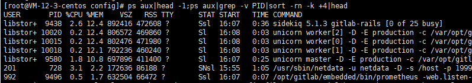
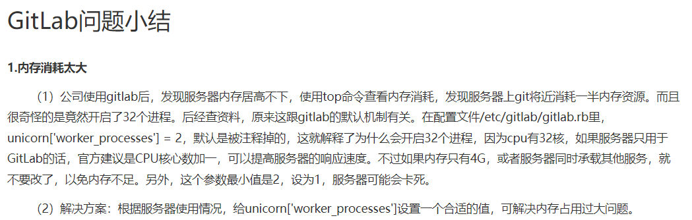
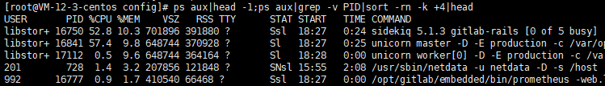

# GitLab内存占用过高解决方案


# 一、问题发现与排查

> 前提：服务器CPU内存信息为2C4G


近来发现，每当推送代码，gitlab服务器很大概率会卡死；`htop` 命令查看服务器运行情况，发现内存占用在80%以上，使用以下命令查询占用内存最多的十个进程

```bash
ps aux|head -1;ps aux|grep -v PID|sort -rn -k +4|head
```

果然，基本吃内存大户都为 gitlab 的进程，主要需要解决`worker` 和 `sidekiq` 高占用




# 二、问题分析

> 参考官方硬件要求： [GitLab installation minimum requirements | GitLab](https://docs.gitlab.com/ee/install/requirements.html#cpu) 

## 1. worker 进程

参考以下总结：




结合官方文档，`unicorn['worker_processess']` 需设置一个合适的值，官方推荐设置为物理核心数+1


## 2. sidekiq 进程

官方文档中写道

> Notice: The 25 workers of Sidekiq will show up as separate processes in your process overview (such as top or htop) but they share the same RAM allocation since Sidekiq is a multithreaded application. Please see the section below about Unicorn workers for information about how many you need of those

翻译中文的意思是：

> 注意：Sidekiq的25名worker将在您的流程概述（例如top或htop）中显示为单独的进程，但由于Sidekiq是一个多线程应用程序，因此它们共享相同的RAM分配。请参阅以下有关Unicorn worker的部分，了解您需要多少人。

实际我并不需要这么多的worker，修改`sidekiq['concurrency']` （默认25）以减少并发数。


# 三、问题解决

依据以上问题分析，修改配置文件 `gitlab.rb` ，默认为以下路径（若为容器运行，请修改挂接目录下的配置文件）

```bash
vim /etc/gitlab/gitlab.rb
```

最终采用解决方案：

## 1. 减少 workder 进程数

```bash
#综合考虑服务器配置，经测试2个进程占用也偏高，采用1个进程足矣
unicorn['worker_processes'] = 2
```

## 2. 减少 worker 进程的内存空间

```bash
unicorn['worker_memory_limit_min'] = "200 * 1 << 20"#默认为400
unicorn['worker_memory_limit_max'] = "350 * 1 << 20"#默认为650
```

## 3. 减少 sidekiq 数据库并发数

```bash
#考虑需求，5个并发足矣
sidekiq['concurrency'] = 5
```

## 4. 减少数据库缓存

```bash
#官方推荐为总RAM的1/4，但服务器不只gitlab一个应用，256MB已能满足需求
postgresql['shared_buffers'] = "256MB"
```

## 5. 重新初始化配置

配置文件修改保存后，重启使配置生效

```bash
#我的是docker中运行的gitlab，需要先进入容器
[root@VM-centos]# docker exec -it gitlab /bin/bash
#执行以下命令使修改后的配置生效
root@111c370ad:/# gitlab-ctl reconfigure
```

## 6. 效果验证

重启，使用命令查看内存占用，已降至50%左右



进行一些提交推送操作，再观察内存占用情况


至此，问题解决。