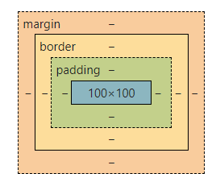

---

title: HTML + CSS 基础

date: 2022/6/20 20:00:00

tags: 

 - html

 - css

categories: 

 - Web前端

---

# HTML 基础

> Hyper Text Markup Language 是一种标记语言，通过标记对内容进行描述，从而提供超出普通文本的信息。


## HTML 组成

包含三部分：

- 文本内容
- 引用（图片、音视频、样式表、JS文件以及其他HTML文件等）
- 标记（预先定义好的、描述语义的标签）

**标记只代表语义**

HTML元素用于描述当前文本的语义，与显示样式无关，例如

```html
<p>说明当前是一个段落（paragraph）</p>
<a>说明当前是一个链接，或者叫锚点（anchor）</a>
```


## DOM 树

HTML在客户端被浏览器组织成一个树形结构，就是 DOM(Document Object Mode) tree，浏览器对网页的显示、CSS的样式和元素选择、JS的DOM节点操作都是以DOM tree为基础的。

### 树形结构中的关系

- 后代（ancestor and descendent）
- 父子（parent and child）
- 兄弟（siblings）


## 文档流

浏览器在渲染HTML时将其看做是一个个节点组成的流，按照从上到下，从左到右的顺序依次展示。


## 盒模型

将元素所占的空间类比成生活中的盒子（BOX），从外到内依次是 `margin` 、`border`和`padding`




## HTML 基本结构


### 文档基本结构

```html
<html>
    <head>
        元数据和标题
    </head>
    <body>
        页面显示内容
    </body>
</html>
```


### 元素、属性和值

```html
<label for="email">Email Address</label>

    <li><a href="#jys">静夜思</a></li>
</ol>
```

2. 无序列表

```html
<ul>
    <li><a href="#jys">静夜思</a></li>
</ul>
```

3. 描述列表

```html
<dl>
    <dt>入朝洛堤步月</dt>
    <dd>唐 上官仪</dd>
</dl>
```

4. 嵌套列表

```html
<ul>
    <li><a href="/lb">李白</a>
    	<ul>
            <li><a href="#sdn">蜀道难</a></li>
            <li><a href="#jys">静夜思</a></li>
        </ul>
    </li>
</ul>
```


## 表单


### HTML5


HTML5对表单进行了扩展和改进，增加了常用的表单输入控件类型等

| 标签     | 输入类型   | 示例代码                                                     |
| -------- | ---------- | ------------------------------------------------------------ |
| input    | 文本       | `<input type="text" />`                                      |
| input    | 密码       | `<input type="password" required="required" />`              |
| input    | 提交       | `<input type="submit" />`                                    |
| input    | 隐藏       | `<input type="hidden" value="test" />`                       |
| input    | 邮箱       | `<input type="email" />`                                     |
| input    | 搜索       | `<input type="search" />`                                    |
| input    | 电话       | `<input type="tel" />`                                       |
| input    | URL        | `<input type="url" pattern="\d{2}-\d{8}" />`                 |
| input    | 单选框     | `<input type="radio" name="rd1" value="male" checked />`     |
| input    | 复选框     | `<input type="checkbox" name="cb1" value="java" checked />`  |
| input    | 文件上传   | `<input type="file" name="cb1" value="java" checked />`      |
| textarea | 多行文本框 | `<textarea name="ta" cols="40" rows="40" />`                 |
| select   | 下拉选择   | `<select name="se"><option value="1" /><option value="2" /></select>` |
| button   | 按钮       | `<button type="submit">  UPLOAD</button>` |


### 表单提交

```html
<form method="post" id="form1" name="cb1" action="req.jsp"/>
```

1. `name` 属性表示提交到后台的字段名，可以重复，checkbox和radio以相同的name成为一组；
2. `id` 属性在整个html文档中唯一标识一个元素，与提交到后台数据无关；
3. `disabled="disabled"` 的表单元素不仅标识元素禁用，且不会提交到后台


### 表格

```html
<table>
    <caption>唐朝诗人留存诗集数统计</caption>
    <thead>
        <tr>
            <th>姓名</th>
            <th>字</th>
            <th>号</th>
            <th>留存诗集数（首）</th>
        </tr>
    </thead>
    <tbody>
        <tr>
            <th>李白</th>
            <td>太白</td>
            <td>青莲居士</td>
            <td>1010</td>
        </tr>
        <tr>
            <th>杜甫</th>
            <td>子美</td>
            <td>少陵野老</td>
            <td>1500</td>
        </tr>
    </tbody>
    <tfoot>
        <tr>
            <th>共计</th>
            <td>-</td>
            <td>-</td>
            <td>2610</td>
        </tr>
    </tfoot>
</table>
```


### 视频和音频

```html
<audio src="static/piano.mp3" controls></audio>
<video src="static/dance.mp4" controls autoplay></video>
```


# CSS 基础

> Cascading Style Sheets 通常称CSS样式表，以HTML为基础，提供了丰富的功能，如字体、样式、背景的控制及整体排版等，而且可以针对不同的浏览器设置不同的样式。


## CSS基本使用


### CSS 规则

- `选择器 {属性: 值;[其他属性和值]}`

```css
h1 {
    color: red;
    font-style: italic;
}
```

### CSS 注释

```css
/* 这是CSS注释 */
```


## CSS 引入


### 1. 行内样式（内联样式）

通过标签的`style` 属性来设置元素的样式；缺点是只能控制当前标签以及嵌套在其中的字标签，没有实现样式和结构分离

```html
<h1 style="属性1:值1; 属性2:值2; 属性3:值3;">标签内容</h1>
```


### 2.内嵌样式

也称为内嵌式，将CSS代码集中写在HTML文档的`head` 标签中，并且用 `style` 标签定义；缺点是只能控制当前页面，没有彻底分离样式和结构

```html
<head>
    <style>
        选择器（选择标签） {
            属性1:值1; 
            属性2:值2; 
            属性3:值3;
        }
    </style>
</head>
```


### 3.外部样式（外链式）

将所有的样式放在一个或多个以 `.css` 为扩展名结尾的外部样式表文件中，通过 `link` 标签将外部样式表文件链接到HTML文档中

- `rel` : 定义当前文档与被链接文档之间的关系，在这里需要指定为 `stylesheet` ，表示被链接的文档是一个样式表文件
- `href` : 定义所链接外部样式表文件的 URL，可以是相对路径也可以是绝对路径

```html
<link  rel="stylesheet" href="/css/main.css" />
```


## CSS 基础选择器


### 1. 标签选择器

用HTML标签名作为选择器，按标签名称分类，为页面中某一类标签指定统一的CSS样式

- 优点：快速为网页中同类型标签统一样式
- 缺点：不能设计差异化样式

```css
/* 语法 */
标签名 {
    属性1:值1; 
    属性2:值2; 
    属性3:值3;
}
/* 示例 */
h1 {
    color: red;
    font-style: italic;
}
```


### 2. 类选择器

使用 `.`  进行标识，后面紧跟我们自定义的类名，可以为元素对象定义单独或相同样式，可以选择一个或多个标签；这里需注意类名的命名：

- 使用英文小写字母，长名称或词组中间使用短横线 `-` 拼接
- 多类名选择器各个类名用空格分割开

```css
/* 定义类名 */
<p class="类名A"></p>
/* 语法 */
.类名A .类名B {
    属性1:值1; 
    属性2:值2; 
    属性3:值3;
}
/* 示例 */
.myclass-head .myclass-foot {
    color: red;
    font-style: italic;
}
```


### 3. id 选择器

id选择器使用 `#` 进行标识，后面紧跟id名；元素的id值是唯一的，只能对应于文档中某一个具体的元素，应尽量减少使用

```css
/* 定义类名 */
<p id="id1"></p>
/* 语法 */
#id名 {
    属性1:值1; 
    属性2:值2; 
    属性3:值3;
}
/* 示例 */
#id1 {
    color: red;
    font-style: italic;
}
```


### 4. 通配符选择器

通配符选择器用 `*` 进行标识，意为选择所有标签，能够匹配页面的所有元素，会降低页面响应速度，不建议随便使用

```css
/* 语法及示例 */
* {
    color: red;
    font-style: italic;
}
```


### 5. 基础选择器总结

| 选择器       | 作用                          | 缺点                     | 使用情况   | 用法                   |
| :----------- | :---------------------------- | :----------------------- | :--------- | :--------------------- |
| 标签选择器   | 可以选出所有相同的标签，比如p | 不能差异化选择           | 较多       | `p { color：red;}`     |
| 类选择器     | 可以选出1个或者多个标签       | 可以根据需求选择         | 非常多     | `.nav { color: red; }` |
| id选择器     | 一次只能选择器1个标签         | 只能使用一次             | 不推荐使用 | `#nav {color: red;}`   |
| 通配符选择器 | 选择所有的标签                | 选择的太多，有部分不需要 | 不推荐使用 | `* {color: red;}`      |


## CSS 复合选择器


### 1. 后代选择器

又称包含选择器，用来选择元素或元素组的子孙后代，其写法就是把外层标签写在前面，内层标签写在后面，中间用空格分割，当标签发生嵌套时，内层标签就成为外层标签的后代

```css
/* 定义类名 */
<p class="parent"><h1>hello</h1></p>
/* 语法 */
父级类选择器 子级标签选择器 {
    属性1:值1; 
    属性2:值2; 
    属性3:值3;
}
/* 示例 */
.parent h1 {
    color: red;
    font-style: italic;
}
```


### 2. 子元素选择器

子元素选择器只能选择作为某元素子元素的元素，且只包含儿子，不包含孙子之类，其写法就是把父级标签写在前面，子级标签写在后面，中间跟一个`>` 进行连接

```css
/* 定义类名 */
<p class="parent"><h1>hello</h1></p>
/* 语法 */
父级类选择器 子级标签选择器{
    属性1:值1; 
    属性2:值2; 
    属性3:值3;
}
/* 示例 */
.parent>h1 {
    color: red;
    font-style: italic;
}
```


### 3. 交集选择器

选择既符合类又符合标签的元素，中间通过 `.` 连接，且不能有空格

```css
/* 定义类名 */
<p class="one">hello</p>
/* 语法 */
标签选择器 类选择器{
    属性1:值1; 
    属性2:值2; 
    属性3:值3;
}
/* 示例 */
p.one {
    color: red;
    font-style: italic;
}
```


### 4. 并集选择器

如果某些选择器定义的相同样式，可通过 `,` 连接，用于集体声明，任何选择器都可以作为并集选择器的一部分

```css
/* 示例 */
.parent, p, #id1 {
    color: red;
    font-style: italic;
}
```


### 5. 链接伪类选择器

用于向某些选择器添加特殊的效果，写的时候尽量按照`l-v-h-a` 的顺序，否则可能引起错位

- `a : link` ：未访问的链接
- `a : visited` ：已访问的链接
- `a : hover` ：鼠标悬浮于链接上
- `a : active` ：点击链接

```css
a:hover {
    color: blue;
}
```


### 6. 复合选择器总结

| 选择器         | 作用                     | 特征                 | 使用情况 | 隔开符号及用法                          |
| :------------- | :----------------------- | :------------------- | :------- | :-------------------------------------- |
| 后代选择器     | 用来选择元素后代         | 是选择所有的子孙后代 | 较多     | 符号是空格 `.nav a`                     |
| 子代选择器     | 选择 最近一级元素        | 只选亲儿子           | 较少     | 符号是> `.nav>p`                        |
| 交集选择器     | 选择两个标签交集的部分   | 既是 又是            | 较少     | 没有符号 `p.one`                        |
| 并集选择器     | 选择某些相同样式的选择器 | 可以用于集体声明     | 较多     | 符号是逗号 `.nav, .header`              |
| 链接伪类选择器 | 给链接更改状态           |                      | 较多     | 重点记住 a{} 和 `a:hover`实际开发的写法 |


