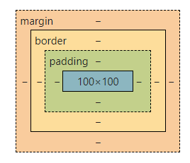

---

title: HTML 基础

date: 2022/6/20 20:00:00

tags: 

 - html

categories: 

 - Web前端

---

# HTML 基础

> Hyper Text Markup Language 是一种标记语言，通过标记对内容进行描述，从而提供超出普通文本的信息。


## HTML 组成

包含三部分：

- 文本内容
- 引用（图片、音视频、样式表、JS文件以及其他HTML文件等）
- 标记（预先定义好的、描述语义的标签）

**标记只代表语义**

HTML元素用于描述当前文本的语义，与显示样式无关，例如

```html
<p>说明当前是一个段落（paragraph）</p>
<a>说明当前是一个链接，或者叫锚点（anchor）</a>
```


## DOM 树

HTML在客户端被浏览器组织成一个树形结构，就是 DOM(Document Object Mode) tree，浏览器对网页的显示、CSS的样式和元素选择、JS的DOM节点操作都是以DOM tree为基础的。

### 树形结构中的关系

- 后代（ancestor and descendent）
- 父子（parent and child）
- 兄弟（siblings）


## 文档流

浏览器在渲染HTML时将其看做是一个个节点组成的流，按照从上到下，从左到右的顺序依次展示。


## 盒模型

将元素所占的空间类比成生活中的盒子（BOX），从外到内依次是 `margin` 、`border`和`padding`




## HTML 基本结构


### 文档基本结构

```html
<html>
    <head>
        元数据和标题
    </head>
    <body>
        页面显示内容
    </body>
</html>
```


### 元素、属性和值

```html
<label for="email">Email Address</label>

    <li><a href="#jys">静夜思</a></li>
</ol>
```

2. 无序列表

```html
<ul>
    <li><a href="#jys">静夜思</a></li>
</ul>
```

3. 描述列表

```html
<dl>
    <dt>入朝洛堤步月</dt>
    <dd>唐 上官仪</dd>
</dl>
```

4. 嵌套列表

```html
<ul>
    <li><a href="/lb">李白</a>
    	<ul>
            <li><a href="#sdn">蜀道难</a></li>
            <li><a href="#jys">静夜思</a></li>
        </ul>
    </li>
</ul>
```


## 表单


### HTML5


HTML5对表单进行了扩展和改进，增加了常用的表单输入控件类型等

| 标签     | 输入类型   | 示例代码                                                     |
| -------- | ---------- | ------------------------------------------------------------ |
| input    | 文本       | `<input type="text" />`                                      |
| input    | 密码       | `<input type="password" required="required" />`              |
| input    | 提交       | `<input type="submit" />`                                    |
| input    | 隐藏       | `<input type="hidden" value="test" />`                       |
| input    | 邮箱       | `<input type="email" />`                                     |
| input    | 搜索       | `<input type="search" />`                                    |
| input    | 电话       | `<input type="tel" />`                                       |
| input    | URL        | `<input type="url" pattern="\d{2}-\d{8}" />`                 |
| input    | 单选框     | `<input type="radio" name="rd1" value="male" checked />`     |
| input    | 复选框     | `<input type="checkbox" name="cb1" value="java" checked />`  |
| input    | 文件上传   | `<input type="file" name="cb1" value="java" checked />`      |
| textarea | 多行文本框 | `<textarea name="ta" cols="40" rows="40" />`                 |
| select   | 下拉选择   | `<select name="se"><option value="1" /><option value="2" /></select>` |
| button   | 按钮       | `<button type="submit">  UPLOAD</button>` |


### 表单提交

```html
<form method="post" id="form1" name="cb1" action="req.jsp"/>
```

1. `name` 属性表示提交到后台的字段名，可以重复，checkbox和radio以相同的name成为一组；
2. `id` 属性在整个html文档中唯一标识一个元素，与提交到后台数据无关；
3. `disabled="disabled"` 的表单元素不仅标识元素禁用，且不会提交到后台


### 表格

```html
<table>
    <caption>唐朝诗人留存诗集数统计</caption>
    <thead>
        <tr>
            <th>姓名</th>
            <th>字</th>
            <th>号</th>
            <th>留存诗集数（首）</th>
        </tr>
    </thead>
    <tbody>
        <tr>
            <th>李白</th>
            <td>太白</td>
            <td>青莲居士</td>
            <td>1010</td>
        </tr>
        <tr>
            <th>杜甫</th>
            <td>子美</td>
            <td>少陵野老</td>
            <td>1500</td>
        </tr>
    </tbody>
    <tfoot>
        <tr>
            <th>共计</th>
            <td>-</td>
            <td>-</td>
            <td>2610</td>
        </tr>
    </tfoot>
</table>
```


### 视频和音频

```html
<audio src="static/piano.mp3" controls></audio>
<video src="static/dance.mp4" controls autoplay></video>
```
