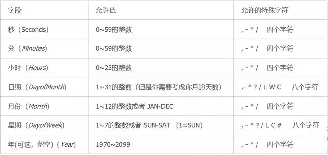
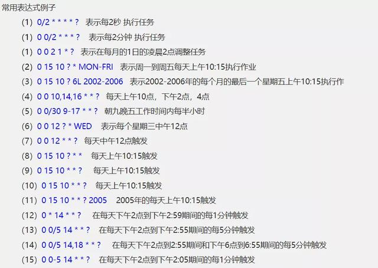

# 一、Timer

`Timer` 是JAVA自带的定时任务类，实现如下： 

```java
public static void main(String[] args){
    // 定义一个任务
    TimerTask timerTask = new TimerTask() {
        @Override
        public void run() {
            System.out.println("打印当前时间：" + new Date());
        }
    };
    // 计时器
    Timer timer = new Timer();
    // 开始执行任务 (延迟1000毫秒执行，每3000毫秒执行一次)
    timer.schedule(timerTask, 1000, 3000);
}
```

`Timer` 优缺点分析：

- 优点：使用简单；
- 缺点：当执行多个定时任务时，前面任务的执行用时和异常将影响到后面的任务，因此不建议使用。


# 二、**ScheduledExecutorService**

`ScheduledExecutorService` 也是java自带的类，如果你对线程池有了解就会发现，它其实就是支持定时任务执行的线程池`ScheduledThreadPool` 。该线程池不仅可以实现`Timer` 的所有功能，还解决 `Timer` 存在的问题：

```java
public static void main(String[] args){
    // 这里采用 ThreadFactoryBuilder 创建自定义线程池
        ScheduledExecutorService scheduledExecutorService = new ScheduledThreadPoolExecutor(5,
                new ThreadFactoryBuilder().setNameFormat("example-schedule-pool-%d").setDaemon(true).build());
    // 执行任务，1s后开始执行，每3s执行一次
    scheduledExecutorService.scheduleAtFixedRate(() -> {
        System.out.println("打印当前时间：" + new Date());
    }, 1, 3, TimeUnit.SECONDS);  
}
```

`ScheduledExecutorService` 优缺点分析：

- 优点：使用简单，且解决了`Timer` 存在的问题，能适用于大部分场景；
- 缺点：只适用于单机环境，无法应用于分布式场景。


# 三、Spring Task

Spring 框架自带的定时任务， **使用上面两种方式，很难实现某些特定需求，比如每周一执行某任务**，但SpringTask可轻松实现。 接下来以 `SpringBoot` 举例。

## 1. 开启定时任务

 在 `SpringBoot` 的启动类上声明 `@EnableScheduling`：

```java
@EnableScheduling
public class ApplicationBoot {

    public static void main(String[] args) {
        SpringApplication.run(ApplicationBoot.class, args);
    }
}
```

## 2. 添加定时任务

使用 `@Scheduled` 注解配合 `cron` 表达式实现：

```java
@Component
public class TaskUtils {    
    // 添加定时任务    
    @Scheduled(cron = "30 40 23 0 0 5") // cron表达式：每周四 23:40:30 执行 
    public void doTask(){        
        System.out.println("周四定时任务执行...");    
    }
}
```

注解生效依赖于 `Spring容器` ，随 `Springboot` 启动后自动加载并执行定时任务。

## 3. Cron 表达式

 `cron` 表达式是由 6 位或者 7 位组成的(最后一位可以省略)，每位之间以空格分隔，每位从左到右代表的含义如下： 

  

 其中 * 和 ? 号都表示匹配所有的时间，以下为一些常用示例：

  

> `cron` 表达式在线生成： https://cron.qqe2.com/ 


# 四、分布式环境下的定时任务

待补充。