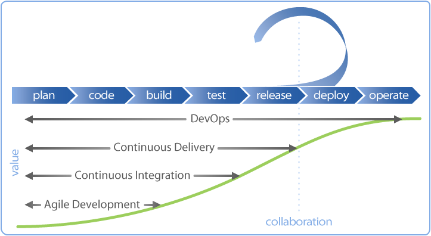
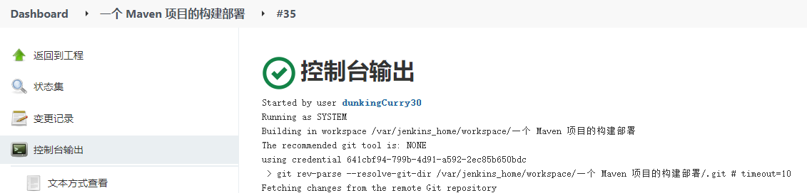

# 一、什么是 CI / CD

互联网软件的开发和发布，已经形成了一套标准流程，假如把开发工作流程分为以下几个阶段：

`编码` → `构建` → `集成` → `测试` → `交付` → `部署`

  

如上图所示， `敏捷开发(Agile Development)`、`持续集成(Continuous Integration)`、`持续交付(Continuous Delivery)`和`持续部署(Continuous Deployment)`有着不同的软件自动化交付周期。 

## 持续集成 CI

` 持续集成` 指的是，频繁地（一天多次）将代码集成到主干。将软件个人研发的部分向软件整体部分交付，频繁进行集成以便更快地发现其中的错误。 

它的好处主要有：

-   快速发现错误。每完成一点更新，就集成到主干，可以快速发现错误，定位错误也比较容易 ；
-  防止分支大幅偏离主干。如果不是经常集成，主干又在不断更新，会导致以后集成的难度变大，甚至难以集成。 

持续集成并不能消除Bug，而是让它们非常容易发现和改正。持续集成的目表是**快速确保开发人员新提交的变更是好的，并且适合在代码库中进一步使用**。它的核心措施是，**代码集成到主干之前，必须通过编译和自动化测试流的验证**。

## 持续交付 CD

`持续交付`（CD）实际上是 CI 的扩展，其中软件交付流程进一步自动化，以便随时轻松地部署到生成环境中。 成熟的持续交付方案也展示了一个始终可部署的代码库。使用 CD 后，软件发布将成为一个没有任何紧张感的例行事件。 开发团队可以在日常开发的任何时间进行产品级的发布，而不需要详细的发布方案或者特殊的后期测试。 

## 持续部署 CD

`持续部署` 扩展了持续交付，以便软件构建在通过所有测试时自动部署。在这样的流程中， 不需要人为决定何时及如何投入生产环境。CI/CD 系统的最后一步将构建后的制品包通过流水线自动部署。 此类自动部署可以配置为快速向客户分发组件、功能模块或修复补丁，并准确说明当前提供的内容。采用持续部署的组织可以将新功能快速传递给用户，得到用户对于新版本的快速反馈，并且可以迅速处理任何明显的缺陷。 用户对无用或者误解需求的功能的快速反馈有助于团队规划投入，避免将精力集中于不容易产生回报的地方。 

> CI/CD 扩展： [什么是 DevOps](https://blog.z0ukun.com/?p=2935) 


# 二、Jenkins 

## 1. Jenkins 概述

> 官方文档： https://jenkins.io/doc/ 

Jenkins是一个开源的、可扩展的持续集成、交付、部署（软件/代码的编译、打包、部署）的基于web界面的平台。允许`持续集成`和`持续交付`项目，无论用的是什么平台，可以处理任何类型的构建或持续集成。 

Jenkins 特性：

- 开源的`java` 语言开发持续集成工具，支持`CI`，`CD`；

- 易于安装部署配置：可通过yum安装,或下载war包以及通过**docker容器**等快速实现安装部署，可方便web界面配置管理；

- 消息通知及测试报告：集成`RSS/E-mail`通过`RSS`发布构建结果或当构建完成时通过e-mail通知，生成`JUnit/TestNG`测试报告；

- 分布式构建：支持Jenkins能够让多台计算机一起构建/测试；

- 文件识别：Jenkins能够跟踪哪次构建生成哪些jar，哪次构建使用哪个版本的jar等； 

- 丰富的插件支持：支持扩展插件，你可以开发适合自己团队使用的工具，如`git`，`svn`，`maven`，`docker` 等。

## 2. Jenkins 安装

参考 [Jenkins安装配置](/2022/07/04/Jenkins安装配置及实现CI)


## 3. 构建部署 Maven 项目

 主要分为`准备` 和 `构建部署`两个部分。

### 3.1 配置准备

- 为了实现maven项目的构建需要先配置`gitlab`、`jdk`和`maven`，具体步骤如下：

1. `系统管理 — 全局工具配置`，进入配置页面 ；
2. 配置`jdk`，输入`jenkins` 所在机器的 `jdk` 的位置，即`JAVA_HOME` ；
   
3. 配置`maven`，自动安装一个maven；
   
4. 配置`gitlab`，参考 [Jenkins配置Gitlab]( [Jenkins中使用GitLab的配置 - 星瑞 - 博客园 (cnblogs.com)](https://www.cnblogs.com/gongxr/p/9257434.html) ) 。

- 为了部署，需要配置远程的server：

1. 首先，安装一个插件：Publish over SSH，`系统管理 — 插件管理 — 可选插件`，搜索安装即可；

2. 然后，配置一个远程server，`系统管理 — 系统设置 - Publish over SSH`
   
     - 首先使用以下命令生成一对公私钥（Jenkins不支持openssh高版本秘钥）；
     
     ```bash
      ssh-keygen -m PEM -t rsa -b 4096
     ```
     
     - 将公钥`id_rsa.pub` 的值拷贝到需要链接的目标server目录文件下：
     ```bash
      vim ~/.ssh/authorized_keys
     ```
     
3. 可以将私钥`id_rsa`的路径填在`Path to key`里面，也可以把私钥文件里面的内容拷贝到`Key`里面；
   
4. 最后，配置远程server，注意这里的`username` 需要为拷贝公钥时登录服务器的用户，点击`Test Configuration` ，左下角出现 `success` 字样（如下图），表示配置成功。


### 3.2 创建 Job 进行构建部署

1. `新建任务-构建一个自由风格的软件项目`， 配置旧的构建的删除策略；

 

2.  配置代码源，这里使用 `Git` 管理（若为 `gitlab` 项目，配置`gitlab`，参考 [Jenkins配置Gitlab]( [Jenkins中使用GitLab的配置 - 星瑞 - 博客园 (cnblogs.com)](https://www.cnblogs.com/gongxr/p/9257434.html) ) ）；

 

3.  `Maven` 打包；

 

4. 在server对应目录编写启动脚本`start.sh`：

```bash
#!/bin/bash

export JAVA_HOME=/usr/local/java
export PATH=$PATH:/usr/local/java/bin

echo $JAVA_HOME

#先将已经运行的本项目进程结束，避免重复运行造成端口冲突
pid=`ps -aux|grep SpringbootDemo-0.0.1-SNAPSHOT.jar | awk '{print $2}'`
if [ -n "$pid" ]
then
   kill -9 $pid
fi

cd /opt/jar
#运行启动本项目，BUILD_ID=dontKillMe命令避免后台运行jar包不生效
BUILD_ID=dontKillMe nohup java -jar SpringbootDemo-0.0.1-SNAPSHOT.jar >> systemOut.log 2>&1 &
```

5. 将打好的`jar`包推到之前配置的server上面，配置如下：


- `Source files` ：以工作空间为根目录，填写工作空间中`target`下`jar` 包的位置


- `Remote directory` ：指定`jar` 上传的server目录
- `Exec command` ：构建后的需要执行的操作，这里需要启动jar包

6. 回到任务面板，点击 `立即构建` 后，查看控制台输出：



7. 控制台输出显示成功后，登录server查看jar包启动成功：


至此，收工！