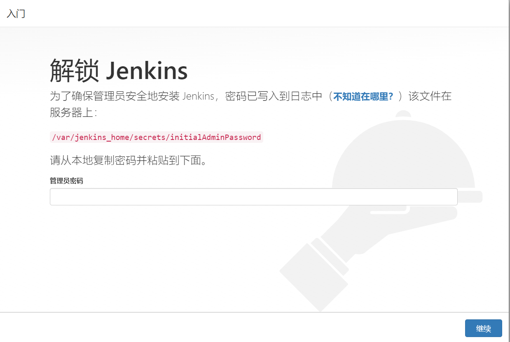
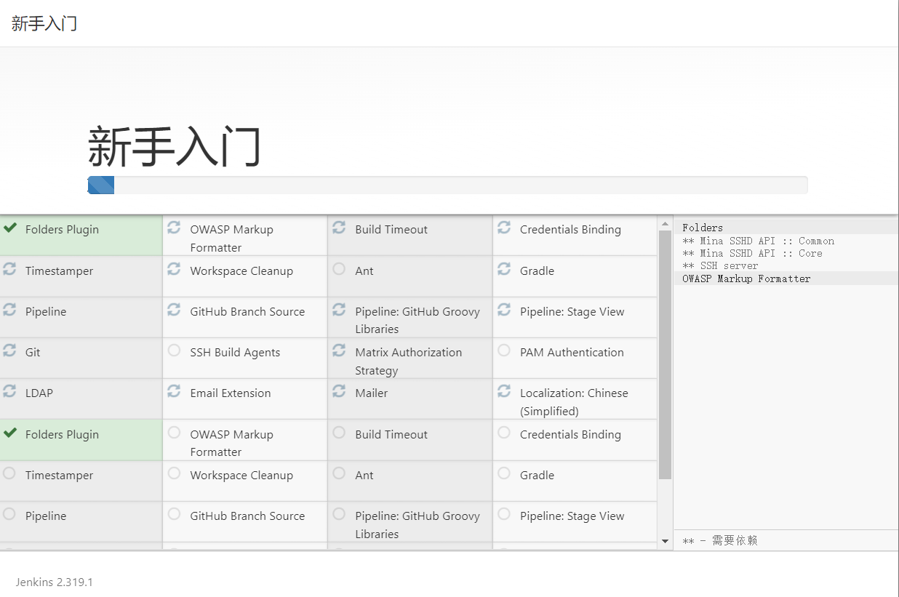
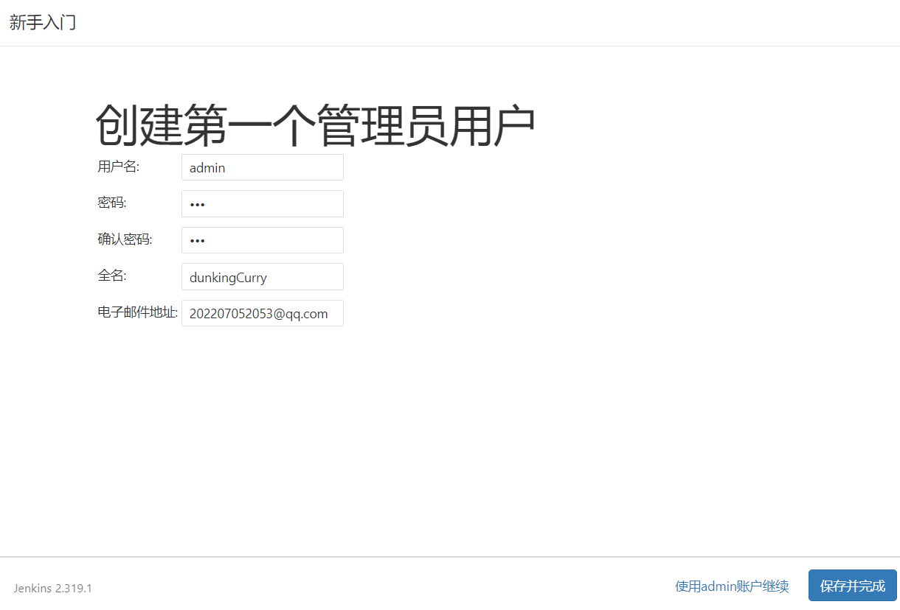
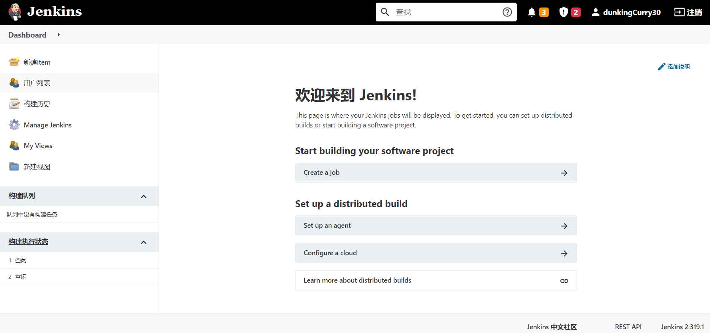

# Jenkins安装配置

> 2023/7/3 更新
>
> - jenkins最新版本由于其他影响大部分插件无法安装，可下列参考 ：
> -  [ docker环境下安装最新版本jenkins](https://blog.csdn.net/xiezuozhen/article/details/129329626?ops_request_misc=%7B%22request%5Fid%22%3A%22168820093716800213062283%22%2C%22scm%22%3A%2220140713.130102334.pc%5Fall.%22%7D&request_id=168820093716800213062283&biz_id=0&utm_medium=distribute.pc_search_result.none-task-blog-2~all~first_rank_ecpm_v1~times_rank-1-129329626-null-null.142^v88^koosearch_v1,239^v2^insert_chatgpt&utm_term=docker jenkins安装&spm=1018.2226.3001.4187) 
>


## 1. docker-compose 启动 Jenkins

创建 `jenkins` 目录，在目录下编辑 `docker-compose.yml` 

```bash
mkdir -p /opt/docker/jenkins && cd /opt/docker/jenkins
#创建data目录并赋权，不然会启动失败
mkdir data && chmod 777 data
#创建docker-compose配置
vim docker-compose.yml
```

内容如下

```yaml
version: '3'
services:
    jenkins:
        image: jenkinsci/blueocean  #jenkins镜像
        container_name: jenkins  #容器名
        restart: always
        environment:
            JAVA_OPTS : "-server -Xms1024m -Xmx1024m -XX:PermSize=256m -XX:MaxPermSize=512m"
        ports:
            - '8998:8080'  #发布端口
            - '50000:50000'  #基于 JNLP 的 Jenkins 代理通过 TCP 端口 50000 与 Jenkins master 进行通信
        volumes:
                - ./data:/var/jenkins_home  #工作目录挂载到外部服务器
```

执行命令启动 `jenkins` 容器

```bash
docker-compose up -d jenkins
```


## 2. Jenkins 安装

通过 `ip:端口` 访问web端进行安装



查看日志获取初始密码

```bash
cat /opt/docker/jenkins/data/secrets/initialAdminPassword 
```

选择推荐插件，等待安装完成



创建一个新的管理员账户



安装成功

