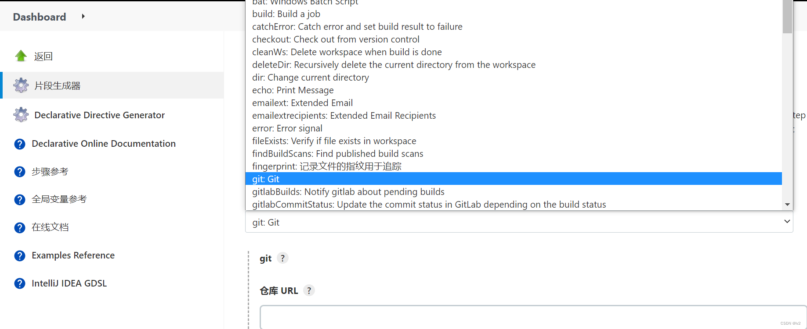

# 一、Pipeline 介绍

`jenkins 2.x` 开始流行`pipeline`（`groovy`语言编写）的写法，目的是通过以代码的方式来进行`job`的构建，减少人工操作导致的人为出错。它是用于描述整条流水线是如何进行，流水线的内容一般包括执行编译、打包、测试、部署及告警通知等步骤。

 

# 二、Pipeline 语法

## 1. 声明式 Pipeline

完整`pipeline`流水线，由以下5部分组成，缺一不可，否则`jenkins`会报错

```groovy
pipeline {
    agent { docker 'maven:3.3.3' }
    stages {
        stage('build') {
            steps {
                sh 'mvn --version'
            }
        }
    }
}
```

- `pipeline`: 代表整条流水线，包含整条流水线的逻辑；
- `agent` : 
  - `any`：任意可用的执行器）；
  - `none`：每个`stage`需指定相应的`agent`；
  - `node`：指定节点；
  - `docker`：指定容器；
- `stages`：整个流水线的所有执行阶段，里面包含多个`stage`；
- `stage`：流水线中的某个阶段，如拉取代码，编译构建，部署等阶段；
- `steps`：代表阶段内需要执行的命令，如shell命令等。

 除以上5个必要组成部分，还可以自定义选择以下配置：

-  `字符串变量`：通过 `def var=1` 定义，可以在 `pipeline` 中使用 `$var` 引用；
- `environment`：配置环境变量，可用于`step`中 ；
- `options`： 允许执行`pipeline`内置的专用选项，也可以使用由插件提供的，如`timeout`，`retry，timestamps`等 ；
- `parameters`：参数列表，如字符参数、布尔参数等；
- `trigger`：定义了触发`pipeline`的方式；
- `tools`：支持`maven`、`jdk`、`gradle`，需在`jenkins`全局配置中已经定义好
- `when`：代码逻辑；
- `script`：流控制，如`if`/`else`；
-  `post`：有`always`，`unstable`，`success`，`failure`，和 `changed`等多种情况，常用于构建完成或失败时的通知告警；

`Jenkins` 支持对声明式 `pipeline` 的语法正确性校验，且支持某个`stage`执行失败后通过修复错误可直接回到此stage步骤重新开始执行。

## 2. 代码生成工具

 部分脚本语法可以使用`jenkins`中的`Pipeline Syntax`来生成 ，例如拉取代码操作， 通过代码生成器，可以快速生成需要的`pipeline`代码段： 

  

配置好版本库信息后，点击 “生成流水线脚本”，得到 `pipeline` 代码如下：

```bash
git branch: 'release', credentialsId: 'xxxx-xxx-xxxx', url: 'http://123.1.2.3/DunkingCurry30/SpringbootDemo.git'
```


# 三、Pipeline 的实际运用

通常来说，一条完整`CI`流水线基本包含代码拉取、编译构建、代码测试及部署，以及部署成功/失败后的通知推送：

  

接下来，我们用 `pipeline` 来实现这个流程。