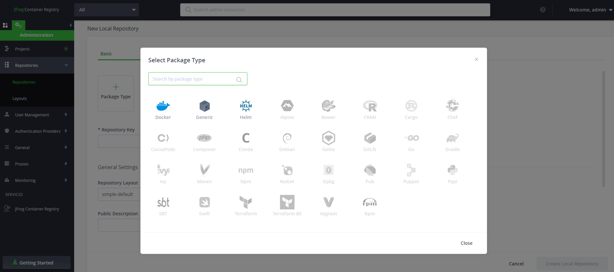
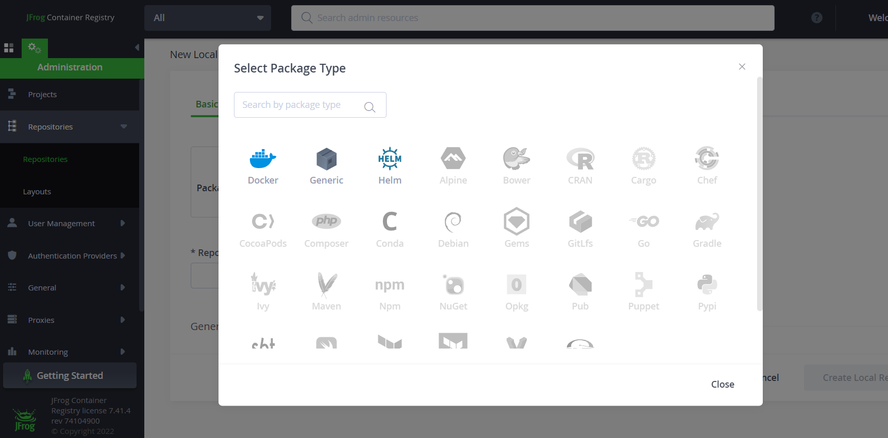
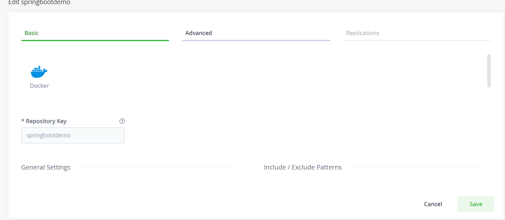
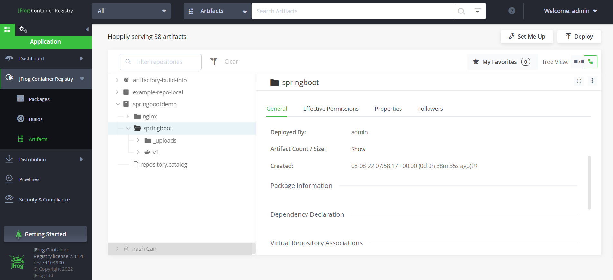

> JFrog 官方安装文档：  [Installing Artifactory - JFrog Documentation](https://www.jfrog.com/confluence/display/JFROG/Installing+Artifactory#InstallingArtifactory-DockerComposeInstallation) 

# 一、JFrog Artifactory

## 1. docker-compose 启动 JFrog Artifactory

```bash
mkdir -p /opt/docker/jfrog/artifactory && cd /opt/docker/jfrog/artifactory
#创建data目录并赋权，不然会启动失败
mkdir data && chmod 777 data
#创建docker-compose配置
vim docker-compose.yml
```

 内容如下 ：

```yaml
version: '3'
services:
    jfrog-oss:
        image: docker.jfrog.io/jfrog/artifactory-oss #社区版，下载较慢
        container_name: jfrog-oss  #容器名
        restart: always
        ports:
        	- '8661:8081'  # Rest Api端口，用作上传拉取制品包
        	- '8662:8082'  # web访问端口，必须开放，否自报错404
        volumes:
        	- ./data:/var/opt/jfrog/artifactory  #工作目录挂载到外部服务器
```

执行命令启动 `jfrog-oss` 容器

```bash
docker-compose up -d jfrog-oss
```


## 2. Artifactory 的使用

通过 ` http://SERVER_ HOSTNAME:8662/ui/` 访问web端，输入默认用户名密码 `admin/password` ：


登录成功后修改管理员密码，即可正常使用。


# 二、JFrog Container Registry

因为目前 `Artifactory` 社区版仅支持`Maven`等五类仓库，暂时不支持 `Docker` ，因此需要安装 JCR（JFrog Container Registry）作为 `Docker` 镜像仓库。

## 1. docker-compose 启动 JCR

```bash
mkdir -p /opt/docker/jfrog/jcr && cd /opt/docker/jfrog/jcr
#创建data目录并赋权，不然会启动失败
mkdir data && chmod 777 data
#创建docker-compose配置
vim docker-compose.yml
```

内容如下 ：

```yaml
version: '3'
services:
    jfrog-jcr:
        image: docker.bintray.io/jfrog/artifactory-jcr:latest 
        container_name: jfrog-jcr  #容器名
        restart: always
        ports:
        	- '8771:8081'  # Rest Api端口，用作上传拉取制品包
        	- '8772:8082'  # web访问端口，必须开放
        volumes:
        	- ./data:/var/opt/jfrog/artifactory  #工作目录挂载到外部服务器
```

执行命令启动 `jfrog-jcr` 容器

```bash
docker-compose up -d jfrog-jcr
```

## 2. JCR 的使用

通过 ` http://SERVER_ HOSTIP:8772/ui/` 访问web端，输入默认用户名密码 `admin/password` ，登陆成功后即可创建 `Docker` 仓库：



## 3. docker 配置 JCR 为私有仓库

### 3.1 JCR 新建仓库

在 `Repositories` 下创建名为 `springbootdemo`的 `Docker`local 仓库：





### 3.2 配置私有仓库

在 `docker` 服务器上修改配置文件：

```bash
修改配置文件
vim /etc/docker/daemon.json
```

添加 JCR 仓库地址：

```json
{
"insecure-registries":["SERVER_ HOSTIP:8771"],
"registry-mirrors": ["https://27vm8t5e.mirror.aliyuncs.com"]
}
```

添加完成后重启`docker` 使配置生效：

```bash
systemctl restart docker
```

### 3.3 上传和拉取镜像

上传和拉取镜像前，需要登录私有仓库：

```bash
docker login -u 用户名 -p 密码 SERVER_ HOSTIP:8771
```

#### 上传镜像

成功登录后，打包上传镜像，这里要上传的镜像是`springboot:v1` ，注意以下命令中的`springbootdemo` 就是我们创建的仓库名：

```bash
# 标记镜像并归入私有仓库
docker tag springboot:v1 SERVER_ HOSTIP:8771/springbootdemo/springboot:v1
# 上传至私有仓库
docker push SERVER_ HOSTIP:8771/springbootdemo/springboot:v1
```

上传成功后，在 `JCR` Web端查看：



#### 拉取镜像

使用以下命令拉取仓库中的镜像即可：

```bash
docker pull SERVER_ HOSTIP:8771/springbootdemo/springboot:v1
```

