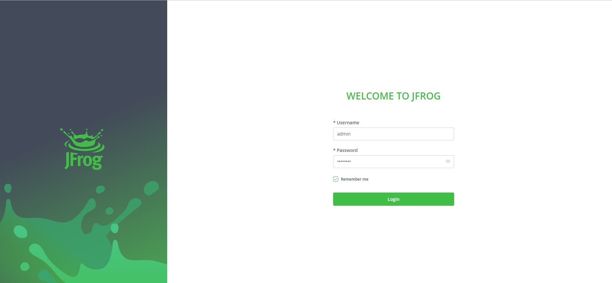

> JFrog 官方安装文档：  [Installing Artifactory - JFrog Documentation](https://www.jfrog.com/confluence/display/JFROG/Installing+Artifactory#InstallingArtifactory-DockerComposeInstallation) 

# 一、docker-compose 启动 JFrog Artifactory

```bash
mkdir -p /opt/docker/jfrog && cd /opt/docker/jfrog
#创建data目录并赋权，不然会启动失败
mkdir data && chmod 777 data
#创建docker-compose配置
vim docker-compose.yml
```

 内容如下 ：

```yaml
version: '3'
services:
    jfrog-oss:
        image: docker.jfrog.io/jfrog/artifactory-oss #社区版，下载较慢，考虑科学上网
        container_name: jfrog-oss  #容器名
        restart: always
        ports:
        	- '8081:8081'  # Rest Api端口，用作上传拉取制品包
        	- '8082:8082'  # web访问端口，必须开放
        volumes:
        	- ./data:/var/opt/jfrog/artifactory  #工作目录挂载到外部服务器
```

执行命令启动 `jenkins` 容器

```bash
docker-compose up -d jfrog-oss
```


# 二、Artifactory 的使用

通过 ` http://SERVER_ HOSTNAME:8082/ui/` 访问web端，输入默认用户名密码 `admin/password` ：



登录成功后修改管理员密码，即可正常使用。