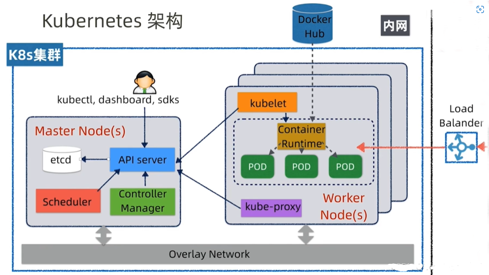
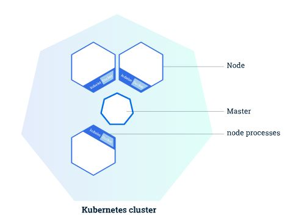
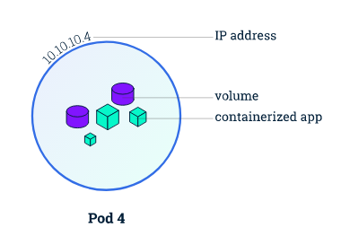
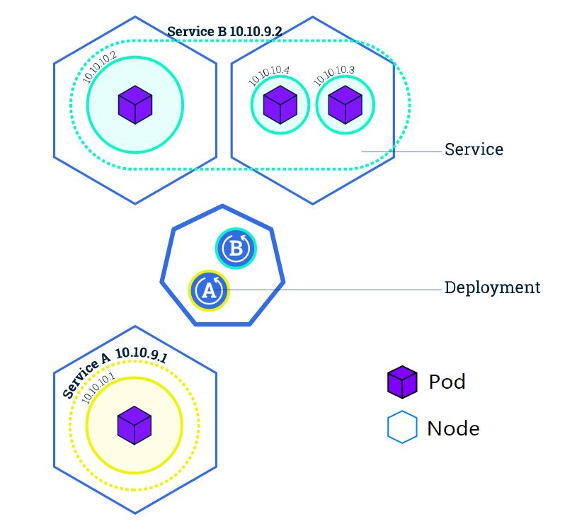

# 一、Kubernetes 简介

`Kubernetes` 简称 `k8s`，是支持云原生部署的一个平台，起源于谷歌。谷歌早在十几年之前就对其应用，通过容器方式进行部署。 

`k8s` 本质上就是用来简化微服务的开发和部署的，关注点包括**自动修复**和**自动伸缩**、**调度和发布**、调用链监控、配置管理、Metrics 监控、日志监控、弹性和容错、API 管理、服务安全等，`k8s` 将这些微服务的公共关注点以组件形式封装打包到 `k8s` 这个大平台中，让开发人员在开发微服务时专注于业务逻辑的实现，而不需要去特别关系微服务底层的这些公共关注点，大大简化了微服务应用的开发和部署，提高了开发效率。

# 二、Kubernetes 架构

 `k8s` 总体架构采用了经典的 `master slave` 架构模式，分 `master`节点和 `worker` 节点，节点可以是虚拟机也可以是物理机。 

 `master` 节点由以下组件组成：

- **etcd**：一种的分布式存储机制，底层采用 `Raft` 协议，`k8s` 集群的状态数据包括配置、节点等都存储于 `etcd` 中，它保存了整个集群的状态；
- **API server**：对外提供操作和获取 `k8s` 集群资源的的 API，是唯一操作 `etcd` 的组件，其他的组件包括管理员操作都是通过 `API server` 进行交互的，可以将它理解成 etcd 的 “代理人”；
- **Scheduler**：在 `k8s` 集群中做调动决策，负责资源的调度，按照预定的调度策略将 `Pod` 调度到相应的机器上；
- **Controller Manager**：相当于集群状态的协调者，观察着集群的实际状态，与 `etcd` 中的预期状态进行对比，如果不一致则对资源进行协调操作让实际状态和预期状态达到最终的一致，维护集群的状态，比如故障检测、自动扩展、滚动更新等。

 `worker` 节点由以下组件组成： 

- **Controller Runtime**：下载镜像和运行容器的组件，负责镜像管理以及 `Pod` 和容器的真正运行[CRI]( [Kubernetes(k8s)CRI(容器运行时)简介_飞翔的乌龟的博客-CSDN博客_k8s 容器运行时](https://blog.csdn.net/u013533380/article/details/115682900) )；
- **Pod**：`k8s` 中特有的一个概念，可以理解为对容器的包装，是 `k8s` 的基本调度单位，实际的容器时运行在 `Pod` 中的，一个节点可以启动一个或多个 `Pod`；
- **kubelet**：负责管理 `worker` 节点上的组件，与 `master` 节点上的 `API server` 节点进行交互，接受指令执行操作；
- **kube-proxy**：负责对 `Pod` 进行寻址和负载均衡。

用户操作 `k8s` 集群一般是通过 `kubectl` 命令行工具或者 `dashboard`；`Pod` 之间进行通讯是通过集群内部的覆盖网络 `Overlay Network`，外部流量想要进入集群访问 `Pod` 则是通过负载均衡 `Load Balander` 设备进行。

# 三、Kunbernetes 有哪些核心概念？

## 1. 集群 Cluster

 集群有多个节点组成且可以按需添加节点（物理机/虚拟机），每一个节点都包含一定数量的 CPU 和内存 RAM。 

  

## 2. 容器 Container

`k8s` 本身是一个容器调度平台，**从宿主机操作系统来看，容器就是一个一个的进程。从容器内部来看容器就是一个操作系统**，它有着自己的网络、CPU、文件系统等资源。 

## 3. POD

`k8s` 也不是直接调度容器的，而是将其封装成了一个个 `POD`。**`POD` 才是 `k8s` 的基本调度单位**。**每个 `POD` 中可以运行一个或多个容器，共享 `POD` 的文件系统、IP 和网络等资源，每一个 `POD` 只有一个 IP**。 

那么有人会问，为什么要使用`POD`，为什么不能直接使用容器呢？ 

使用`POD`，相当于一个逻辑主机 ，`POD`的存在主要是让几个紧密连接的几个容器之间共享资源，例如IP地址，共享存储等信息。 例如你运行一个程序，其中使用了`nginx`、`mysql`，那么可以将这两个容器运行在同一个`POD`中，对他们提供统一的调配能力。如果直接调度容器的话，那么几个容器可能运行在不同的主机上，这样就增加了系统的复杂性。 

  

## 4. 副本集 ReplicaSet

一个应用发布时会发布多个 `POD` 实例，副本集可对应一个应用的一组 `POD`，它可以通过模板来规范某个应用的容器镜像、端口，副本数量等。运行时副本集会监控和维护 `POD`的数量，数量过多则会下线 `POD`，过少则启动 `POD`，即扩容与缩容。 

## 5. 服务 service

一方面，`POD` 在 `k8s` 中是不固定的，可能会挂起或者重启，且挂起重启都是不可预期的，那么这就会导致服务的 IP 也随着不停的变化，给用户的寻址造成一定的困难。

另一方面，在集群当中，创建的 IP 地址等资源，只有在同一个集群中才能访问，每个`POD` 也有独一的 IP 地址，当有多个 `POD`  提供相同的服务的时候，就需要有负载均衡的能力 。

`service` 就是用来解决这些问题的，**它屏蔽了应用的 IP 寻址和负载均衡，消费方可直接通过服务名来访问目标服务，寻址和负载均衡均由 `service` 底层进行**。

## 6. 发布 Deployment

副本集就是一种基本的发布机制，可以实现基本的或者高级的应用发布，但操作较为繁琐。为了简化这些操作，`k8s` 引入了 `Deployment` 来管理 `ReplicaSet`，实现一些高级发布机制。 

  

## 7. ConfigMap/Secret

微服务在上线时需要设置一些可变配置，环境不同则配置值不同，有些配置如数据库的连接字符串在启动时就应该配好，有些配置则可以在运行中动态调整。为了实现针对不同环境灵活实现动态配置，微服务就需要 `ConfigMap` 的支持。 

`k8s` 平台内置支持微服务的配置 `ConfigMap`，开发人员将配置填写在 `ConfigMap` 中，`k8s` 再 将 `ConfigMap` 中的配置以环境变量的形式注入 `POD`，这样 `POD` 中的应用就可以访问这些配置。 

`Secret` 是一种特殊的 `ConfigMap`，提供更加安全的存储和访问配置机制。

## 8. DaemonSet

在微服务中，每个节点需要配置一个常驻守护进程。`DaemonSet` 可支持在每一个 worker 节点上面配置一个守护进程 `POD` 并且保证每一个节点上有且仅有一个 `POD`。 

> 扩展阅读：[为什么要使用 k8s ？](https://blog.csdn.net/TM6zNf87MDG7Bo/article/details/79621510?ops_request_misc=%7B%22request%5Fid%22%3A%22166011313016782184685132%22%2C%22scm%22%3A%2220140713.130102334..%22%7D&request_id=166011313016782184685132&biz_id=0&utm_medium=distribute.pc_search_result.none-task-blog-2~all~top_positive~default-3-79621510-null-null.142^v40^pc_rank_34_2,185^v2^control&utm_term=k8s&spm=1018.2226.3001.4187) 