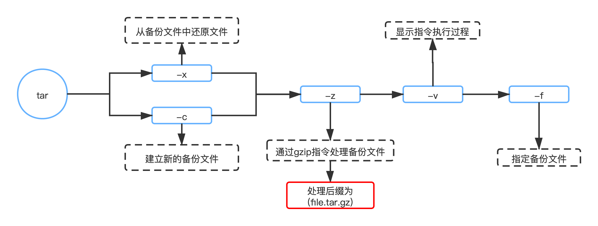

# 一、常用快捷键


## [ Tab ] 

自动补全，只需要输入一个命令，文件名，目录名甚至是命令选项的开头，并敲击 tab 键。它将自动完成你输入的内容，或为你显示全部可能的结果。


## [ Ctrl + C ]

立刻终止正在运行的程序或进程


## [ Ctrl + Z ]

让程序在后台运行


## [ Ctrl + A ]

移动光标至所在行的行首


## [ Ctrl + E ]

移动光标至所在行的行尾


## [ Ctrl + U ]

删除当前光标至行首的全部内容


## [ Ctrl + K ]

删除当前光标至行尾的全部内容


## [ Ctrl + Y ]

粘贴恢复之前删除的单词


## [ Ctrl + W ]

删除光标前的第一个单词


## [ Ctrl + P ] 或 [ ↑ ]

查看上一个命令


## [ Ctrl + N ] 或 [ ↓ ]

查看下一个命令


## [ Ctrl+左右键 ]

在单词之间跳转


# 二、Linux 常用命令


## Linux 系统目录

```bash
├── bin -> usr/bin # 用于存放二进制命令
├── boot # 内核及引导系统程序所在的目录
├── dev # 所有设备文件的目录（如磁盘、光驱等）
├── etc # 配置文件默认路径、服务启动命令存放目录
├── home # 用户家目录，root用户为/root
├── lib -> usr/lib # 32位库文件存放目录
├── lib64 -> usr/lib64 # 64位库文件存放目录
├── media # 媒体文件存放目录
├── mnt # 临时挂载设备目录
├── opt # 自定义软件安装存放目录
├── proc # 进程及内核信息存放目录
├── root # Root用户家目录
├── run # 系统运行时产生临时文件，存放目录
├── sbin -> usr/sbin # 系统管理命令存放目录
├── srv # 服务启动之后需要访问的数据目录
├── sys # 系统使用目录
├── tmp # 临时文件目录
├── usr # 系统命令和帮助文件目录
└── var # 存放内容易变的文件的目录
```


## 1. 目录操作

```bash
pwd				查看当前工作目录
clear 			清除屏幕
cd ~			当前用户目录
cd /			根目录
cd -			上一次访问的目录
cd .            当前目录
cd ..			上一级目录
ll				查看当前目录下内容（LL的小写）
```

#### 创建目录

```bash
mkdir aaa		在当前目录下创建aaa目录，相对路径；
mkdir ./bbb		在当前目录下创建bbb目录，相对路径；
mkdir /ccc		在根目录下创建ccc目录，绝对路径；
mkdir -p temp/nginx  递归创建目录
```

#### 搜索命令

```bash
find / -name 'b*'		查询根目录下（包括子目录），名以b开头的目录和文件； 
```

#### 剪切命令

```bash
mv	/aaa /bbb		    将根目录下的aaa目录，移动到根目录下的bbb目录下(假如没有bbb目录，则重命名为bbb)；
mv	bbbb usr/bbb		将当前目录下的bbbb目录，移动到usr目录下，并且修改名称为bbb；
```

#### 复制目录

```bash
cp -r /aaa /bbb			将/目录下的aaa目录复制到/bbb目录下，在/bbb目录下的名称为aaa
cp -r /aa /bbb/aaa		将/目录下的aa目录复制到/bbb目录下，且修改名为aaa;
```

#### 删除目录

```bash
rm -r /bbb			普通删除。会询问你是否删除每一个文件
rmdir test01		目录的删除
rm -rf /bbb			强制删除/目录下的bbb目录。如果bbb目录中还有子目录，也会被强制删除，不会提示；
```

#### 查看树状目录

```bash
tree -L 1			以树状形式查看当前目录下的一级目录
```

#### 批量操作

```bash
mkdir {dirA,dirB}          批量创建测试目录
touch dirA/{A1,A2,A3}      dirA创建三个文件dirA/A1,dirA/A2,dirA/A3
```


## 2. 文件操作


#### 创建文件

```bash
touch testFile
```

#### 删除文件

```bash
rm -r a.java		删除当前目录下的a.java文件（每次回询问是否删除y：同意）
rm -rf a.java		强制删除当前目录下的a.java文件
rm -rf ./a*			强制删除当前目录下以a开头的所有文件；
rm -rf ./*			强制删除当前目录下所有文件（慎用）；
```

#### 分割文件

```bash
[root@VM-8-8-centos bbb]# split -b 10k system.log -d -a 3 system
[root@VM-8-8-centos bbb]# ls
system000  system001  system002  system003  system004  system005  system.log
```

以上命令将 `system.log` 文件分割成大小为 10KB 的小文件，每个小文件名以`system` 为前缀，3位数字位后缀，其中：

> -b：值为每一输出档案的大小，单位为 byte
> -C：每一输出档中，单行的最大 byte 数
> -d：使用数字作为后缀
> -l：值为每一输出档的行数大小
> -a：指定后缀长度(默认为2)


## 3. 文件内容操作

#### 修改文件内容

```bash
vim a.java   	进入一般模式
i(按键)   		进入插入模式(编辑模式)
ESC(按键)  		退出
:wq 			保存退出（shift+：调起输入框）
:q！			不保存退出（shift+：调起输入框）（内容有更改）(强制退出，不保留更改内容)
:q				不保存退出（shift+：调起输入框）（没有内容更改）
```

#### 文件内容查看

```bash
cat a.java		查看a.java文件的最后一页内容；
more a.java		从第一页开始查看a.java文件内容，按回车键一行一行进行查看，
                    按空格键一页一页进行查看，q退出；
less a.java		从第一页开始查看a.java文件内容，按回车键一行一行的看，
                    按空格键一页一页的看，支持使用PageDown和PageUp翻页，q退出；
```

#### 实时查看文件

```bash
head a.java				查看a.java文件的前10行内容；
tail -f a.java			查看a.java文件的后10行内容；
head -n 7 a.java		查看a.java文件的前7行内容；
tail -n 7 a.java		查看a.java文件的后7行内容；
```

#### 文件内部搜索指定内容

```bash
grep under 123.txt			在123.txt文件中搜索under字符串，大小写敏感，显示行；
grep -n under 123.txt		在123.txt文件中搜索under字符串，大小写敏感，显示行及行号；
grep -v under 123.txt		在123.txt文件中搜索under字符串，大小写敏感，显示没搜索到的行；
grep -i under 123.txt		在123.txt文件中搜索under字符串，忽略大小写，显示行；
grep -ni under 123.txt		在123.txt文件中搜索under字符串，忽略大小写，显示行及行号；
```

#### 替换文件内容

```bash
sed -i 's/Jack/me/g/' replace.java     全文将Jack替换为me(g是全部替换,不加只替换首个)
sed -i '/^ *$/d' replace.java          删除replace.java中的空格(d是删除)
sed -i '/Interger/d' replace.java      删除包含Interger的行(d是删除)
```

#### 管道操作符 [ | ]

可将指令连起来，前一个指令的输出作为后一个指令的输入

- 只处理前一个命令的正确输出，不处理错误输出
- 右边的命令必须能接受标准输入流，否则传递过程中数据将被丢弃

```bash
ps -ef | grep tomcat        查找tomcat进程信息
```


## 4. 系统日志位置

```bash
cat /etc/redhat-release		查看操作系统版本
/var/log/message			系统启动后的信息和错误日志，是Red Hat Linux中最常用的日志之一
/var/log/message			系统启动后的信息和错误日志，是Red Hat Linux中最常用的日志之一 
/var/log/secure				与安全相关的日志信息 
/var/log/maillog			与邮件相关的日志信息 
/var/log/cron				与定时任务相关的日志信息 
/var/log/spooler			与UUCP和news设备相关的日志信息 
/var/log/boot.log			守护进程启动和停止相关的日志消息 
```


## 5. 创建与删除软连接

#### 创建软连接

```bash
ln -s /usr/local/app /data  创建 /usr/local/app 目录与 /data 目录的软连接
```

#### 删除软连接

```bash
rm -rf /data                删除软连接, 最后不能加/, 加上表示删除文件夹
```


## 6. 压缩和解压缩

#### tar 命令

  

#### 压缩

```bash
tar -cvf start.tar a.java b.java		//将当前目录下a.java、b.java打包
tar -cvf start.tar ./*					//将当前目录下的所欲文件打包压缩成haha.tar文件

tar -zcvf start.tar.gz a.java b.java	//将当前目录下a.java、b.java打包
tar -zcvf start.tar.gz ./*				//将当前目录下的所欲文件打包压缩成start.tar.gz文件
```

#### 解压缩

```bash
tar -xvf start.tar						//解压start.tar压缩包，到当前文件夹下；
tar -xvf start.tar -C usr/local 		//（C为大写，中间无空格）
										//解压start.tar压缩包，到/usr/local目录下；

tar -zxvf start.tar.gz					//解压start.tar.gz压缩包，到当前文件夹下；
tar -zxvf start.tar.gz -C usr/local 	//（C为大写，中间无空格）
										//解压start.tar.gz压缩包，到/usr/local目录下；
```


## 7. Linux 下文件的详细信息

```bash
 R:Read  w:write  x: execute执行
-rw-r--r-- 1 root root  34942 Jan 19  2018 bootstrap.jar
首位代表文件类型：目录为 d, 文件为 - 
接下来：
- 前三位代表当前用户对文件权限：可以读/可以写/不能执行
- 中间三位代表当前组的其他用户对当前文件的操作权限：可以读/不能写/不能执行
- 后三位其他用户对当前文件权限：可以读/不能写/不能执行
```

