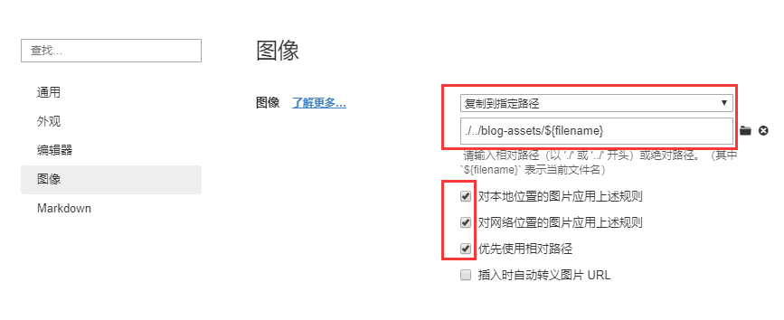

- 前置条件： `Typora` 编辑器

# Markdown 图片无法正常显示

> Q：**本地编辑markdown图片插入正常，`.md` 文件迁移后，图片无法显示** ？
>
> A：`Markdown` 默认插入图片为`绝对路径` ，使用相对路径插入，在`.md`文件迁移后将对应的图片目录一并打包进行迁移，图片显示正常

### Typora 插入图片设置相对路径

打开 Typora `文件—偏好设置—图像` 


按上图进行勾选，其中路径可以自定义设置相对路径，举例说明，现需在 `helloword.md` 中插入图片`1.jpg` ，相对路径设置为 ：

```bash
./${filename}
```

则`1.jpg` 会被复制到 `helloworld.md` 的同级目录的 `helloword` 文件夹下

- 文件迁移时，同时迁移 `helloworld.md` 及 `helloworld` 文件夹，切不改变目录层级结构时，图片显示正常
- 此方法对本地图片复制，或者网络链接图片，截图均可生效