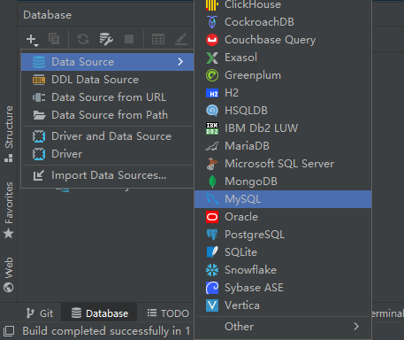
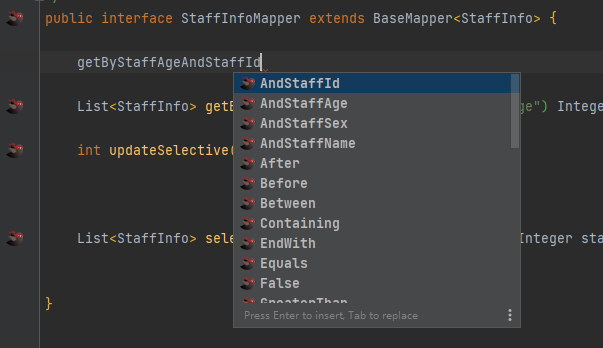
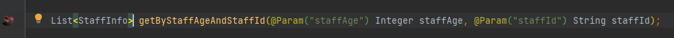

# 一、MybatisX 插件

 MyBatisX插件是[IDEA插件](https://so.csdn.net/so/search?q=IDEA插件&spm=1001.2101.3001.7020)，如果想要使用它，那么首先需要在IDEA中进行安装（Markplace搜索安装即可)。 


## 1、插件用途：接口与 mapper.xml 跳转

安装插件后，在mapper的接口文件中，会出现红色小鸟标识（如下图），点击即可跳转至对应 `mapper.xml` 文件的映射方法。


同样，在 `mapper.xml` 文件中也会出现蓝色小鸟标识（如下图），点击即可跳转至对应`mapper` 接口。


## 2、插件进阶用途I：代码快速生成

首先，需要在IDEA中配置对应的数据库链接：



找到需要生成代码的表名，右键选择 `Mybatis-X` 菜单，


接着按以下提示依次填写相应内容，即可在对应目录生成表所对应的 `mapper` 接口、`xml` 文件（`service` 部分建议去掉，实际开发用处不大）。


## 3、插件进阶用途II：CRUD快速生成

在代码生成的 `mapper` 接口中，不需要写返回值，只需要依据以下语法写方法名：

> select、query、get —— 查找
> update —— 更新
> delete —— 删除
> by 条件
> and 连接条件 



接着按下 `Alt` + `Enter` ，选择 `Generate Mybatis Sql` ，


即可生成对应方法，以及 `xml` 文件的语句。




## 4、插件进阶用途III：mybatis-plus 的使用

我们可以结合 `mybatis-plus` 进一步提高效率，在第二步代码生成的选项中，我们选择了 `Mybatis Plus 3` 以后，生成的 `mapper` 接口会继承 `BaseMapper` 接口，后续在 `service` 中就能直接调用 `mybatis-plus` 封装的方法，这其中包括了单表常见的增删改查，针对单表的操作基本可以告别编写 `xml` 配置。为此，我们还需要引入 `mybatis-plus` 的依赖，以使 `BaseMapper` 接口生效：

```xml
<!-- Mybatis-plus 依赖  -->
<dependency>
    <groupId>com.baomidou</groupId>
    <artifactId>mybatis-plus-boot-starter</artifactId>
    <version>3.5.1</version>
</dependency>
```

接下来，就可以在 `service` 中直接调用 `mapper` 封装的 CRUD 接口了。当然，在实际应用中仍然要结合具体情况，复杂单表操作仍建议使用 `xml` 配置，便于维护。


# 二、Mybatis Plus

> - 此处只大致介绍Mybatis Plus，详细应用请移步官方文档
> - Mybatis Plus 官方参考文档： [MyBatis-Plus (baomidou.com)](https://baomidou.com/) 

## 1. MP 实体类

使用注解将实体类 T entity与Mybatis Plus（下称MP）封装好的接口配合使用，这里以一个基础实体类 `BaseDO` 举例：

```java
@Data
@TableName("sys_user")
public class BaseDO implements Serializable {

    /**
     * 主键ID
     */
    @ApiModelProperty("主键ID")
    @TableId(value = "id", type = IdType.AUTO)
    private Long id;

    /**
     * 业务主键
     */
    @ApiModelProperty("业务主键")
    @TableField(value = "bid", fill = FieldFill.INSERT)
    private Long bid;

    /**
     * 创建时间
     */
    @ApiModelProperty("创建时间")
    @JsonFormat(pattern = "yyyy-MM-dd HH:mm:ss")
    @TableField(value = "create_at", fill = FieldFill.INSERT)
    private Date createAt;

    /**
     * 创建人
     */
    @ApiModelProperty("创建人")
    @TableField(value = "create_by", fill = FieldFill.INSERT)
    private String createBy;

    /**
     * 更新时间
     */
    @ApiModelProperty("更新时间")
    @JsonFormat(pattern = "yyyy-MM-dd HH:mm:ss")
    @TableField(value = "update_at", fill = FieldFill.INSERT_UPDATE)
    private Date updateAt;

    /**
     * 更新人
     */
    @ApiModelProperty("更新人")
    @TableField(value = "update_by", fill = FieldFill.INSERT_UPDATE)
    private String updateBy;

    /**
     * 逻辑删除 0-未删除 1-已删除
     */
    @ApiModelProperty("逻辑删除")
    @TableField(value = "deleted", fill = FieldFill.INSERT)
    @TableLogic(value = "0", delval = "1")
    private Integer deleted;
    
    @ApiModelProperty(hidden = true)
    @TableField(exist = false)
    private static final long serialVersionUID = 1L;
}
```

### @TableName

- 描述：表名注解，标识实体类对应的表
- 使用位置：实体类
- 多数据库需指定库名

### @TableId

- 描述：主键注解
- 使用位置：实体类主键字段

| 属性  | 类型   | 必须指定 | 默认值      | 描述         |
| :---- | :----- | :------- | :---------- | :----------- |
| value | String | 否       | ""          | 主键字段名   |
| type  | Enum   | 否       | IdType.NONE | 指定主键类型 |

#### IdType

| 值            | 描述                                                         |
| :------------ | :----------------------------------------------------------- |
| AUTO          | 数据库 ID 自增                                               |
| NONE          | 无状态，该类型为未设置主键类型（注解里等于跟随全局，全局里约等于 INPUT） |
| INPUT         | insert 前自行 set 主键值                                     |

### @TableField

- 描述：字段注解（非主键）

| 属性           | 类型    | 必须指定 | 默认值                | 描述                                                         |
| :------------- | :------ | :------- | :-------------------- | :----------------------------------------------------------- |
| value          | String  | 否       | ""                    | 数据库字段名                                                 |
| exist          | boolean | 否       | true                  | 是否为数据库表字段                                           |
| condition      | String  | 否       | ""                    | 字段 `where` 实体查询比较条件，有值设置则按设置的值为准，没有则为默认全局的 `%s=#{%s}`，[参考(opens new window)](https://github.com/baomidou/mybatis-plus/blob/3.0/mybatis-plus-annotation/src/main/java/com/baomidou/mybatisplus/annotation/SqlCondition.java) |                |
| fill           | Enum    | 否       | FieldFill.DEFAULT     | 字段自动填充策略                                             |

其中 `fill` 自动填充需配合 `MetaObjectHandler` 使用，可参考 [Mybatis Plus 提升CRUD效率（二）]()

### @TableLogic

- 描述：表字段逻辑处理注解（逻辑删除）

| 属性   | 类型   | 必须指定 | 默认值 | 描述         |
| :----- | :----- | :------- | :----- | :----------- |
| value  | String | 否       | ""     | 逻辑未删除值 |
| delval | String | 否       | ""     | 逻辑删除值   |

> **说明:**
>
> 只对自动注入的 sql 起效:
>
> - 插入: 不作限制
> - 查找: 追加 where 条件过滤掉已删除数据,如果使用 wrapper.entity 生成的 where 条件也会自动追加该字段
> - 更新: 追加 where 条件防止更新到已删除数据,如果使用 wrapper.entity 生成的 where 条件也会自动追加该字段
> - 删除: 转变为 更新

## 2. 单表查询CRUD

> 阅读本节需结合Mybatis-Plus 中 Wrapper 对象即条件构造器的官方文档  [条件构造器 | MyBatis-Plus ](https://baomidou.com/pages/10c804/#abstractwrapper?login=from_csdn) 

接上节可知，我们利用MybatisX插件可快速逆向生成单表的对象、service和mapper，其中都继承了MP的 `IService` 及 `BaseMapper`，里面封装对单表查询的常用方法，如此以来，简单CRUD我们无需在XML中编写SQL方式去实现，例如：

### Service CRUD 接口

> 说明:
>
> - 通用 Service CRUD 封装[IService](https://gitee.com/baomidou/mybatis-plus/blob/3.0/mybatis-plus-extension/src/main/java/com/baomidou/mybatisplus/extension/service/IService.java)接口，进一步封装 CRUD 采用 `get 查询单行` `remove 删除` `list 查询集合` `page 分页` 前缀命名方式区分 `Mapper` 层避免混淆，
> - 泛型 `T` 为任意实体对象
> - 建议如果存在自定义通用 Service 方法的可能，请创建自己的 `IBaseService` 继承 `Mybatis-Plus` 提供的基类
> - 对象 `Wrapper` 为 [条件构造器](https://baomidou.com/01.指南/02.核心功能/wrapper.html)

#### List

```java
// 查询所有
List<T> list();
// 查询列表
List<T> list(Wrapper<T> queryWrapper);
// 查询（根据ID 批量查询）
Collection<T> listByIds(Collection<? extends Serializable> idList);
// 查询（根据 columnMap 条件）
Collection<T> listByMap(Map<String, Object> columnMap);
```

#### Update

```java
// 根据 UpdateWrapper 条件，更新记录 需要设置sqlset
boolean update(Wrapper<T> updateWrapper);
// 根据 ID 选择修改
boolean updateById(T entity);
// 根据ID 批量更新
boolean updateBatchById(Collection<T> entityList);
// 根据ID 批量更新
boolean updateBatchById(Collection<T> entityList, int batchSize);
```

#### Save

```java
// 插入一条记录（选择字段，策略插入）
boolean save(T entity);
// 插入（批量），支持事务回滚
boolean saveBatch(Collection<T> entityList);
// 插入（批量），指定批量大小
boolean saveBatch(Collection<T> entityList, int batchSize);
```

### Mapper CRUD 接口

> 说明:
>
> - 通用 CRUD 封装[BaseMapper](https://gitee.com/baomidou/mybatis-plus/blob/3.0/mybatis-plus-core/src/main/java/com/baomidou/mybatisplus/core/mapper/BaseMapper.java)接口，为 `Mybatis-Plus` 启动时自动解析实体表关系映射转换为 `Mybatis` 内部对象注入容器
> - 泛型 `T` 为任意实体对象
> - 参数 `Serializable` 为任意类型主键 `Mybatis-Plus` 不推荐使用复合主键约定每一张表都有自己的唯一 `id` 主键
> - 对象 `Wrapper` 为 [条件构造器](https://baomidou.com/01.指南/02.核心功能/wrapper.html)
> - 事实上，`IService` 仍然是调用的`BaseMapper`中方法，只是进行了一些封装，如事务控制

### Insert

```java
// 插入一条记录
int insert(T entity);
```

### Delete

```java
// 根据 entity 条件，删除记录
int delete(@Param(Constants.WRAPPER) Wrapper<T> wrapper);
// 删除（根据ID 批量删除）
int deleteBatchIds(@Param(Constants.COLLECTION) Collection<? extends Serializable> idList);
// 根据 ID 删除
int deleteById(Serializable id);
// 根据 columnMap 条件，删除记录
int deleteByMap(@Param(Constants.COLUMN_MAP) Map<String, Object> columnMap);
```

### Update

```java
// 根据 whereWrapper 条件，更新记录
int update(@Param(Constants.ENTITY) T updateEntity, @Param(Constants.WRAPPER) Wrapper<T> whereWrapper);
// 根据 ID 修改
int updateById(@Param(Constants.ENTITY) T entity);
```

> **使用提示:**
>
> 在调用`xxxxxxById`方法前，需要在`T entity`（对应的实体类）中的主键属性上加上`@TableId`注解。