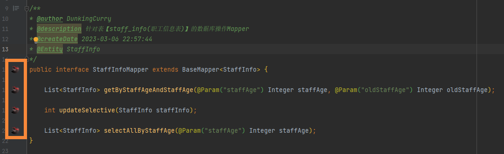
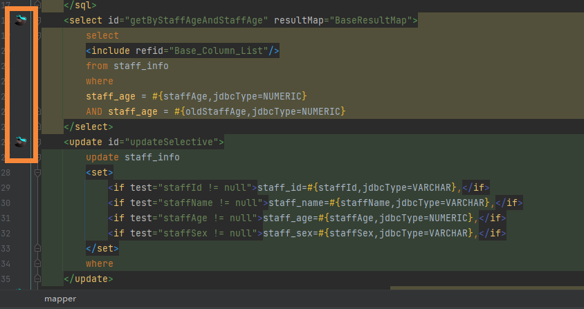
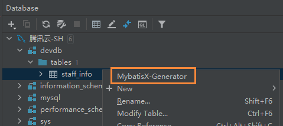
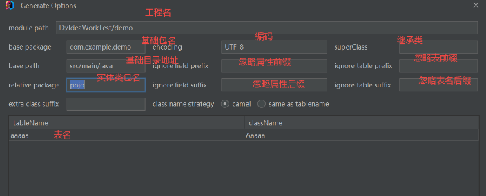
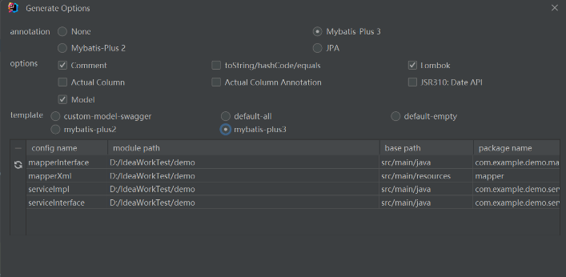
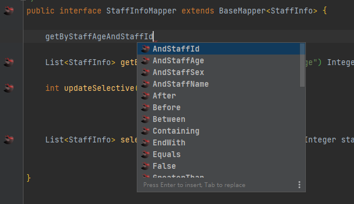
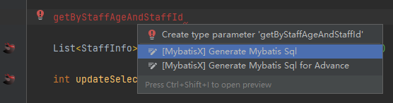
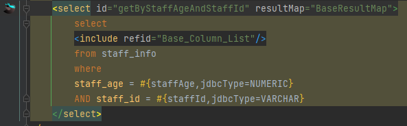
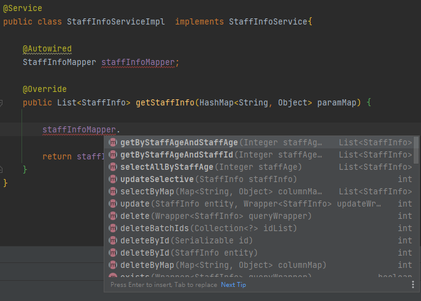

# 一、MybatisX 插件

 MyBatisX插件是[IDEA插件](https://so.csdn.net/so/search?q=IDEA插件&spm=1001.2101.3001.7020)，如果想要使用它，那么首先需要在IDEA中进行安装（Markplace搜索安装即可)。 


## 1、插件用途：接口与 mapper.xml 跳转

安装插件后，在mapper的接口文件中，会出现红色小鸟标识（如下图），点击即可跳转至对应 `mapper.xml` 文件的映射方法。



同样，在 `mapper.xml` 文件中也会出现蓝色小鸟标识（如下图），点击即可跳转至对应`mapper` 接口。




## 2、插件进阶用途I：代码快速生成

首先，需要在IDEA中配置对应的数据库链接：


找到需要生成代码的表名，右键选择 `Mybatis-X` 菜单，



接着按以下提示依次填写相应内容，即可在对应目录生成表所对应的 `mapper` 接口、`xml` 文件（`service` 部分建议去掉，实际开发用处不大）。






## 3、插件进阶用途II：CRUD快速生成

在代码生成的 `mapper` 接口中，不需要写返回值，只需要依据以下语法写方法名：

> select、query、get —— 查找
> update —— 更新
> delete —— 删除
> by 条件
> and 连接条件 



接着按下 `Alt` + `Enter` ，选择 `Generate Mybatis Sql` ，



即可生成对应方法，以及 `xml` 文件的语句。





## 4、插件进阶用途III：mybatis-plus 的使用

我们可以结合 `mybatis-plus` 进一步提高效率，在第二步代码生成的选项中，我们选择了 `Mybatis Plus 3` 以后，生成的 `mapper` 接口会继承 `BaseMapper` 接口，后续在 `service` 中就能直接调用 `mybatis-plus` 封装的方法，这其中包括了单表常见的增删改查，针对单表的操作基本可以告别编写 `xml` 配置。为此，我们还需要引入 `mybatis-plus` 的依赖，以使 `BaseMapper` 接口生效：

```xml
<!-- Mybatis-plus 依赖  -->
<dependency>
    <groupId>com.baomidou</groupId>
    <artifactId>mybatis-plus-boot-starter</artifactId>
    <version>3.5.1</version>
</dependency>
```

接下来，就可以在 `service` 中直接调用 `mapper` 封装的 CRUD 接口了。当然，在实际应用中仍然要结合具体情况，复杂单表操作仍建议使用 `xml` 配置，便于维护。



> 补充：Mybatis-Plus 中 Wrapper 对象即条件构造器的官方文档  [条件构造器 | MyBatis-Plus ](https://baomidou.com/pages/10c804/#abstractwrapper?login=from_csdn) 