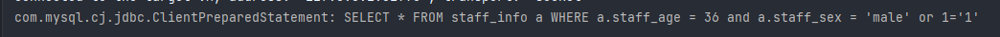
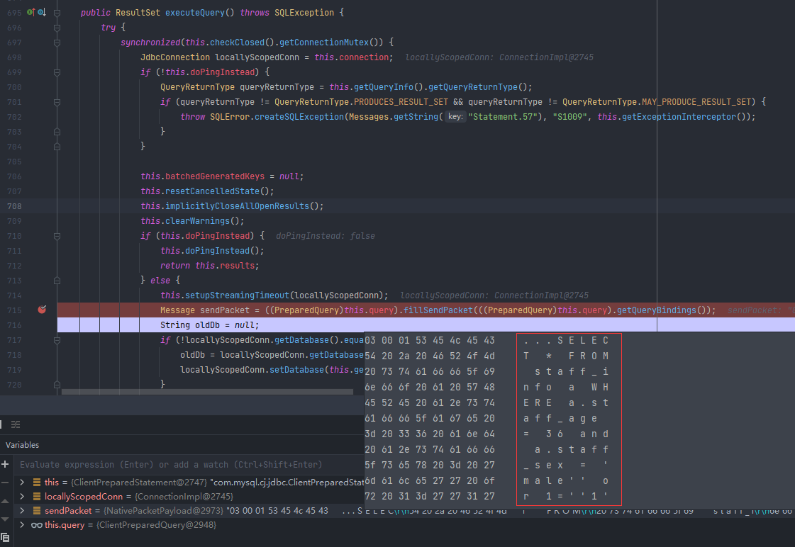
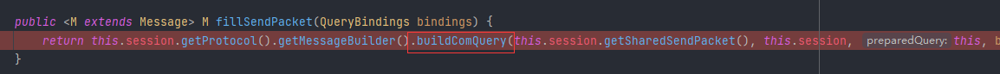
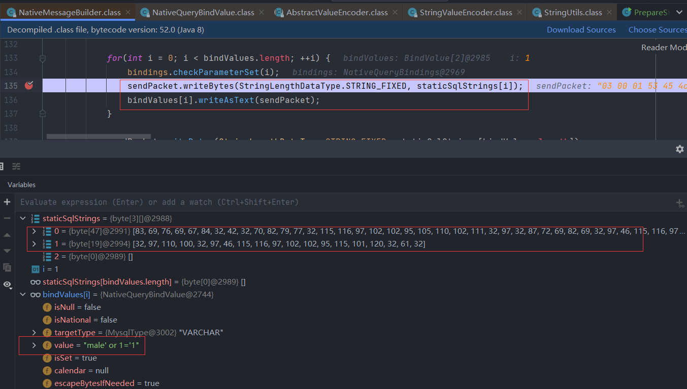
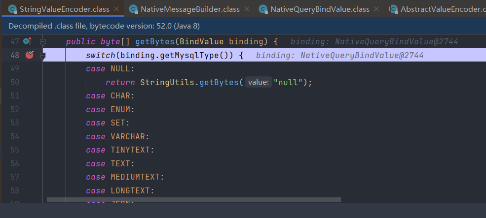
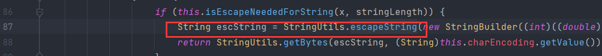
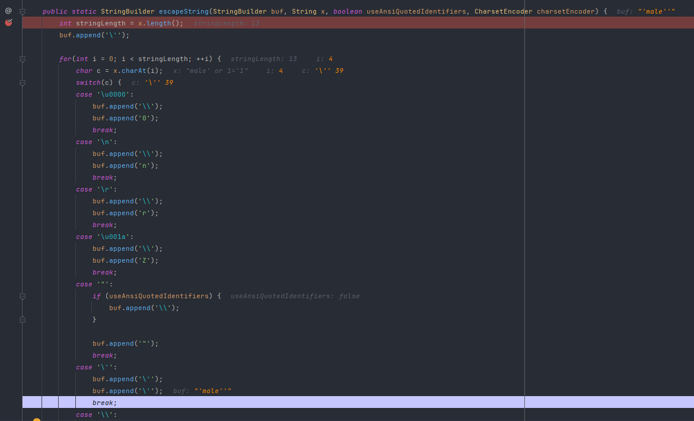

# PrepareStatement 基本用法

## 1. 加载驱动

首先在`pom.xml` 中引入 `mysql` 依赖

```xml
<dependency>
    <groupId>mysql</groupId>
    <artifactId>mysql-connector-java</artifactId>
    <version>8.0.23</version>
</dependency>
```

通过以下代码加载驱动

```java
Class.forName("com.mysql.cj.jdbc.Driver");
```


## 2. 获取 Connection 对象

数据库连接需要数据库链接、用户名、密码三个参数，建议配置在`application.properties` 中，方便统一管理（当然也可以直接在使用的地方用字符串变量）

```properties
#PrepareStatement
#数据库链接
pstmt.dbUrl="jdbc:mysql://localhost:3306/mydb?serverTimezone=UTC&characterEncoding=utf8&useUnicode=true"
#用户名
pstmt.dbUser=root
#密码
pstmt.dbPwd=123456
```

通过以下代码获取connection

```java
Connection connection = DriverManager.getConnection(dbUrl,dbUser,dbPwd);
```


## 3. 获取 PrepareStatement 对象

根据需求创建Sql语句字符串，在需要加入参数的地方用 `?` 占位符代替

```java
//查询符合指定年龄和性别的员工姓名
String sql = "SELECT a.name FROM staff_info a WHERE a.age = ? and a.sex = ?";
```

接下来，创建 `PrepareStatement`对象对sql进行预编译

```java
PreparedStatement pstmt = connection.prepareStatement(sql);
```


## 4. 设置参数

`PrepareStatement`对象提供多种参数类型方法，**使用时依据数据库字段类型一一对应**，设置时需注意第一个参数为占位符`?` 的索引且**从 1 开始**，例如之前sql的设置应为

```java
pstmt.setInt(1,35);
pstmt.setString(2,"男");
```


## 5. SQL执行

### 单条语句执行

```java
//单次查询
pstmt.executeQuery();
//单次更新
pstmt.executeUpdate();
```

### 批量执行
若一次要插入大量数据，应尽量减少jdbc的调用次数，使用批量执行来优化

```java
//第一批
pstmt.setInt(1,35);
pstmt.setString(2,"男");
//加入批次
pstmt.addBatch();

//第二批
pstmt.setInt(1,24);
pstmt.setString(2,"女");
pstmt.addBatch();

//统一批量执行
pstmt.executeBatch();
```


## 6. 完整示例

```java
@Component
public class PrepareStatementUtils {
    private  final Logger LOGGER = LoggerFactory.getLogger(PrepareStatementUtils.class);

    @Value("${pstmt.dbUrl}")
    private  String dbUrl;

    @Value("${pstmt.dbUser}")
    private  String dbUser;

    @Value("${pstmt.dbPwd}")
    private  String dbPwd;

    public void prepareStatementExecute() {
        try {
            //加载 mysql 驱动
            Class.forName("com.mysql.cj.jdbc.Driver");
            //获取链接
            Connection connection = DriverManager.getConnection(dbUrl,dbUser,dbPwd);
            //获取preparestatement对象
            String sql = "SELECT a.name FROM staff_info a WHERE a.age = ? and a.sex = ?";
            PreparedStatement pstmt = connection.prepareStatement(sql);

            //单次执行
            pstmt.setInt(1,35);
            pstmt.setString(2,"男");
            ResultSet rs = pstmt.executeQuery();

            //批量执行
            String sql2 = "insert into staff_info(staff_id,staff_name,staff_age,staff_sex) values(?,?,?,?)";
            PreparedStatement pstmt1 = connection.prepareStatement(sql2);
            //第一批
            pstmt1.setString(1,"001");
            pstmt1.setString(2,"小谭");
            pstmt1.setInt(3,35);
            pstmt1.setString(4,"男");
            //加入批次
            pstmt1.addBatch();

            //第二批
            pstmt1.setString(1,"002");
            pstmt1.setString(2,"小高");
            pstmt1.setInt(3,24);
            pstmt1.setString(4,"女");
            pstmt1.addBatch();

            //统一执行
            pstmt1.executeBatch();

        } catch (ClassNotFoundException | SQLException e) {
            LOGGER.error(e.getMessage());
        }
    }
}
```


# SQL注入攻击（附源码解析）

> `SQL注入攻击`：  通过将恶意的 Sql 查询或添加语句插入到应用的输入参数中，再在后台 Sql 服务器上解析执行进行的攻击，它目前黑客对数据库进行攻击的最常用手段之一。 


## 1. Statement 发生 SQL 注入的情况

现存在以下语句查询指定年龄的职工信息，其中age为入参

```java
String sql = "SELECT * FROM staff_info a WHERE a.staff_age ="+age;
ResultSet rs = statement.executeQuery(sql);
```

若age值为`24 or 1=1` 

```java
String age = "24 or 1=1";
```

最后的拼接语句为

```sql
SELECT * FROM staff_info a WHERE a.staff_age = 36 OR 1=1;
```

会返回该表的所有职工信息；常见的SQL注入还存在于恶意删表，例如：

```java
String age = "24; drop table staff_info";
```

该语句会删除职工信息表，造成严重后果，因此防止SQL注入是必备操作。


## 2. PrepareStatement 防止SQL注入源码解析

同样存在以下语句查询指定年龄和性别的职工信息，其中age和sex为入参

```java
String sql = "SELECT * FROM staff_info a WHERE a.staff_age = ? and a.staff_sex = ?";
PreparedStatement pstmt = connection.prepareStatement(sql);
```

同样以SQL注入的形式设置sex参数为 `male' or 1='1` ，

```java
pstmt.setInt(1,36); 
pstmt.setString(2,"male' or 1='1");
```

打印一下看看PrepareStatement预编译的语句，

```java
System.out.println(pstmt);
```

从以下结果可知，PrepareStatement会在占位符的两侧加上 `'` ，但你可能已经发现到目前为止预编译拼接的sql仍然是存在SQL注入风险的sql，若被直接执行，也会返回表的全部信息，别着急，我们接着看；



接下来执行SQL；

```java
ResultSet rspre = pstmt.executeQuery();
```

通过 debug 进入 `com.mysql.cj.jdbc.ClientPreparedStatement` 的 `executeQuery()`方法




可以看出，在 `fillSendPacket()` 方法将sql转换为字节的过程中，给占位符中包含的单引号`'`，额外加上一个单引号 `'` ，最后执行的sql就变为了：

```sql
SELECT * FROM staff_info a WHERE a.staff_age =  36 and a.staff_sex = 'male'' or 1=''1'
```

该查询返回信息为空，避免了SQL注入；接下来我们继续debug，到底是哪个操作加上了单引号`'`：




找到 `buligComQuery()`方法，有如下代码，其中：



1. `staticSqlStrings[]` ：存储的是以占位符`?` 划分开的sql语句转换的字节数组，不包含参数，即

- `staticSqlStrings[0]`= `SELECT * FROM staff_info a WHERE a.staff_age =`
- `staticSqlStrings[1]` = `and a.staff_sex =`

2. `bindValues[]` ：绑定的参数数组

从以上源码可以看出，sql语句和参数共同组装成 `sendPacket` 发给远程数据库做执行，而防SQL注入的处理，肯定就在 `writeAsText()` 流程中；

我们继续往下，来到 `com.mysql.cj.protocol.a.StringValueEncoder` 类中，该类用于处理String参数，于是可以定位到在将参数转换为字节数组的 `getBytes()` 方法中对输入的字符串进行了 `StringUtils.escapeString()` 处理： 




既然已经发现字符串的工具类调用，不出意外我们马上就要找到答案了




果然，功夫不负有心人，我们终于找到了它。

可以看到方法中对各类特殊字符都做了转义处理，常规的添加斜杠 `\` 如换行符`\n` ；而我们这里涉及的单引号 `'` ，转义时会再添加一个 `'`， 这也解释了上述最终执行sql 的生成。


Ps：最近干活用到PrepareStatement，网上提到的PrepareStatement源码解析多为老驱动（做法为添加斜杠`\` ），实际使用时发现转义后其实添加的是单引号`'`  ，正好就顺道学习下源码，也借此回顾一下SQL注入。