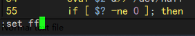
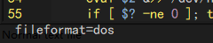

# 一、Shell 入门简介

## 什么是 shell

> Shell 通过提示您输入，向操作系统解释该输入，然后处理来自操作系统的任何结果输出，简单来说 Shell 就是一个用户跟操作系统之间的一个命令解释器。

shell 本质上是 Linux 命令，多条命令组合在一起，实现某一目的，就构成了 shell 脚本


## shell 编程注意事项

- 脚本命名：一般为**英文字母、数字、下划线**组成，以 `.sh` 为后缀

- 脚本首行需要以 `#!/bin/bash`  开头

- 脚本变量不能以数字、特殊符号开头，可以使用英文字母、下划线

-  在linux下编写shell脚本，赋予权限即可运行。如果是在windows下编写，有时候会报错， 原因是windows系统下换行符为 `\r\n`，linux下换行符为 `\n`，所以导致在windows下编写的文件会比linux下多回车符号 `\r`，这种情况可以使用以下方法解决：

  用 vim 来重新编辑脚本，首先查看文件格式：

  

  在底行模式下输入 **set ff**，回车可以看到文件格式为 `dos`；

  
  底行模式下输入 **set ff=unix** ，修改文件格式为 `unix` 后保存退出即可。

    


## Hello World 实战

```bash
[root@VM-8-8-centos bbb]# touch helloworld.sh
[root@VM-8-8-centos bbb]# vim helloworld.sh 
[root@VM-8-8-centos bbb]# cat helloworld.sh 
#!/bin/bash
# This is our first shell
# by author dunkingcurry 2022.06
echo "hello world!"
[root@VM-8-8-centos bbb]# chmod o+x helloworld.sh 
[root@VM-8-8-centos bbb]# ./helloworld.sh 
hello world!
```


# 二、Shell 变量详解


> shell 编程中常见变量一般分为三种：系统变量、环境变量和用户变量

## 系统变量

主要是用于 **对参数判断和命令返回值判断** 时使用，详解如下：

```bash
$0 		当前脚本的名称;
$n 		当前脚本的第n个参数,n=1,2,…9;
$* 		当前脚本的所有参数(不包括程序本身);
$# 		当前脚本的参数个数(不包括程序本身);
$? 		0 或程序执行完后的状态，返回0表示执行成功;
$$ 		程序本身的PID号
```

## 环境变量

主要是在**程序运行时需要设置**，详解如下：

```bash
$PATH  		 命令所示路径，以冒号为分割;
$HOME  		 打印用户家目录;
$SHELL 		 显示当前Shell类型;
$USER  		 打印当前用户名;
$ID    		 打印当前用户id信息;
$PWD   		 显示当前所在路径;
$TERM  		 打印当前终端类型;
$HOSTNAME    显示当前主机名;
$PS1         定义主机命令提示符的;
$HISTSIZE    历史命令大小，可通过 HISTTIMEFORMAT 变量设置命令执行时间;
$RANDOM      随机生成一个 0 至 32767 的整数;
```

## 用户变量

用户变量又称为局部变量，主要用**在Shell脚本内部或者临时局部使用**，详解如下：

```bash
a=rivers 				       自定义变量A;
BACK_DIR=/data/backup/         自定义变量BACK_DIR
```


# 三、Shell 流程控制


## 1. if 条件语句


### 基本使用

通常以 `if` 开头，`fi` 结尾，也可加入`else`或者`elif`进行多条件的判断

```bash
# 单分支语句 ---比较大小
if [ 条件表达式 ];then
	语句1
fi

# 双分支if 语句
if [ 条件表达式 ]
	语句1
else
	语句2
fi

# 多支条件语句 ---判断成绩
if [ 条件表达式 ]
	语句1
elif [ 条件表达式 ];then
	语句2
elif [ 条件表达式 ];then
	语句2
fi  
```


### 常见逻辑判断运算符

```bash
-f	 	判断文件是否存在 eg: if [ -f filename ];
-d	 	判断目录是否存在 eg: if [ -d dir ];
-eq		等于，应用于整型比较 equal;
-ne		不等于，应用于整型比较 not equal;
-lt		小于，应用于整型比较 letter;
-gt		大于，应用于整型比较 greater;
-le		小于或等于，应用于整型比较;
-ge 	大于或等于，应用于整型比较;
-a		双方都成立（and） 逻辑表达式 –a 逻辑表达式;
-o		单方成立（or） 逻辑表达式 –o 逻辑表达式;
-z		空字符串;
-x      是否具有可执行权限;
||      单方成立;
&&      双方都成立表达式
```


### 实例 — 判断学生成绩等级

```bash
#!/bin/bash
# this check grade shell

grade=$1
if [ $grade -gt 90 ];then
	echo "Smart!"
elif [ $grade -gt 80 ];then
	echo "Good!"
elif [ $grade -ge 60 ];then
	echo "Not Bad"
else
	echo "No Pass"
fi
```


## 2. for 循环语句

```bash
#格式：for name [ [ in [ word ... ] ] ; ] do list ; done
for 变量名 in 取值列表
do
	语句 1
done
```


### 实例 —  打印数字 1-10

```bash
for num in $(seq 1 10)
do
	echo $num
done
```


## 3. while 循环语句

```bash
#while 关联的还有一个 until 语句，它与 while 不同之处在于，是当条件表达式为 false 时才循环，实际使用中比较少，这里不再讲解。

while  (表达式)
do
  语句1
  if [ 条件表达式 ];then
  	break
  if [ 条件表达式 ];then
  	continue
done
```


### 实例 — 求和数字 1-10

```bash
i=1
total=0
while ((i <= 10))
do
	total=`expr $i + $total`
	((i++))
done
	
```


## 4. case 选择语句

对多个选择条件进行匹配输出，通常用于脚本传递输入参数，打印出输出结果及内容

```bash
case 模式名  in
  模式 1)
    命令
    ;;
  模式 2)
    命令
    ;;
*)
不符合以上模式执行的命令
esac
# 每个模式必须以右括号结束，命令结尾以双分号结束。

```


### 实例 — 模式选择

```bash
read -p "请输入你的选择 start|status|quit:" char
case $char in
start)
        echo "service starting..."
;;
status)
        echo "service started"
;;
stop)
        echo "service stopped"
;;
quit)
esac
```


## 5. select 选择语句

类似于 for 循环，常用于选择菜单的创建，可以配合 PS3 来做打印菜单的输出信息

```bash
select i in （表达式） 
do
语句
done
```


### 实例 — 菜单选择

```bash
#!/bin/bash

PS3="Select a operation: "
while true; do
select oper in start status stop quit;
 do
  case $oper in
  start)
    echo "service starting..."
      break
      ;;
  status)
    echo "service running..."
       break
       ;;
  stop)
    echo "service stopped"
       break
       ;;
  quit)
  	exit
  	;;
  *)
    echo "Input error, Please enter again!"
      break
  esac
 done
done
```


# 四、Shell 计算方式


## 1. expr 命令

`expr`  命令可以处理 **算数表达式** 、**字符串表达式** 以及 **逻辑表达式**，实现数值运算，进行数值或字符串的比较，字符串的匹配、提取、统计长度，甚至可以判断变量或参数是否为整数、是否为空、是否为0等，十分强大。

### 1. 处理算数表达式

- 只能处理整数运算，并且算术表达式优先级低于字符串表达式，高于逻辑关系表达式；
- `+` 、`-` 、`*`  、`/` 、`%`  **操作符的两边都要用空格隔开**。并且需要注意一些特殊的字符，例如`*`、`/`、`()` 等等。这些字符在shell中有特殊含义，需要使用 `\ ` 进行转义或者 `''` 包围

```bash
expr 1 + 2
expr $a \* $b
expr $a '*' $b
```


### 2. 处理字符串表达式

- `expr STRING : REGEX` 等价于 `expr match STRING REGEX` ；
两个参数都会被视为字符格式，第二个参数会被作为正则表达式解释，并且它默认隐含前缀 ^  

```bash
[root@VM-centos]# expr study.avi : ".*avi"          
9 ------- 返回匹配的字符数
[root@VM-centos]# expr match study.avi "\(.*\).avi"
study -------- 返回()里的匹配到的字符
```

- `expr substr STRING POSITION LENGTH`
 返回STRING字符串中从POSITION开始，长度最大为LENGTH的字符串子串。如果POSITION或LENGTH为负数、0或非数值，则返回空字符串

```bash
[root@VM-centos]# expr substr howareyou 4 3
are ------- 返回从第4位开始长度为3的子串
```

- `expr index STRING SUBSTR`
 SUBSTR中任意单个字符在STRING中最前面的字符位置。如果在STRING中完全不存在SUBSTR中的字符，则返回0

```bash
[root@VM-centos]# expr index Iamfine am
2 ------- 返回子串最前的起始位置
```

- `expr length STRING`
 返回STRING的字符数

```bash
[root@VM-centos]# expr length 123456
6 ------- 返回字符串长度
```


### 3. 处理逻辑表达式

- 除了 `|` 和 `&`   ，其余的逻辑符号在表达式为真时，返回 1，否则返回 0 
-  `|` 和 `&` 在使用时都需要转义 `\`  或用引号 `''`  括起来

```bash
[root@VM-centos]# expr 1 \> 3
0
[root@VM-centos]# expr 0 '|' 2
2
```


## 2. `$[operation]` 

 `$[]`符号的方便之处在于它对方括号内的空格无太严格的要求，同时方括号内的运算符**不需要进行转义**，但是它依旧**只能处理整数运算**

```bash
$[ 1 + 2 ]
```


## 3. let 命令 

 let命令属于内建命令，执行它的开销要少于上面两种，并且还提供了求幂运算符`**`、自加自减等， 使用let命令时需要注意一些细节: 

-  let 表达式内变量不用加 `$`  
-  运算符两边不可以有空格，有的话就必须用单引号或者双引号括起来 
-  let 后面必须是赋值表达式，即为变量赋值 

```bash
let var++             计算var变量自增
let var=3+2           运算符两边不能有空格
```


## 4. 使用双括号 `(())` 

 `(())`也属于内建命令，并且依然**只支持整型计算**，双括号内的运算符**不需要进行转义**,  常用来计算并测试算术表达式，搭配c风格的 for，while，if 等 

```bash
# 打印数字1-10
for((a=1;a<=10;a++))
do
	echo $a
done
```


# 五、其他命令

## 1. nohup 命令

`nohup` 英文全称 no hang up（不挂起），用于在系统后台不挂断地运行命令，退出终端不会影响程序的运行。

**nohup** 命令，在默认情况下（非重定向时），会输出一个名叫 `nohup.out` 的文件到当前目录下，如果当前目录的 nohup.out 文件不可写，输出重定向到 **$HOME/nohup.out** 文件中。

```bash
nohup Command [ Arg … ] [　& ]
```

参数说明：

- `Command`：要执行的命令；
- `Arg`：一些参数，可以指定输出文件；
- `&`：让命令在后台执行，终端退出后命令仍旧执行。

### 实例

 在后台执行 root 目录下的 test.sh 脚本，并追加输入到 /data/log/test.log 文件中

```shell
nohup /root/test.sh >> /data/log/test.log &
```

接下来，我们再看一个，将jar包在后台执行且将标准输出和标准错误输出都重定向到 log 中

```shell
nohup java -jar app.jar >log 2>&1 &
```

> 这里的 `2>&1` 含义可参考： [Linux shell中2>&1的含义解释](https://blog.csdn.net/zhaominpro/article/details/82630528) 