> docker 官方文档： [Docker Documentation](https://docs.docker.com/reference/) 

# 一、Docker 概述

## 1. 何为 Docker


 Docker 是一个开源的应用容器引擎，让开发者可以打包他们的应用以及依赖包到一个可移植的[镜像](https://baike.baidu.com/item/镜像/1574)中，然后发布到任何流行的 [Linux](https://baike.baidu.com/item/Linux) 或 [Windows](https://baike.baidu.com/item/Windows/165458) 操作系统的机器上，也可以实现[虚拟化](https://baike.baidu.com/item/虚拟化/547949)。容器是完全使用[沙箱](https://baike.baidu.com/item/沙箱/393318)机制，相互之间不会有任何接口。 


## 2. Docker 给我们带来的了什么


- **更高效的利用系统资源**

由于**容器不需要进行硬件虚拟以及运行完整操作系统等额外开销**，Docker 对系统资源的利用率更高。无论是应用执行速度、内存损耗或者文件存储速度，都要比传统虚拟机技术更高效。因此，相比虚拟机技术，一个相同配置的主机，往往可以运行更多数量的应用。

- **更快速的启动时间**

传统的虚拟机技术启动应用服务往往需要数分钟，而 Docker 容器应用，由于直接运行于宿主内核，无需启动完整的操作系统，因此可以做到秒级、甚至毫秒级的启动时间。大大的节约了开发、测试、部署的时间。

- **一致的运行环境**

开发过程中一个常见的问题是环境一致性问题。由于开发环境、测试环境、生产环境不一致，导致有些 bug 并未在开发过程中被发现。而 Docker 的镜像提供了除内核外完整的运行时环境，确保了应用运行环境一致性，从而不会再出现「这段代码在我机器上没问题啊」这类问题。

- **持续交付和部署**

对开发和运维（`DevOps`）人员来说，最希望的就是**一次创建或配置，可以在任意地方正常运行**。

使用 Docker 可以通过定制应用镜像来实现持续集成、持续交付、部署。开发人员可以通过 `Dockerfile` 来进行镜像构建，并结合持续集成（即`CI`，Continuous Integration）系统进行集成测试，而运维人员则可以直接在生产环境中快速部署该镜像，甚至结合持续部署（即`CD`，Continuous Delivery/Deployment）系统进行自动部署。

而且使用 `Dockerfile` 使镜像构建透明化，不仅仅开发团队可以理解应用运行环境，也方便运维团队理解应用运行所需条件，帮助更好的在生产环境中部署该镜像。

- **更轻松的迁移**

由于 Docker 确保了执行环境的一致性，使得应用的迁移更加容易。Docker 可以在很多平台上运行，无论是物理机、虚拟机、公有云、私有云，甚至是笔记本，其运行结果是一致的。因此用户可以很轻易的将在一个平台上运行的应用，迁移到另一个平台上，而不用担心运行环境的变化导致应用无法正常运行的情况。

- **更轻松的维护和扩展**

Docker 使用的分层存储以及镜像的技术，使得应用重复部分的复用更为容易，也使得应用的维护更新更加简单，基于基础镜像进一步扩展镜像也变得非常简单。此外，Docker 团队同各个开源项目团队一起维护了一大批高质量的 官方镜像，既可以直接在生产环境使用，又可以作为基础进一步定制，大大的降低了应用服务的镜像制作成本。


## 3. Docker 与 DevOps


+ **应用更快速的交付和部署**
  + 传统：一堆帮助文档，安装程序
  + Docker：打包镜像发布测试，一键运行

- **更便捷的升级和扩缩容**

使用Docker之后，部署应用就和搭积木一样
项目打包成一个镜像，比如服务器 A 出现性能瓶颈，水平拓展，在服务器 B 上一键运行镜像

- **更简单的系统运维**

容器化之后，开发、测试环境高度一致

- **更高效的计算资源利用**

Docker是内核级别的虚拟化，可以在一个物理机上运行很多容器实例，服务器性能可以被压榨到极致


# 二、Docker的组成部件

  

## 1. 镜像 image


镜像就是一个只读的模板，可以**通过这个模板创建容器服务**，一个镜像可以创建多个容器（最终服务运行或者项目运行就是在容器中）。


## 2. 容器 container


Docker利用容器技术，独立运行的一个或一组应用。**容器是用镜像创建的运行实例**。
它可以被启用，开始，停止，删除。每个容器都是相互隔离的，保证安全的平台。
可以把容器看作是一个简易版的Linux系统(包括root用户权限，进程空间，用户空间和网络空间等)和运行在其中的应用程序。
容器的定义和镜像几乎一摸一样，也是一堆层的统一视角，唯一区别在于容器的最上面那一层是可读可写的


## 3. 仓库 repository


- 仓库是集中存放镜像文件的场所。

- 仓库和仓库注册服务器(Registry)是有区别的，仓库注册服务器上往往存放着多个仓库，每个仓库中又包含了多个镜像，每个镜像有不同的标签

- 存放软件交付成果性产物（即制品）的仓库称为制品仓库，用以对制品进行管理（排查漏洞等）


# 三、Docker 安装与常用命令


该部分可参考之前的文章 [docker环境安装](/2022/06/07/docker环境安装/)


# 四、Docker 的RUN流程和底层原理


## 1. Run 流程

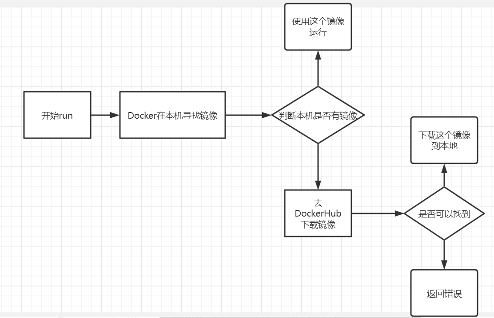


## 2. Docker 是怎么工作的


- `Docker` 是一个 `Client-Server` 结构的系统，`Docker`的守护进程运行在主机上，通过Socket从客户端访问
- `DockerServer` 接收到 `DockerClient` 的指令，就会执行这个命令

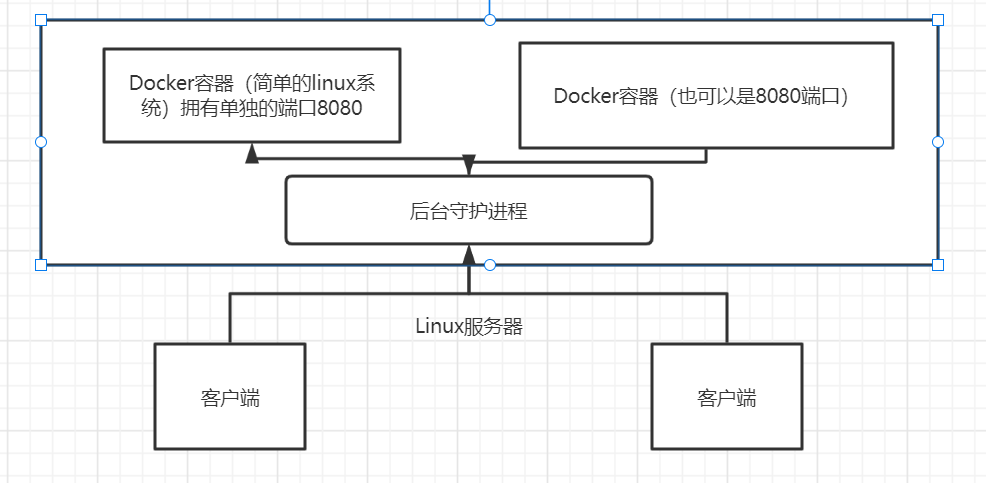

 

从图上可以看出，在 `Linux` 服务器上面可以有一个后台守护进程，客户端访问服务器通过守护进程进行访问，然后通过命令来找到对应的 `Docker` 容器，这些容器可以看出是独立的简单 `Linux` 系统，有单独的端口号，互相隔离、互不影响。 


## 3. Docker 为什么比 VM 快

 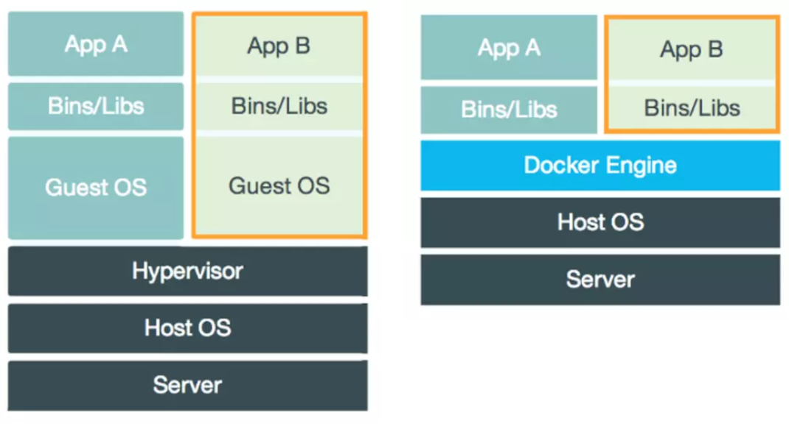 


- `Docker` 有着比虚拟机更少的抽象层，由于 `Docker` 不需要 `Hypervisor` 实现硬件资源虚拟化，运行在 `Docker` 容器上的程序直接使用的都是实际物理机的硬件资源，因此在CPU、内存利用率上 `Docker` 将会在效率上有明显优势。

- `Docker` 利用的是宿主机的内核，而不需要 `Guest OS`，因此，当新建一个容器时，`Docker` 不需要和虚拟机一样重新加载一个操作系统，避免了引导、加载操作系统内核这个比较费时费资源的过程，当新建一个虚拟机时，虚拟机软件需要加载Guest OS，这个新建过程是分钟级别的，而`Docker`由于直接利用宿主机的操作系统则省略了这个过程，因此新建一个`Docker`容器只需要几秒钟。

以下简单总结两者区别：

|            | Docker容器              | 虚拟机（VM）                |
| ---------- | ----------------------- | --------------------------- |
| 操作系统   | 与宿主机共享OS          | 宿主机OS上运行宿主机OS      |
| 存储大小   | 镜像小，便于存储与传输  | 镜像庞大（vmdk等            |
| 运行性能   | 几乎无额外性能损失      | 操作系统额外的cpu、内存消耗 |
| 移植性     | 轻便、灵活、适用于Linux | 笨重、与虚拟化技术耦合度高  |
| 硬件亲和性 | 面向软件开发者          | 面向硬件运维者              |


# 五、Docker 镜像解析


## 1. 什么是镜像


**镜像** 是一种轻量级，可执行的软件包，用来打包软件运行环境和基于运行软件开发的软件，它包含运行某个软件所需的所有内容，包括代码、运行时、库、环境变量和配置文件。

所有的应用，直接打包制作成docker镜像，就可以直接跑起来


## 2. Docker 镜像加载原理

> `UnionFS` (联合文件系统)：一种分层、轻量级且高性能的文件系统，它支持对文件系统的修改作为一次提交来一层层的叠加，同时可以将不通目录挂载到同一个虚拟文件系统下（unite serveral directories into a single virtual filesystem）。`Union` 文件系统是 `Docker` 镜像的基础，镜像可以通过分层来继承，基于基础镜像（没有父镜像），可以制作各种具体的应用镜像。
>
> - 特性：一次同时加载多个文件系统，但从外面看起来，只能看到一个文件系统，联合加载会把各层文件系统叠加起来，这样最终的文件系统会包含所有底层的文件和目录。

`Docker` 的镜像实际上由一层一层的文件系统组成，这种层级的文件系统就是 `UnionFS` 。

`bootfs`（boot file system）主要包含 `bootloader` 和 `kernel` ，`bootloader` 主要是引导加载 `kerel` ，`Linux`刚启动时会加载 `bootfs` 文件系统，在 `Docker` 镜像的最底层时`bootfs`。这一层与我们典型的 Linux/Unix 内核是一样的，包含`boot` 加载器和内核。当`boot` 加载完成之后整个内核就都在内存中了，此时内存的使用权已由 `bootfs` 转交给内核，此时系统也会卸载 `bootfs`

`rootfs`(root file system)在`bootfs`之上，包含的就是典型的 Linux系统中的 `/dev`、`/proc`、`/bin`、`/etc` 等标准文件。`rootfs` 就是各种不同的操作系统发行版。

 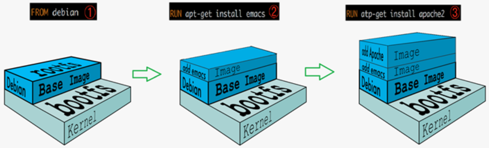 


> 平时安装的虚拟机的 `CentOS` 都是好几个G，为什么`Docker` 中才200MB？ 

因为对于一个精简的 OS，`rootfs` 可以很小，只需要包含最基本的命令、工具和程序库就可以了，因为底层使用的是主机的 `Kernel`，自己只需要提供 `rootfs` 就可以了。由此可见，对于不同`Linux`发行版，`bootfs` 是基本一致的，`rootfs` 会有差别，因此不同的发行版可以公用 `bootfs` 


## 3. 分层理解


 当我们下载一个镜像的时候，可以看到，是一层一层的在下载！ 

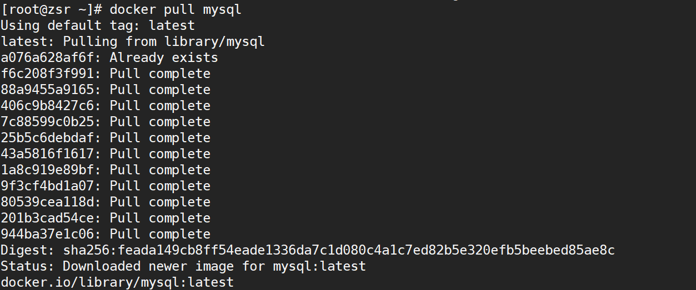 


### 为什么Docker镜像要采取分层结构？

###  

**资源共享**：如果有多个镜像从相同的Base镜像构建而来，那么宿主机只需要在磁盘上保留一份base镜像，同时内存中也只需要加载一份base镜像，这样就可以为所有的容器服务，且每一层的镜像都可以被共享。 

使用 `docker image inspect 镜像名称` 命令可以查看镜像分层

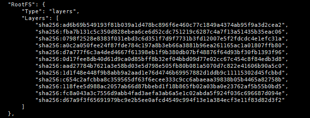


### 分层结构解析


所有的 Docker镜像都起始于一个基础镜像层，当进行修改或增加新的内容时，就会在当前镜像层之上创建新的镜像层。

举一个简单的例子，假如基于 Ubuntu Linux 16.04 创建一个新的镜像，这就是新镜像的第一层；如果要在该镜像中添加python包，就会在基础镜像层之上创建了新的一个镜像层；如果继续添加一个安全补丁，就会创建第三个镜像层

 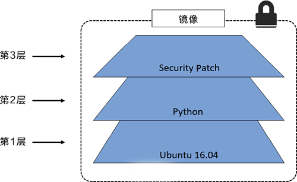 

 在添加额外的镜像层的同时，镜像始终保持是当前所有镜像的组合。下图中举了一个简单的例子，每个镜像层包含 3 个文件，而镜像包含了来自两个镜像层的 6 个文件 

 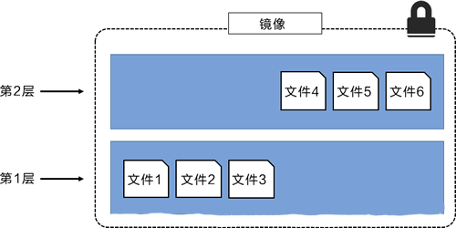 

上图中的镜像层跟之前图中的略有区别，主要目的是便于展示文件。
下图中展示了一个稍微复杂的三层镜像，在外部看来整个镜像只有 6 个文件，这是因为最上层中的文件7 是文件 5 的一个更新版本 

 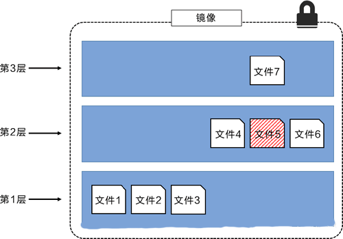 

这种情况下，上层镜像层中的文件覆盖了底层镜像层中的文件。这样就使得文件的更新版本作为一个新镜像层添加到镜像当中。
Docker 通过**存储引擎**（新版本采用**快照机制**）的方式来实现镜像层堆栈，并保证多镜像层对外展示为统一的文件系统。
Linux 上可用的存储引擎有 AUFS、Overlay2、Device Mapper、Btrfs 以及 ZFS。顾名思义，每种存储引擎都基于 Linux 中对应的文件系统或者块设备技术，并且每种存储引擎都有其独有的性能特点。
下图展示了与系统显示相同的三层镜像。所有镜像层堆叠并合并，对外提供统一的视图。
 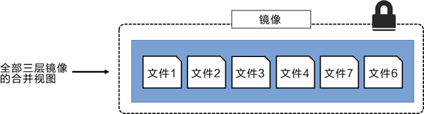 


### 镜像运行特点


Docker镜像都是只读的，当容器启动时，一个新的可写层被加载到镜像的顶部！

这一层就是我们通常说的容器层，容器之下的都叫镜像层！

 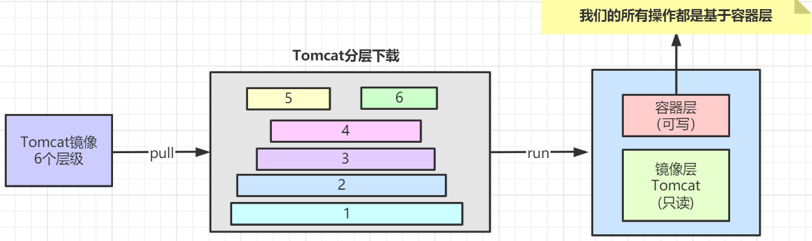 


## 4. Commit 镜像

 当我们通过镜像启动一个容器时，分为了两层：容器层和镜像层；镜像层是可读的，容器层可写，我们的所有操作都是基于容器层，当我们对容器层修改完后，就可以再将修改后的容器层和不变的镜像曾一起打包成一个新的镜像，也就是`Commit`镜像

 ```bash
# 提交容器成为一个新的副本
docker commit
docker commit -m="提交的描述信息" -a="作者" 容器id 目标镜像名:[TAG]
 ```


# 六、容器数据卷


## 1. 什么是容器数据卷

 `docker` 将应用和环境打包成一个镜像，通过镜像启动容器运行，但这样存在一个问题：

- 在容器中存储的程序数据是需要持久化的，**不能容器删了数据也随之删除**。比如，安装一个MySQL容器，在其中存储了大量数据，结果把容器删了数据也没了，就相当于删库跑路，这是不可能发生的。

这就轮到卷技术大展身手的时候了，数据卷也就是**目录的挂载**，**将容器内的目录挂载到`Linux`上** ，**实现了容器的持久化和数据同步操作，容器之间也可以共享数据。**


## 2. 使用数据卷

以下三种方式可以实现目录挂载：

- 在启动容器的命令中用 `-v` 参数指定

```bash
docker run -d -v Linux服务器目录:容器内目录
```

- 如果使用 `docker-compose` 方式启动容器，在 `docker-compose.yml` 中配置 `volumes`，可参考以下 `nginx` 的配置：

```yml
version: '3'
services:
    nginx:
        image: nginx     # 镜像名称
        container_name: nginx     # 容器名字
        restart: always     # 开机自动重启
        ports:     # 端口号绑定（宿主机:容器内）
            - '80:80'
            - '443:443'
        volumes:   # 目录映射（Linux服务器目录:容器内目录）
            - ./conf/nginx.conf:/etc/nginx/nginx.conf
            - ./conf.d:/etc/nginx/conf.d
            - ./html:/usr/share/nginx/html
```

- 还可以事先通过 `docker volume create 卷名` 命令创建数据卷，将容器内目录挂载到数据卷，所有docker容器内的卷，没有指定目录情况下都是在`/var/lib/docker/volumes/卷名/_data`下 

```bash
docker volume create portainer_data
docker run -d -p 8080:8080 -v portainer_data:/data

# 拓展：还可通过 容器内目录:ro/rw 限制容器的读写操作
# ro:read only 	只读,该路径文件只能通过宿主机来操作,容器内无法操作
# rw:read write	可读可写
docker run -d -P --name nginx02 -v specific-nginx:/etc/nginx:ro nginx
docker run -d -P --name nginx02 -v specific-nginx:/etc/nginx:rw nginx

```


## 3. 初始 Dockerfile


