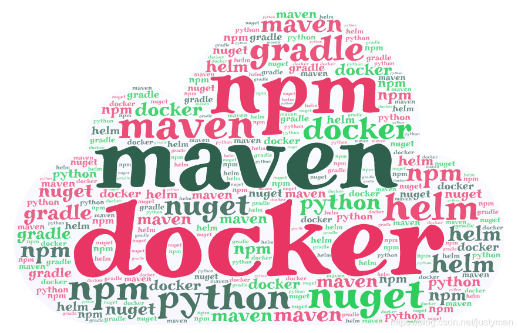
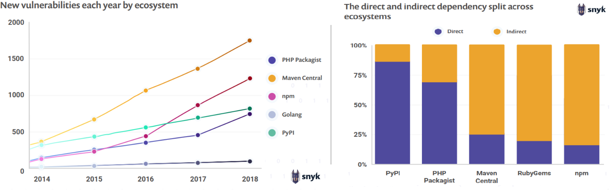
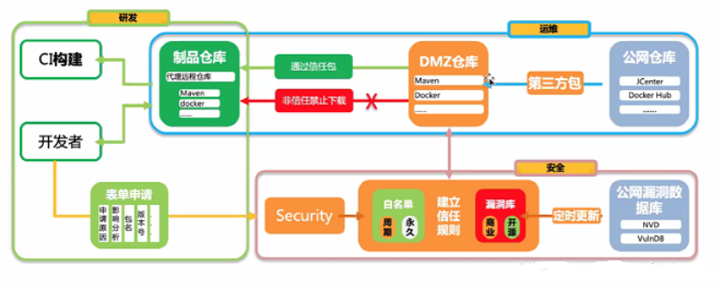
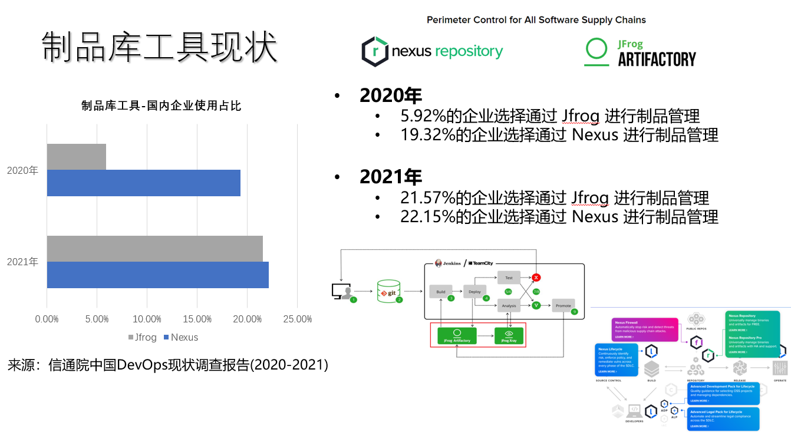
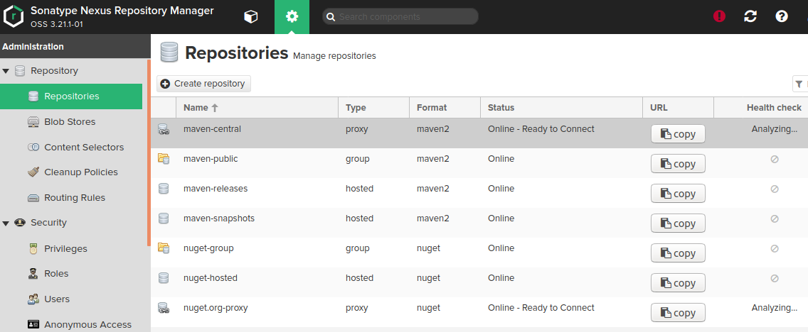
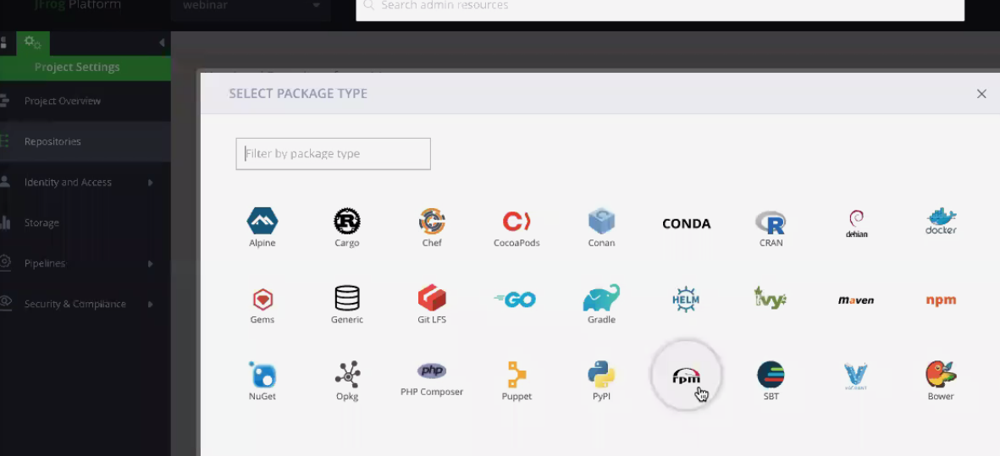
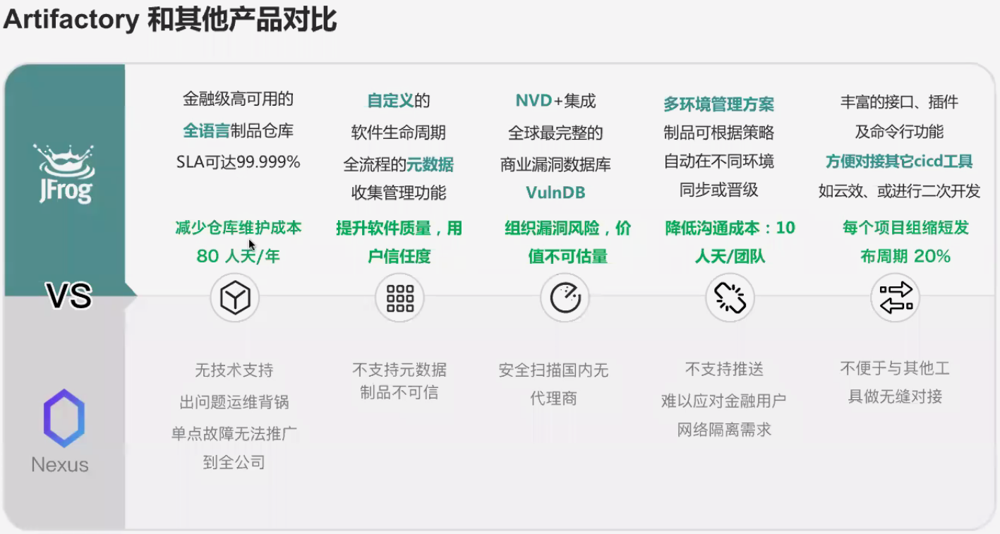

# 一、什么是制品与制品库？

## **制品**

由源码编译打包生成的二进制文件（jar、war、镜像等），不同的开发语言对应着不同格式的二进制文件，这些二进制通常可以直接运行在服务器上。 

**按照使用场景，制品大致分为三类**

1. 外部引入的第三方组件（`Maven`、`Npm`等）；
2. 产品内部依赖包，公共`SDK`；
3. 产品交付安装包（`jar`包，`docker`镜像等）。

## **制品库**

用来统一管理不同格式的软件制品。 除了基本的存储功能，还提供了**版本控制**、**访问控制**、**安全扫描**、**依赖分析**等重要功能，是一种企业处理软件开发过程中产生的所有包类型的标准化方式。 

  

# 二、为什么我们需要制品库？

目前常规的制品管理存在如下问题：

- **外部依赖下载速度慢**；

- **安全漏洞风险**：第三方依赖包的安全风险管理形同虚设，或者滞后；针对引入进来的第三组件没有进行组件扫描，极易引入漏洞；

- **版本管理混乱**：交付包使用`FTP`或者`SVN`进行管理，管理粒度相对较粗；由于受到监管约束，一键部署是不可能任务，跨网段的包交付智能依赖于手工拷贝；

- **制品存储风险**：团队内部搭建的制品库是单点的，缺乏集群部署；

- **资源浪费**：因为没有统一的制品库，存在重复建设的问题；维护成本高，或者说目前根本就没有维护；

## 1. 安全风险

从底层操作系统、到容器、开源脚手架、再到三方组件，我们在系统开发过程中引用着越来越多的开源组件，研发效率确实是提升上去了，但是带来的安全风险是越来越高。从以下图可以看出来，我们自己写的代码量只占了0.1%，但对应的第三方依赖却占了99.9%。因此，对于制品的管理（包括版本管理、风险管理）就尤其显得重要。另外，已知30%的`Docker`镜像，14%的 `npm package`，59%的`maven`中央库都还包含已知漏洞，而且漏洞平均修复周期约为2年。

## 2. 组件准入

拿 `maven`举例子吧，程序员只需在`pom`文件配一个新依赖就可直接从中央库上拉取一个不知名的三方包，当然一般有点血性的同学还是会拉取高知名度的三方包；而且最要命的是你根本都不知道整个研发团队的组件引用情况是怎样的，因此你的整体风险评估根本无法下手做。根据2018年**synk**发布的信息安全状态报告，可以从以下两个维度去告诉你风险在哪里：

+ 从趋势上来说，`maven`中央库新增漏洞在2018年增长了27%，`npm`则增长了47%（如下图左）。随着我们工程的依赖越多，我们引入漏洞的风险几率也是正比增加的； 
+ 从依赖层次来说，**`npm`、`Maven`和`Ruby`中的大多数依赖项都是间接依赖项**，间接依赖项中的漏洞占总体漏洞的 78%（如下图右），这样就使得
  + 通过人工发现的依赖漏洞变得越困难，因为漏洞藏得越深；
  + 漏洞发现后的修复工作需要更长时间。而根据过往经验，在一天或更短的时间内解决高危或关键漏洞的基本是很困难。

## 3. 版本溯源

从下图可以看出来**制品管理**就是我们整个`DevOps`流水线的枢纽。首先，它控制着部署包的按配置规则**自动分发部署**，可以避免人工因操作失误带来的版本问题；其次，它是可以设成**自动化**，让分发部署变成一种自助式服务；具体可以问问你旁边的同事，你问问他们更愿意用APP、ATM机还是人工柜台去转账，道理就不言自明。 

- 如果版本发布错误怎么办？如何追溯？

- 如果版本引入了安全漏洞怎么办？推到重来，业务方允许吗？

- 生产问题紧急发版测试，手工传包的同事无法及时支持怎么办？估计开发要被拉去祭天了。

只有引入了制品库，才能真正实践 **Once Integration，Run anytime anywhere**，才能真正无缝实现所测即所部署。

# 三、如何管控？

>相关知识扩展：
>
>- `SIT`和`UAT` ： [什么的SIT测试？什么是UAT测试？](https://blog.csdn.net/qq646642124/article/details/93326241?spm=1001.2101.3001.6661.1&utm_medium=distribute.pc_relevant_t0.none-task-blog-2~default~CTRLIST~default-1-93326241-blog-87865727.pc_relevant_multi_platform_whitelistv3&depth_1-utm_source=distribute.pc_relevant_t0.none-task-blog-2~default~CTRLIST~default-1-93326241-blog-87865727.pc_relevant_multi_platform_whitelistv3&utm_relevant_index=1)
>  - `SIT`：系统集成测试
>  - `UAT`：用户验收测试
>- `DMZ` 区： [图解DMZ ](https://www.bbsmax.com/A/gAJGVQLbzZ/) 
>  -  `DMZ` 就是一个让物理位置在内网，希望被外网访问的一个主机区域（通常用来放 `Web`服务器、`Mail`服务器；
>  -  `DMZ`区域是由网络防火墙设置规则而隔离出来的一个逻辑区域，该区域里的主机**内网和外网用户均可以访问**， **但这些主机不能主动访问内网**，从而来保护内部网络的安全 ；
>  -  要想实现`DMZ`功能，其实借助`Linux`提供的`iptables`/`netfilter`即可实现。只需打上几条防火墙规则即可。只需打上NAT规则即可。将路由器IP `DNAT`为`DMZ`主机IP，将`DMZ`主机IP `SNAT`为路由器IP；
>  - `DNAT` 和 `SNAT` ： [SNAT与DNAT的区别](https://blog.csdn.net/jkwanga/article/details/106199387) 

## 1. 安全左移

目前由于我们的第三方组件扫描都是滞后的，当我们的版本基本上到了`SIT`或`UAT`测试尾声才交付给信息安全进行组件扫描。如果这个时候扫描出一些第三方组件有严重的安全漏洞。那还要不要投产？如果继续投，我们是求神拜佛保佑漏洞不被发现且利用吗？如果修复后再脱产，因为部分可能涉及到底层框架的改动（如`Spring`这类），如果要在临近投产的这么短时间内完成改造首先不现实，其次是高风险，同时也有可能会导致项目延期。

那应该要怎么办呢？对了，进行**安全左移**。如果要实现安全左移，需要从策略、流程、工具、培训四个维度开展。 

1. 要把安全策略从被动转为主动，把组件扫描前置到开发过程中 ；
2. 对于源码的交付也要设置安全准入，如组件扫描中的`CVE`漏洞不能出现中高危；
3. 工具层面， **JFrog Xray** 能够在开发IDE端侦听`POM`文件的依赖及依赖传递的变化，一旦`POM`文件发生任何变化，Xray就可以对该工程的所有的依赖进行深度递归扫描，将扫描结果呈现在IDE上，让开发马上收到关于该新引进组件的安全情况反馈 ；
4.  安全左移的最后一步，就是确保作为编码主体的人员在开发初期便创建安全的代码， 因此，信息安全开发层面的培训还是得跟上。 

## 2. 建立安全白名单制度

参考 JFrog 的 一些解决方案如下：

1.  在外网建立安全漏洞库，开源的可以从`NVD`、`VnlrDB`定时更新，商业可以购买**synk**的服务；同步建设有白名单制度用于特殊包申请，统一整合到整体的信任规则库； 
2.  在`DMZ`区建设`DMZ`代理公网镜像仓库，根据安全漏洞库的规则过滤从公网上拉取第三方包。如果第三方包是被扫描到漏洞的，则禁止拉取到内网的制品仓库。 

## 3. 使用制品库进行组件版本溯源

传统制品仓库无法管理构建过程，因此对构建过程中的依赖也无法统一管理，该部署包具体含有多少个依赖包，依赖包的二级依赖包又有什么包，完全是两眼一抹黑。因此，这时候就需要对二进制制品的所有内容有一个清晰的视图，它需要提供以下功能： 

1. 正反向依赖：能够清楚知道应用程序引入的依赖组件清单，同时能够知道某个依赖组件的使用范围；

2. 依赖可用性：能够通过人工识别，工具扫描等方式判断依赖组件的可用性；

3. 依赖控制：当某个依赖组件不可用时能够根据组件的严重级别实施不同的控制策略；

4. 依赖知识库：沉淀依赖组件知识库，能够记录依赖组件的基本信息，问题记录，黑名单，白名单。当开发人员在引入组件时就能知道依赖组件是否可用，而不需要到后面的阶段在被拦截；

5. 依赖度量：度量依赖组件使用情况，能够通过统计图表的展现形式统计组件的最多使用，以及分布，问题版本统计，问题版本产生的问题统计，以及特定时间范围内的趋势。

目前， `Nexus` 没有针对编译包的整个依赖管理及正反向解析功能，而`Artifactory `将构建任务、构建历史及依赖信息有条理地管理起来，方便对正反向依赖进行追踪，能够清晰了解安全威胁传递的路径、影响范围(项目、团队、产品)等信息，能够为开发人员提供可视化的能力。 

# 四、制品管理工具

综上所述，由于制品管理的重要性，所以衍生出来对应的制品解决方案用来统一管理不同格式的软件制品，即制品库工具。

  

 目前主市场上主流的制品管理工具主要有`Nexus`、`JFrog Artifactory`、`Harbor`等 ，接下来将一一介绍。

## 1. Nexus

`Nexus`是一套“开箱即用”的系统不需要数据库，它使用文件系统加Lucene来组织数据。Nexus 使用ExtJS来开发界面，利用Restlet来提供完整的REST APIs，通过m2eclipse与Eclipse集成使用。Nexus支持WebDAV与LDAP安全身份认证。 

 

`Nexus`是少有的**支持几乎所有主流制品格式**，并且提供免费版的制品管理产品，这也是大多数中小公司的选择，可以满足大部分业务场景，但是，**免费版不提供高可用方案**。 

## 2. JFrog Artifactory

`JFrog`是一家以色列公司，专注于制品管理环境，提供商用的解决方案，所以它的产品是要花钱的。 

 

下图列出了`JFrog Artifactory`和`Nexus`的产品特点对比，仅供参考。既然是掏钱买的，肯定比免费的Nexus提供的支持和服务更多，包括高可用，组件的漏洞风险分析，多地分发等等。不是说Nexus不行，而是我们大家用的大部分都是Nexus的免费版，其实它的收费版也提供类似的方案。

 

## 3. Harbor

`Harbor`是VMware公司开源的企业级Docker Registry项目，其目标是帮助用户迅速搭建一个企业级的Docker registry服务。  提供了管理UI，基于角色的访问控制，AD/LDAP集成、以及审计日志等企业用户需求的功能，通过添加一些企业必需的功能特性，例如安全、标识和管理等，扩展了开源 Docker Distribution。 

`Harbor`目前已经成为私有Docker/Helm管理的主要工具，相比于`Nexus`, `Harbor`在docker镜像的管理方面更有优势，提供镜像同步服务，支持团队项目隔离。 

> 参考文章： [聊聊DevOps制品管理](https://blog.csdn.net/libin95188/article/details/123602609?ops_request_misc=%7B%22request%5Fid%22%3A%22165985766416781685342377%22%2C%22scm%22%3A%2220140713.130102334.pc%5Fall.%22%7D&request_id=165985766416781685342377&biz_id=0&utm_medium=distribute.pc_search_result.none-task-blog-2~all~first_rank_ecpm_v1~pc_rank_34-2-123602609-null-null.142^v39^pc_rank_34_2,185^v2^control&utm_term=DevOps中制品库的选择&spm=1018.2226.3001.4187) 