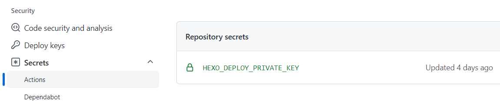
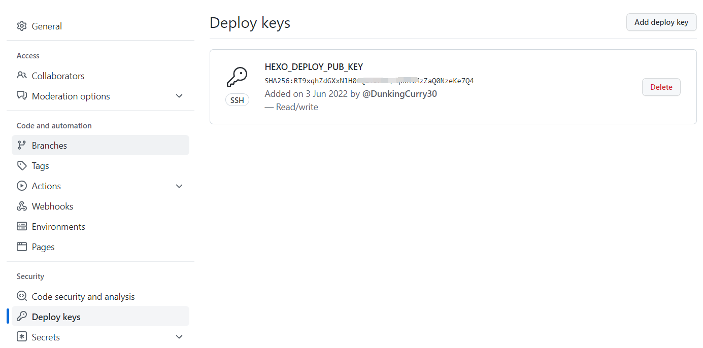
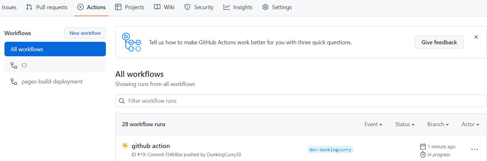
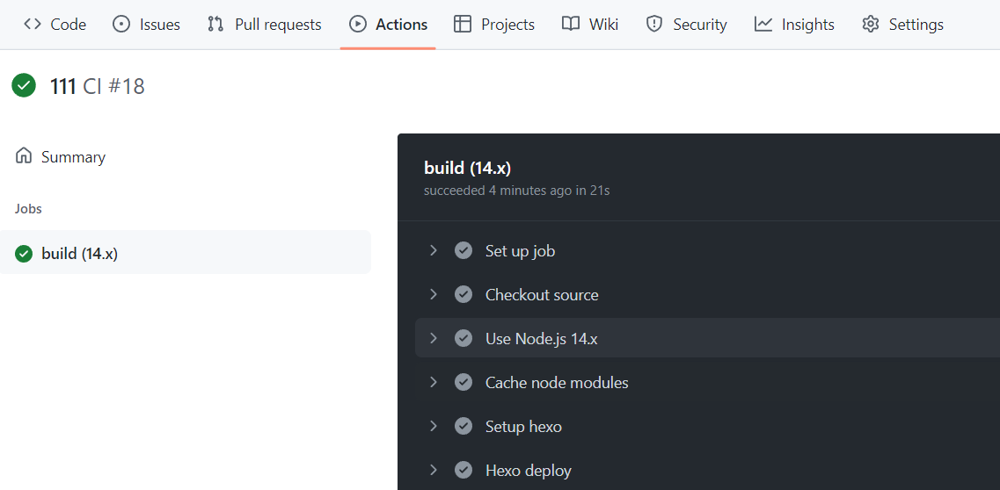

> 使用 Hexo 博客框架快速搭建个人博客，配合 Github Pages 实现博客部署及域名访问

## Hexo安装

- 前置环境：安装`Node.js`、`git` 

### 配置本地`git` 仓库

 找到Git安装目录，打开Git Bash窗口，设置user.name和 user.email  

```shell
git config --global user.name niceday
git config --global user.email niceday@163.com
```

配置Git公钥

```shell
ssh-keygen -t rsa -C "niceday@163.com"
```

连按三个回车后，得到生成的公钥文件 `id_rsa.pub` ，复制其中的内容，添加到Github的`SSH KEY` 中，添加完成后，使用以下命令查看是否添加成功

```shell
ssh git@github.com
```


### Hexo搭建

Hexo 官方文档：  [文档 | Hexo](https://hexo.io/zh-cn/docs/index.html) 

进入创建好的 Blog 文件夹，右击选择 `Git Bash here` 打开命令窗口，输入以下命令

```bash
# 安装Hexo
npm install -g hexo-cli
# 检查安装是否成功
hexo -v
# 初始化hexo文件夹
hexo init blog
cd blog
# 新建一个文章
hexo new test_blog
# 生成静态页面
hexo g
# 启动服务器，本地预览 localhost:4000
hexo s
```

## Hexo 主题安装

参考 `Hexo Fluid` 官方手册：[Hexo Fluid 用户手册](https://hexo.fluid-dev.com/docs)

## Hexo 部署至 Nginx

在`Hexo` 项目目录下，执行以下命令打包 `Hexo` ，生成 `public` 目录

```bash
hexo g
```

将`public` 目录下的文件放至 nginx 的`html` 目录，启动 nginx 即可

## Github Pages 

GitHub 主页右上角加号 -> New repository ：

- Repository name 中输入 `账号名.github.io`
- 勾选 “Initialize this repository with a README”

创建仓库后，默认自动启用HTTPS，访问地址为 `https://账号名.github.io` 


### 部署 Hexo 到 Github Pages

在 Blog 文件目录下，输入以下命令

```shell
# 安装 hexo-deployer-git
npm run install hexo-deployer-git --save
```
安装完成后，修改同目录下`_config.yml`文件末尾部分

```yaml
deploy:
  type: git
  repository: git@github.com:账户名/账户名.github.io.git
  branch: main
```

完成后，运行以下命令，将Hexo部署到Github Pages，通过域名 `https://账号名.github.io` 可查看博客网站

```bash
hexo deploy
```


### Github Action 实现自动化部署 Hexo

> 1. 配置部署公钥

利用 `ssh-keygen` 生成公私钥

- Github Pages 仓库  `Settings -> Secrets -> Actions` ， 新建一个 ` HEXO_DEPLOY_PRIVATE_KEY ` 存放私钥



- Pages 仓库  `Settings -> Deploy keys` ，新建一个 `HEXO_DEPLOY_PUB_KEY` 存放公钥  



> 2. 编写 Action

 在 `.github/workflows` 新建 `deploy.yml` 文件，内容如下：

```yaml
name: CI
on:
  push:
    branches:
      - dev-dunkingcurry
jobs:
  build:
    runs-on: ubuntu-latest
    strategy:
      matrix:
        node_version: [14.x]

    steps:
      - name: Checkout source
        uses: actions/checkout@v1
        with:
          ref: myblog

      - name: Use Node.js ${{ matrix.node_version }}
        uses: actions/setup-node@v1
        with:
          version: ${{ matrix.node_version }}

      # 缓存node_modules，避免每次跑action都要重新下载
      - name: Cache node modules
        uses: actions/cache@v1    
        id: cache    
        with:
        path: node_modules
        key: ${{ runner.os }}-node-${{ hashFiles('**/package-lock.json') }}
        restore-keys: |
          ${{ runner.os }}-node-

      - name: Setup hexo
        env:
          ACTION_DEPLOY_KEY: ${{ secrets.HEXO_DEPLOY_PRIVATE_KEY }}
        run: |
          mkdir -p ~/.ssh/
          echo "$ACTION_DEPLOY_KEY" > ~/.ssh/id_rsa
          chmod 600 ~/.ssh/id_rsa
          ssh-keyscan github.com >> ~/.ssh/known_hosts
          git config --global user.email "DunkingCurry30"
          git config --global user.name "123456789@qq.com"
          npm install hexo-cli -g
          npm install
      - name: Hexo deploy
        run: |
          hexo clean
          hexo g
```

> 3. push 至 Pages 仓库

push 至 Pages 仓库后，在 仓库 `Action` 界面下查看自动化流水线




点击可查看每个步骤的执行信息



> 4. 验证自动化部署结果

流水线显示执行成功后，通过域名 `https://账号名.github.io` 可查看博客网站内容，更新成功


**至此，大功告成！**