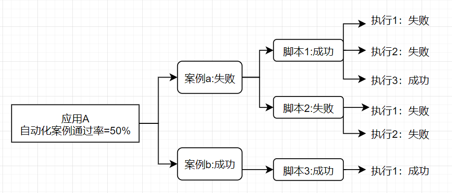

# 一、需求概述

前台支持根据条件查询多项测试效能数据指标数据报表

## 需求背景

- 需要查询的各项数据指标来自不同数据库的多张数据源表
- 数据源表存在大表（`1000w`-`2亿`数据量不等）
- 部分表日增量超过`100w`，且需要每日同步
- 前台查询响应时间不能太长

## 需求分析

工欲善其事，必先利其器。依据上述需求背景，设计方案如下：

- *多数据源表同步至统一的数据仓库*：
  - 存量数据同步：因存量数据量大，将`datax` 环境打包成 `docker` 镜像，使用 `jenkins` 调度多台服务器执行多个容器实现多表并行同步，缩短数据同步时间
  - 每日的增量数据同步：使用 `crontab` 配合 `datax` 实现
- *中间表减少联表计算*：为避免指标查询过程中过多的连表操作，根据指标所需字段设计中间表（需考虑索引，这能极大程度提高查询效率），通过 `Java` **定时任务提前对数据源表进行处理**，做好部分计算和汇总至中间表中，操作时间在数据源表同步完成后
- *多线程加快查询*：`Java` 查询中间表，计算出各类指标数据，一般不存在依赖关系的指标可以**多线程**并发计算，最后汇总结果返回，将查询时间由**多个查询的时间和**优化为**最长查询所需时间**

现在我们有了初步方案，接下来就可以开始详细设计开发了。

# 二、实战开发

## 1. 多数据源表同步 

在需求分析中我们已经了解到，本次所需要数据来自于多个不同数据库的数据源表。当然`oracle`  的 `dblink` 、`mysql` 的 `federated` 都可以帮我们实现在一个数据库实例中访问，但这种方式存在以下明显的缺陷：

- 链接仅限同类数据库，即 `oracle` 只能连 `oracle` ，`mysql` 只能连 `mysql`，如果存在从 `oracle` 同步到 `mysql` 的情况就抓瞎了
- 链接依赖于网络，速度不稳定且比同库访问慢很多
- 应用自身无备份数据，无法自定义数据处理（例如指标数据通常需要看不同年份的环比数据，而数据源表的清理周期不一定与需求查询周期一致）
- 直接对数据源表进行查询，也增大了数据库服务器的压力

因此基于以上缺点，同步数据库至统一的数据仓库显然是更好的选择：

- `datax` 支持同步不同类型的数据库，即可以从 `oracle` 同步至 `mysql` 
- `datax` 数据同步效率高，数据量同步速率可达`1w/s` 
-  统一的数据仓库也更方便数据的管理，和自定义处理（例如可根据需要对同步的数据源表增加索引）
-  中间表的计算也基于同一数据库的表，效率更高

`datax` 同步多数据源表操作可参考该文章：[高效数据同步工具 DataX 的使用](/2022/07/29/高效数据同步工具DataX的使用) 

> 【注】：由于表数据量大，必然涉及数据周期性清理，常规处理方式，数据保留周期2年，2年之前的数据移入历史表归档。

## 2. 中间表减少联表计算

在数据源表同步至数据仓库后，一些指标涉及到多张表的复杂查询，这仍会大大降低查询效率，例如以下场景：

现需统计A应用在6月版本测试案例在6月的`自动化案例执行通过率`，指标计算公式如下：

> ​     **自动化案例执行通过率** = **自动化执行通过的案例数** / **当前版本案例总数**

 - **自动化案例执行通过**：案例下关联的**全部自动化脚本执行通过**
 - **自动化脚本执行通过**：该脚本在6月内存在执行通过的记录，即多次调度有一次通过即算作通过

以上计算逻辑图**从右往左**即为计算过程，该场景涉及到以下数据源表：

- **案例表**：包含案例和应用的关联关系；
- **案例与自动化脚本挂接关联表**：包含案例和自动化脚本的关联关系；
- **自动化脚本的执行明细表**：包含脚本在指定时间内的执行记录。

通过以上信息，我们可以知道`自动化脚本通过率`这个指标的查询：

- 涉及到三张表的**关联嵌套查询**；
- 查询中包含着两个**计算**（案例是否通过，脚本是否执行通过）；
- 实际上脚本执行明细表数据量是非常大，实际单日增量在70w左右，存量数据上亿级别，即使有索引对该表的直接查询也很慢；

因此，如果能提前将一些数据计算出来放入一张中间表，就能极大减少查询时间，在这个场景里，可以新建一张中间表包含以下字段：

| script_id | month        | is_pass              |
| --------- | ------------ | -------------------- |
| 脚本ID    | 按月维度计算 | 脚本是否执行通过标志 |

该表记录了某个脚本在某个月份的执行通过信息，显然`is_allpass` 即为我们需要提前计算的值，而该值需要：

- 因为每天都会有新增的脚本和调度记录，因此需要每日计算；
- 且计算需要在源表数据同步之后。

综上，这里考虑将计算逻辑和将计算记录插入中间表操作，通过 `Springboot` 中定时任务注解 `@Schedule` 实现，实现方式较为简单可参考[Java 中的定时任务实现](/2022/07/27/Java 中的定时任务实现) 。

## 3. 多线程汇总查询

经过前面两个步骤，我们通过数据同步，建立索引、中间表的方式一定程度上解决了查询速度慢，查询逻辑复杂的问题。但在实际实践操作中，查询效率仍旧不够理想，原因在于一次往往是查询多个需要复杂计算逻辑的指标，虽然我们优化了单个指标的查询，但如果采用传统串行执行查询的方式，单次查询的效率为**多次查询时间之和**，这显然是不科学的。因此我们引入java中的多线程处理：

- 有`n` 个指标需要同时查询，就使用线程池创建包含`n` 个线程的线程池；
- 利用 `CountDownLatch` 来汇总多个线程执行结果，统一返回至前端。

以上操作具体实现可参考[线程池创建](/2022/07/06/异步调用(一)) 和 [CountDownLatch 多线程执行同一任务]() ，至此我们将查询时间由**多个查询的时间和**优化为**最长查询所需时间**，查询效率优化到这也暂告一段落。

# 三、总结

本文用来记录一次指标查询需求的分析、设计、实现过程，由于能力和经验不足，方案必然还存在极大的优化空间。整个过程下来：

1. 感受最深的还是数据库表结构的设计，大表字段、索引、分区的设计对数据操作的效率、数据操作的逻辑都存在巨大的影响，良好的表结构设计不仅能提高查询效率，也能简化查询逻辑，让整个处理链条更为清晰，方便维护；
2. 本次没有涉及到分库分表，但我们知道当表数据超过千万量级对数据库的性能已经会产生较大影响了，具体可参考  [分库分表原因](https://blog.csdn.net/m0_48383346/article/details/116999608?ops_request_misc=%7B%22request%5Fid%22%3A%22165925327116781432942421%22%2C%22scm%22%3A%2220140713.130102334..%22%7D&request_id=165925327116781432942421&biz_id=0&utm_medium=distribute.pc_search_result.none-task-blog-2~all~top_positive~default-1-116999608-null-null.142^v35^experiment_2_v1&utm_term=分库分表&spm=1018.2226.3001.4187) ，这也是后续优化改进的方向；
3. 该方案中使用了数据源表和中间表，借此机会初步了解了下 `数据仓库（data warehouse）` ，数仓的架构体系应该是该类业务决策性需求的标准答案，后续应该着重学习这块的内容。

**道阻且长，行则将至**。