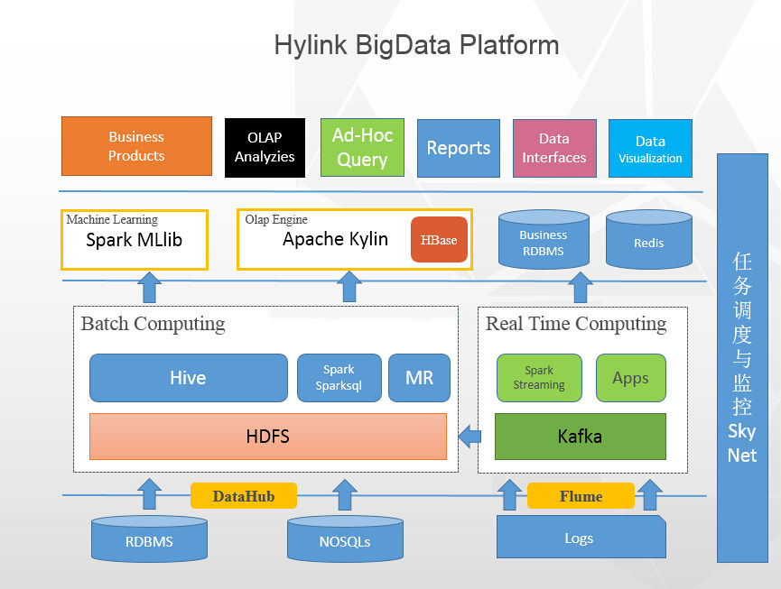
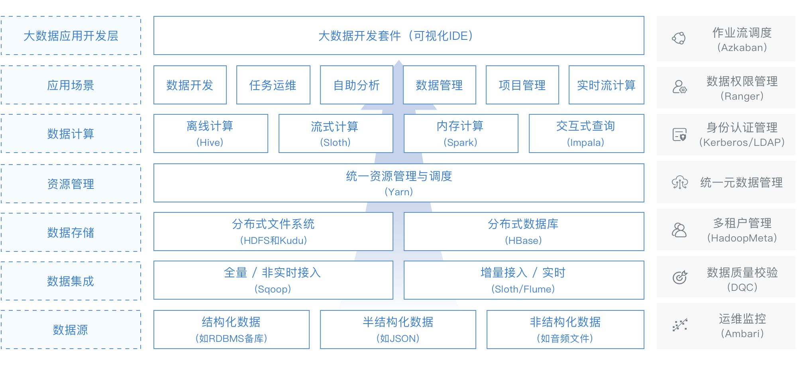
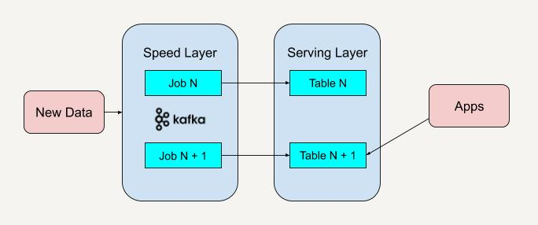
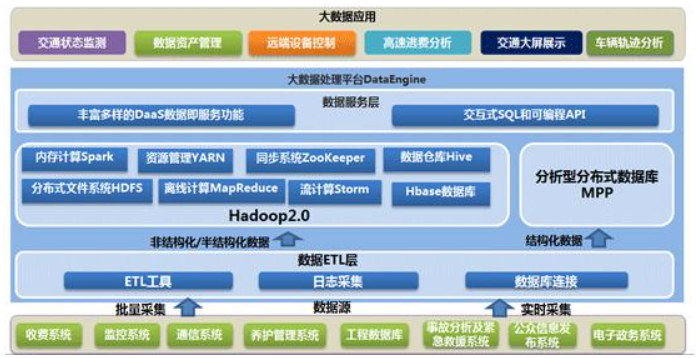

# 一、大数据架构概述

以下面这张架构图为例：

  

 从这张大数据的整体架构图上看来，大数据的核心层应该是：**数据采集层、数据存储与分析层、数据共享层、数据应用层，**可能叫法有所不同，本质上的角色都大同小异。 

经过多年的发展，业界已孕育出了一些较为成熟的架构模式， 如`Lambda`架构、`Kappa`架构及`Smack`架构。

## **1、Lambda架构**

 Lambda架构是大数据平台里最成熟、最稳定的架构，它的核心思想是：将批处理作业和实时流处理作业分离，各自独立运行，资源互相隔离。 

下图是引自网易的猛犸大数据平台**lambda**架构图 

  

标准的Lambda架构有如下几个层次：

1. **Batch Layer**：主要负责所有的批处理操作，支撑该层的技术以`Hive`、`Spark-SQL`或`MapReduce`这类批处理技术为主。另外，数据处理依赖的主数据也是在该层维护的。

2. **Serving Layer**：以Batch Layer处理的结果数据为基础，对外提供低延时的数据查询和`ad-hoc`查询（即席查询）服务，Serving Layer可以认为是对Batch Layer数据访问能力上的延伸或增强。因为批处理本身是比较慢的，无法支撑实时的查询请求，从Serving Layer的角度看，Batch Layer的工作本质是一种“预计算”，即预先对大体量数据集进行处理，得到相对较小的结果集，然后由Serving Layer接手，提供实时的数据查询服务。Serving Layer既可以使用包括关系型数据库在内的传统技术，也可以使用`Kylin`、`Doris`、`Impala`或`Druid`等大数据`OLAP`产品。

3. **Speed Layer**：使用流式计算技术实时处理当前数据。**Speed Layer区别于Batch Layer的地方在于它能以实时或近似实时的方式处理大量的数据**，但是它的局限在于只能处理当前新生成的数据，无法对全部历史数据进行操作，因为流式计算只能针对当前产生的“热数据”进行处理。Speed Layer经常使用`Storm`、`Spark Streaming`或`Flink`等大数据流计算框架。

Lambda架构使用两条数据管道来分别应对批处理和实时处理两种场景，数据因此也有两份冗余，所以Lambda是很健壮的一种架构，但缺点是需要开发团队针对批处理和实时处理分别进行开发，同时维护两套代码，增加了工作量和维护成本。

## 2、Kappa架构

Kappa架构可以认为是对Lambda架构的一种简化，它使用流计算技术来统一批处理和实时处理两条通道,这样，无论从开发和维护的工作量方面，还是从数据存储方面都比Lambda架构节约很多成本。

Kappa架构在技术选型上往往需要这些组件:
消息队列：`Kafka`/ `Pulsar`

流计算框架：`Flink`/ `Spark Streaming`/`Storm`

  

完全使用流计算处理所有的数据对开发和数据分析的方方面面都有影响。例如，**在Kappa架构下，所有的数据以流计算的方式处理之后，都将以一种追加的方式写入目标位置，而之前写入的数据也没有机会再被改动，因而变成不可变的**。这种处理模式和Kafka对待数据的方式是完全一致的，本质上都是受流计算这种计算模式的影响。Kappa架构在技术选型上与Lambda架构在Speed Layer上选型是类似的，都以流计算框架为主。

## 3、SMACK架构

**SMACK**架构是最近两三年兴起的一种新的架构，S、M、A、C、K分别代表了这个架构使用的5种技术:`Spark`、`Mesos`、`Akka`、`Cassandra`和`Kafka`。SMACK成功地融合了批处理和实时处理，但是它的融合方式与Kappa有很大的差别。SMACK架构的成功之处在于它充分而巧妙地利用了选型组件的特性，用一种更加自然和平滑的方式统一了批处理和实时处理。

  

SMACK架构使用`Akka`进行数据采集(`Akka`可以应对高并发和实时性要求很高的场景，非常适合`IOT`领域)，然后将数据写入`Kafka`,接着使用`Spark Streaming`进行实时流处理，处理的结果和原始数据都写入`Cassandra`。到这里，所有的做法和Kappa架构是一样的。不同于Kappa架构的地方在于，SMACK架构依然保留了批处理能力，它巧妙地利用了Cassandra的多数据中心(`Multiple Datacenters`)特性将数据透明地冗余到两个`Cassandra`集群（集群1用来接收流处理结果，集群2用于批处理分析，供`Spark`(`Spark Core`或`Spark SQL`)读写。

SMACK架构之所以可行，关键是利用了相关产品的特性保证了以下重要的三点:

1. 利用Cassandra的多数据中心机制透明地实现数据冗余，为实时处理和批处理配置专门
   的存储资源，互不影响;
2. 利用`Spark-Cassandra`连接器的“本地数据感知”能力，在批处理时让Spark尽量读取
   Cassandra上本地节点的数据，避免数据的网际传输;
3. 利用`Mesos`的`Marathon`和`Chronos`来配合流式作业和批处理作业。

SMACK架构既支持批处理又支持实时处理，在数据处理层面只依赖Spark,在数据存储层面只依赖Cassandra,很好地统一了技术堆栈。

# 二、数据采集

数据采集的任务就是把数据从各种数据源中采集和存储到数据存储上，在这期间可能会做一些简单的数据清洗（即**ETL**，将数据从来源端经过抽取`extract` 、转换`transform` 、加载`load` 至目的端的过程）。

## 数据源的种类

- **网站日志**：互联网行业，网站日志占的份额最大，网站日志存储在多台网站日志服务器上，一般是在每台网站日志服务器上部署 `flume agent` ，实时地收集网站日志并存储到`HDFS`上；
- **业务数据库**：存在多种多样的业务数据库，例如 `mysql`, `oracle`,`sqlserver` 等，这时候我们迫切需要一种能从各类数据库将数据同步到`HDFS` 的工具， `Sqoop`是一种，但是`Sqoop`太过繁重，而且不管数据量大小，都需要启动`MapReduce`来执行，而且需要`Hadoop`集群的每台机器都能访问业务数据库；应对此场景，`DataX`是一个很好的解决方案，有资源的话，可以基于`DataX`之上做二次开发，就能非常好的解决 。当然`Flume` 通过配置于开发，也可以实时的从数据库中同步数据到`HDFS` ；
- 来自于 `FTP/HTTP` 的数据源：可能一些合作方提供数据，需要提供 `FTP/HTTP`的方式定时获取，该类型数据仍然可以使用 `DataX` 进行数据同步；

> `DataX` 的具体使用可参考站内文章：[高效数据同步工具 DataX 的使用](/2022/07/29/高效数据同步工具DataX的使用) 

- 其他数据源：比如一些手工录入的数据，只需要提供一个接口或者小程序入口，即可完成。

# 三、数据存储与分析

 毋庸置疑，`HDFS`是大数据环境下数据仓库/数据平台最完美的数据存储解决方案。 

离线数据分析与计算，也就是对实时性要求不高的部分，在笔者看来，`Hive`还是首要的选择，丰富的数据类型、内置函数；压缩比非常高的`ORC`文件存储格式；非常方便的`SQL`支持，使得`Hive`在基于结构化数据上的统计分析远远比`MapReduce`要高效的多，一句`SQL`可以完成的需求，开发`MR`可能需要上百行代码；

  

 `Spark`是这两年非常火的，经过实践，它的性能的确比`MapReduce`要好很多，而且和`Hive`、`Yarn`结合的越来越好，因此，必须支持使用`Spark`和`SparkSQL`来做分析和计算。因为已经有`Hadoop Yarn`，使用`Spark`其实是非常容易的，不用单独部署`Spark`集群；

上图中涉及的分析型分布式数据库MPP，业内主流为`Doris`，后续会详细讲述，此处暂且按下不表。

# 四、数据共享

 这里的数据共享，其实指的是前面数据分析与计算后的结果存放的地方，其实就是关系型数据库和NOSQL数据库。 

前面使用`Hive`、`MR`、`Spark`、`SparkSQL`分析和计算的结果，还是在`HDFS`上，但大多业务和应用不可能直接从`HDFS`上获取数据，那么就需要一个数据共享的地方，使得各业务和产品能方便的获取数据；和数据采集层到`HDFS`刚好相反，这里需要一个从`HDFS`将数据同步至其他目标数据源的工具，同样，`DataX`也可以满足。

另外，一些实时计算的结果数据可能由实时计算模块直接写入数据共享。

# 五、数据应用

- 业务产品（CRM、ERP等）

业务产品所使用的数据，已经存在于数据共享层，直接从数据共享层访问即可；

- 报表（FineReport、业务报表）

同业务产品，报表所使用的数据，一般也是已经统计汇总好的，存放于数据共享层；

- 即席查询

即席查询的用户有很多，有可能是数据开发人员、网站和产品运营人员、数据分析人员、甚至是部门老大，他们都有即席查询数据的需求； 

这种即席查询通常是现有的报表和数据共享层的数据并不能满足他们的需求，需要从数据存储层直接查询。

即席查询一般是通过`SQL`完成，最大的难度在于响应速度上，使用Hive有点慢，可以用`SparkSQL`，它的响应速度较`Hive`快很多，而且能很好的与`Hive`兼容；

- OLAP

目前，很多的`OLAP`工具不能很好的支持从`HDFS`上直接获取数据，都是通过将需要的数据同步到关系型数据库中做`OLAP`，但如果数据量巨大的话，关系型数据库显然不行；

 `Apache Doris` 是一个基于 `MPP` 架构的高性能、实时的分析型数据库，以极速易用的特点被人们所熟知，仅需亚秒级响应时间即可返回海量数据下的查询结果，不仅可以支持高并发的点查询场景，也能支持高吞吐的复杂分析场景。基于此，`Apache Doris` 能够较好的满足报表分析、即席查询、统一数仓构建、数据湖联邦查询加速等使用场景，用户可以在此之上构建用户行为分析、AB 实验平台、日志检索分析、用户画像分析、订单分析等应用。

# 六、实时计算

现在业务对数据仓库实时性的需求越来越多，比如：实时的了解网站的整体流量；实时的获取一个广告的曝光和点击；在海量数据下，依靠传统数据库和传统实现方法基本完成不了，需要的是一种分布式的、高吞吐量的、延时低的、高可靠的实时计算框架；Storm在这块是比较成熟了，当然也可以使用Spark Streaming，少引入一个框架到平台中，另外，Spark Streaming比Storm延时性高那么一点点。

# 七、任务调度与监控

在数据仓库/数据平台中，有各种各样非常多的程序和任务，比如：数据采集任务、数据同步任务、数据分析任务等； 

这些任务除了定时调度，还存在非常复杂的任务依赖关系，比如：数据分析任务必须等相应的数据采集任务完成后才能开始；数据同步任务需要等数据分析任务完成后才能开始； 

 这就需要一个非常完善的任务调度与监控系统，它作为数据仓库/数据平台的中枢，负责调度和监控所有任务的分配与运行，目前主流的任务调度框架有：

- **XXL-JOB**: XXL-JOB 是一个轻量级分布式任务调度框架，支持通过 Web 页面对任务进行 CRUD 操作，支持动态修改任务状态、暂停/恢复任务，以及终止运行中任务，支持在线配置调度任务入参和在线查看调度结果。
- **Azkaban**：Azkaban是由Linkedin公司推出的一个批量工作流任务调度器，主要用于在一个工作流内以一个特定的顺序运行一组工作和流程。官网：https://azkaban.github.io/
- **Elastic Job**：Elastic-Job 是一个分布式调度解决方案，由两个相互独立的子项目 Elastic-Job-Lite 和 Elastic-Job-Cloud 组成。定位为轻量级无中心化解决方案，使用 jar 包的形式提供分布式任务的协调服务。支持分布式调度协调、弹性扩容缩容、失效转移、错过执行作业重触发、并行调度、自诊断和修复等等功能特性。官网：http://elasticjob.io/
- **Apache Oozie**：Oozie 是一个工作流调度系统，用来管理 Hadoop 任务。官网：http://oozie.apache.org/

> `XXL-JOB` 的具体使用可参考站内文章：[分布式任务调度框架XXL-JOB的使用](/2022/08/24/分布式任务调度框架XXL-JOB)