# 一、人像摄影

## 光线

### 1. 顺光

- 拍摄时间：上午十点前，下午三点后

### 2. 逆光

#### 2.1 正确测光步骤

- 先测环境光：点测光，测高光，确保画面不大面积过曝，看直方图，过渡自然舒服，确定参数
- 人物曝光：通过反光板补光，侧面略高于人像45度，轮廓突出下巴

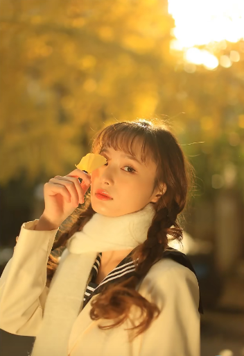

### 3. 测光

> 层次感强，脸圆偏胖，不适合测光，逆光侧仍然需要补光

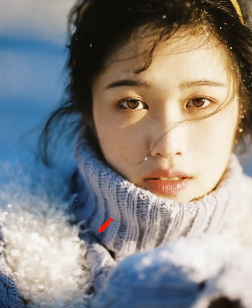

### 4. 柔光

> 柔光镜，丝袜，塑料薄膜，达到半透明效果即可

关键点：人脸受强光时

## 色调

### 1. 冷暖对比

- 蓝调时刻：太阳刚刚落山——冷色，补光（三色手电筒）——暖色

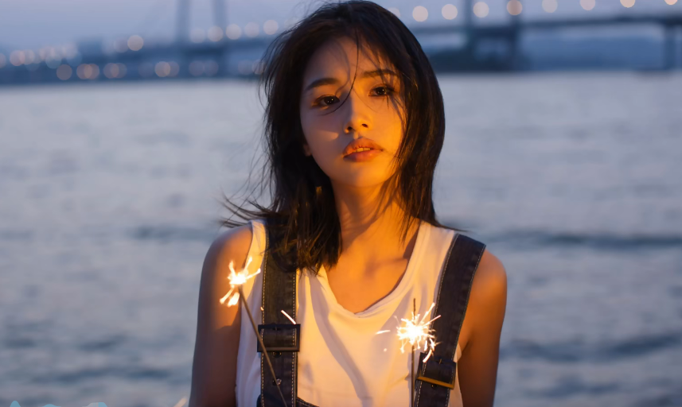

## 构图

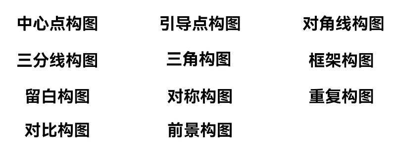

### 点构图

#### 中心点构图

顾名思义，中心突出主体，缺点是画面平庸、单调

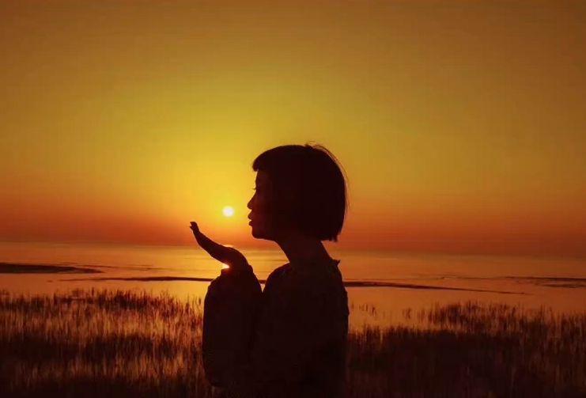

#### 引导点构图

利用镜头的透视，场景中带有指向性的线条，适合拍地铁、马路、建筑等题材

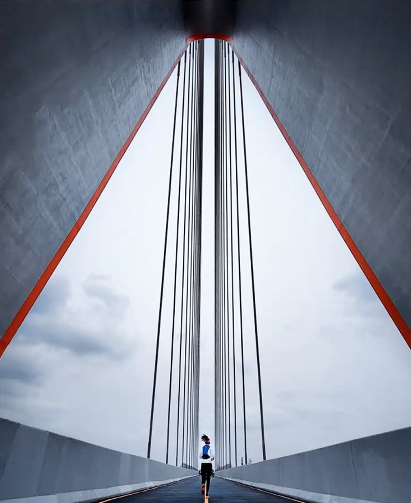

### 线构图

画面当中存在一条明显的对角分界线，在拍人像全身或者半身照时，会显得主体更高，腿更长

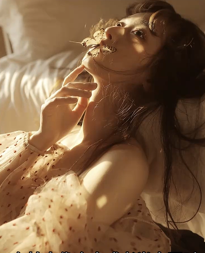

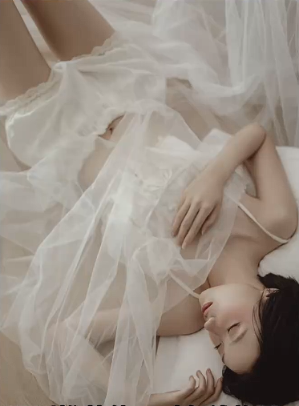

### 三分线构图

将画面三等分，可以尝试把主体放置分割线交点上，有突出主体的效果，对比中心构图，画面不至过于平庸单调

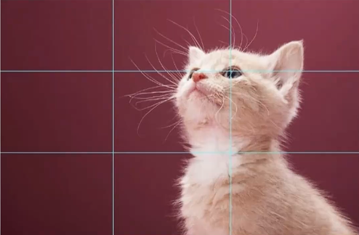

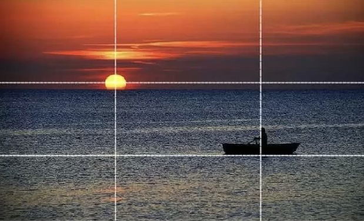

拍摄人像时，将人物放置三分线交点上，人朝向空白区域，有平衡画面，引导视觉，加强意境等效果

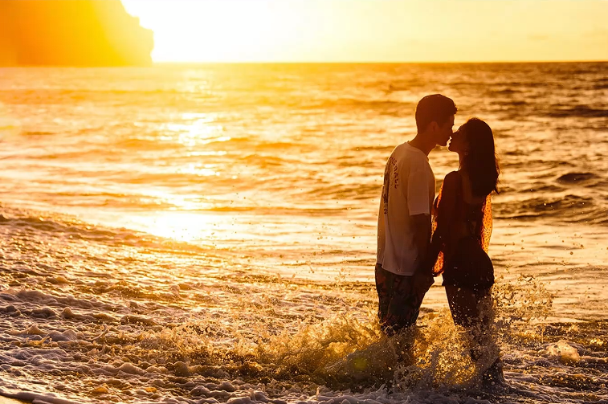

### 前景构图

利用一些元素放置在离镜头比较近的位置，比如树叶、小花小草等作为前景，以衬托主体、营造氛围感、引导视线，增加画面的层次感，还可以利用前景挡住画面中杂乱或者不希望入画的元素

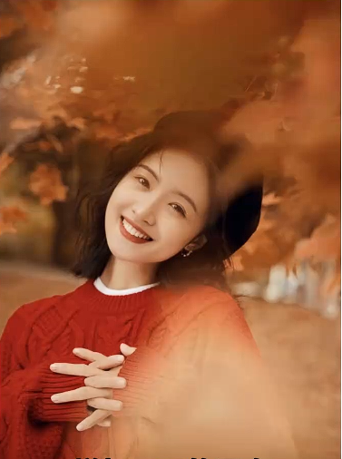

## 摆姿

> 摆姿是人像摄影中非常重要的环节，一个好看的摆姿会让模特展示出很好的身形和角度，也能避免模特自身的缺点，不好的摆姿则会让观众看的非常别扭，把模特自身的缺点无限放大，传递不出画面意境

### 技巧

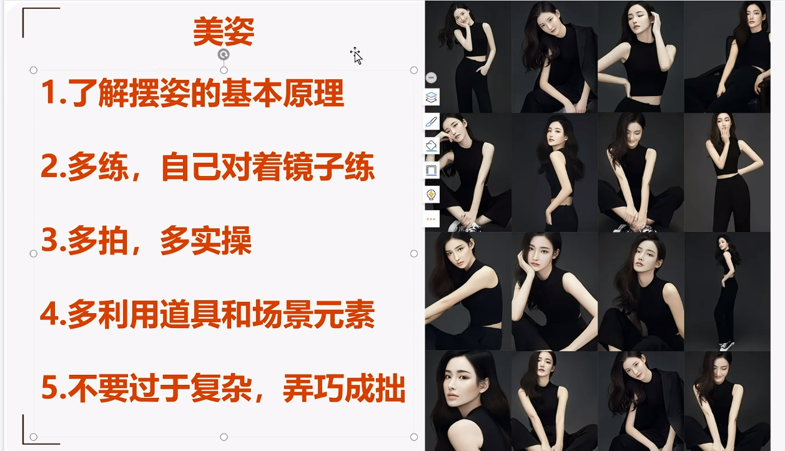

#### 抓拍

模特做一整套连贯动作，才能保证动作自然。比如手拨头发，不可能直接让人把手放到耳朵上，这样动作时僵硬的，神情也会不自然

#### 让眼神变自然

大部分人不具备天生的镜头感，选择让模特一开始不看镜头，以一个第三视角去捕捉模特的自然动态，等模特慢慢适应了镜头拍摄的状态后，就可以让模特过渡到看镜头的画面了，

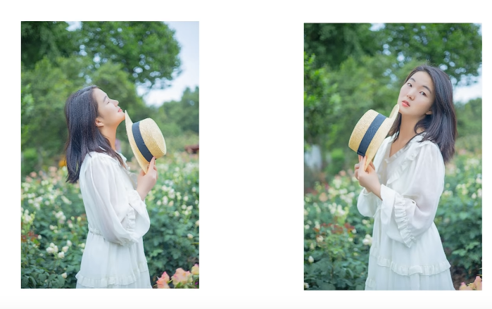

一开始可以让模特闭着眼，做好取景构图后，再让她慢慢睁开眼看向镜头。

#### 让嘴唇放轻松

如果拍照时嘴巴抿得太紧，很容易出现紧绷感，可以尝试让模特先微微张开双唇，逐步找到放松的状态，根据模特牙齿的状况决定牙齿露出的程度，平时也可以对着镜子练习松弛的面部笑容，找到最适合自身的唇齿状态

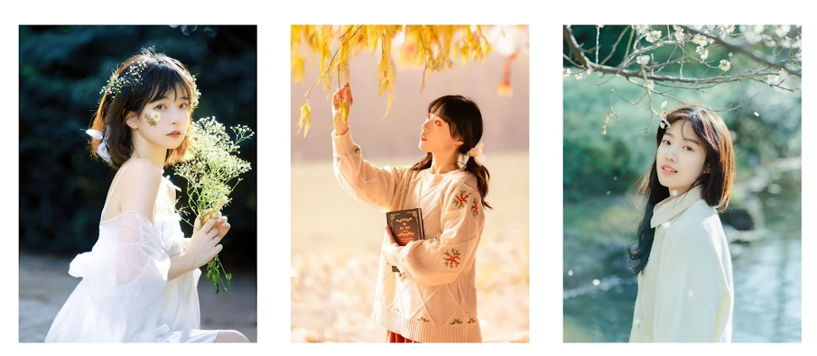

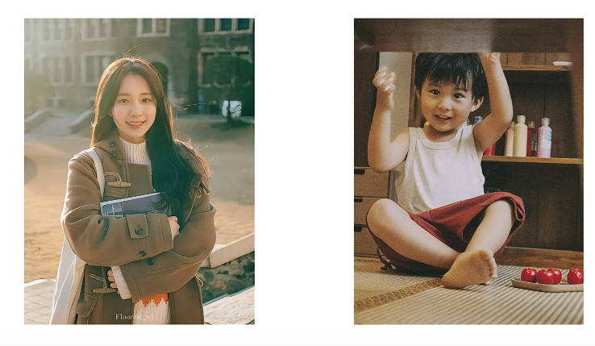

#### 无处安放的小手

别让模特手闲着，可以拿点道具（结合场景有的物品、包包、奶茶、栏杆等），自然就不会觉得手不知道往哪里放，然后手足无措

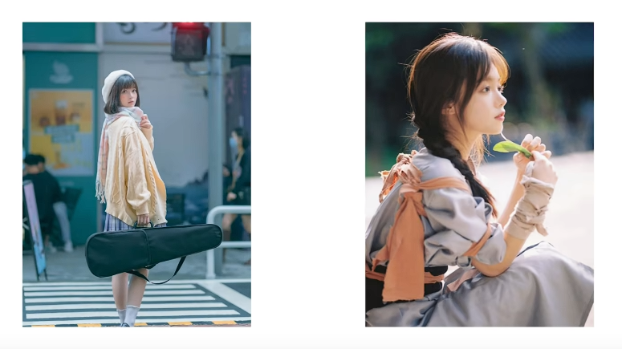

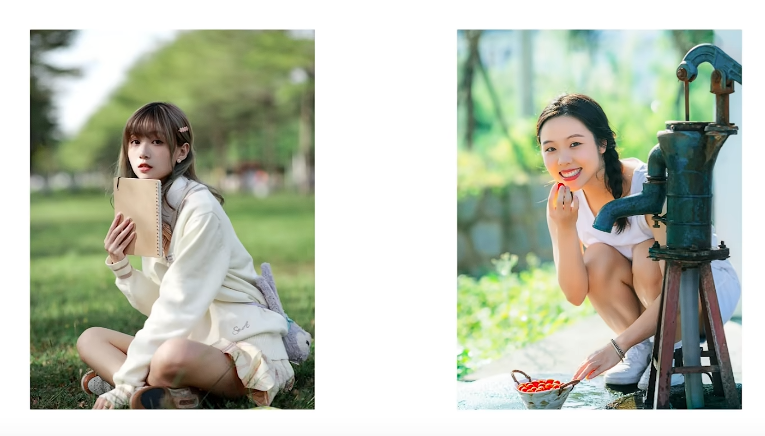

#### 低机位拍摄

将机位放低，从下往上拍，就算不用广角镜头，也可以让照片中的腿部比例显得更修长，达到视觉拉腿的效果，

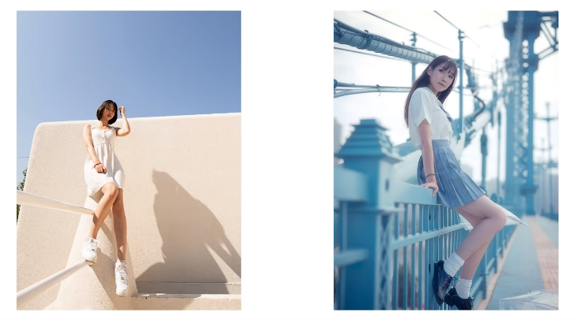

机位放在腹部左右的位置，对上半身也会比例拉伸的效果，显得更加修长

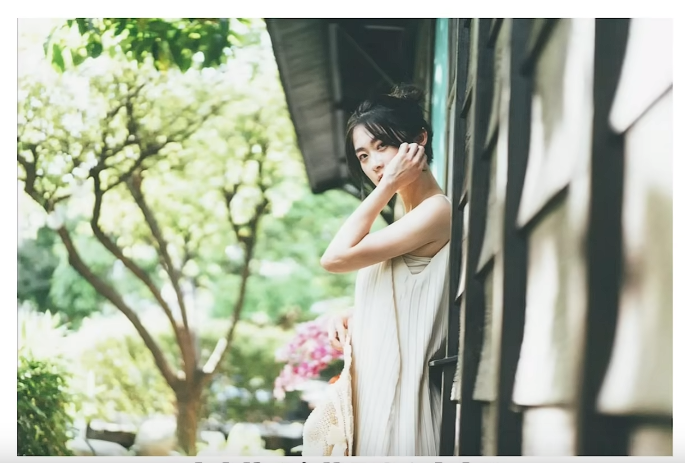