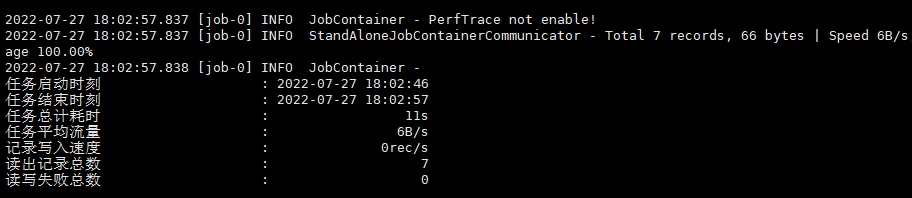

# 一、DataX 简介

DataX 是阿里云 DataWorks 数据集成 的开源版本，主要就是用于实现数据间的离线同步。 DataX 致力于实现包括关系型数据库（MySQL、Oracle 等）、HDFS、Hive、ODPS、HBase、FTP 等 各种异构数据源（即不同的数据库） 间稳定高效的数据同步功能。
  

- 为了 **解决异构数据源同步问题，DataX 将复杂的网状同步链路变成了星型数据链路**，DataX 作为中间传输载体负责连接各种数据源；
- 当需要接入一个新的数据源时，只需要将此数据源对接到 DataX，便能跟已有的数据源作为无缝数据同步。

## 1. DataX 3.0 框架设计

DataX 采用 Framework + Plugin 架构，将数据源读取和写入抽象称为 Reader/Writer 插件，纳入到整个同步框架中。 

  

| 角色                | 作用                                                         |
| ------------------- | ------------------------------------------------------------ |
| Reader（采集模块）  | 负责采集数据源的数据，将数据发送给 `Framework`               |
| Writer（写入模块）  | 负责不断向 `Framework` 中取数据，并将数据写入到目的端        |
| Framework（中间商） | 负责连接 `Reader` 和 `Writer`，作为两者的数据传输通道，并处理缓冲，流控，并发，数据转换等核心技术问题 |


## 2. DataX 3.0 核心架构

DataX 完成单个数据同步的作业，我们称为 `Job`，DataX 接收到一个 `Job` 后，将启动一个进程来完成整个作业同步过程。**DataX Job 模块是单个作业的中枢管理节点，承担了数据清理、子任务切分、TaskGroup 管理等功能**。 

 

- DataX Job 启动后，会根据不同源端的切分策略，将 `Job` 切分成多个小的 `Task` (子任务)，以便于**并发执行**；
- 接着 DataX Job 会调用 `Scheduler` 模块，根据配置的并发数量，将拆分成的 `Task` 重新组合，组装成 `TaskGroup`（任务组）；
- 每一个 `Task` 都由 `TaskGroup` 负责启动，`Task` 启动后，会固定启动 `Reader --> Channel --> Writer` 线程来完成任务同步工作；
- DataX 作业运行启动后，Job 会对 `TaskGroup` **进行监控操作**，等待所有 TaskGroup 完成后，Job 便会成功退出（**异常退出时 值非 0**）

### DataX 调度过程

- 首先 DataX Job 模块会根据分库分表切分成若干个 `Task`，然后根据用户配置并发数，来计算需要分配多少个 `TaskGroup`；
- 计算过程：`Task / Channel = TaskGroup`，最后由 `TaskGroup` 根据分配好的并发数来运行 `Task`（任务）


# 二、使用 DataX 实现数据同步

> 准备环境：
>
> - JDK（`1.8` 以上，推荐 1.8）
> - Python（`2.x` 版本，CentOS 7 自带python 2.7，若要使用python3需修改  `datax/bin` 目录下的三个py文件以符合 python3 语法要求）
> - Apache Maven 3.x（Compile DataX）（手动打包使用，使用 `tar` 包方式不需要安装）

## 1. Linux 上安装 DataX 软件

### 安装 DataX

```bash
# 获取datax软件包
wget http://datax-opensource.oss-cn-hangzhou.aliyuncs.com/datax.tar.gz
# 创建datax目录并解压
mkdir /opt/docker/datax && mv datax.tar.gz /opt/docker/datax
cd /opt/docker/datax && tar zxf datax.tar.gz -C /usr/local/
# 需要删除隐藏文件 (重要)
rm -rf /usr/local/datax/plugin/*/._*
```

### 安装JDK 1.8（已安装可忽略）

```bash
# 需先下载 jdk-8u301-linux-x64.tar.gz 并上传至服务器目录
[root@VM-12-14-centos datax]# ls
datax.tar.gz  jdk-8u301-linux-x64.tar.gz
[root@VM-12-14-centos datax]# mv jdk1.8.0_301 /usr/local/java
[root@VM-12-14-centos datax]# cat <<END >> /etc/profile
> export JAVA_HOME=/usr/local/java
> export PATH=$PATH:$JAVA_HOME/bin
> END
[root@VM-12-14-centos datax]# source /etc/profile
[root@VM-12-14-centos datax]# java -version
```


## 2. DataX 基本使用

查看 DataX 数据同步 `json` 配置模板及使用说明

```bash
python /usr/local/datax/bin/datax.py -r streamreader -w streamwriter
```

输出如下：

```json
DataX (DATAX-OPENSOURCE-3.0), From Alibaba !
Copyright (C) 2010-2017, Alibaba Group. All Rights Reserved.

Please refer to the streamreader document:     https://github.com/alibaba/DataX/blob/master/streamreader/doc/streamreader.md 

Please refer to the streamwriter document:     https://github.com/alibaba/DataX/blob/master/streamwriter/doc/streamwriter.md 
 
Please save the following configuration as a json file and  use
     python {DATAX_HOME}/bin/datax.py {JSON_FILE_NAME}.json 
to run the job.

{
    "job": {
        "content": [
            {
                "reader": {
                    "name": "streamreader", 
                    "parameter": {
                        "column": [], 
                        "sliceRecordCount": ""
                    }
                }, 
                "writer": {
                    "name": "streamwriter", 
                    "parameter": {
                        "encoding": "", 
                        "print": true
                    }
                }
            }
        ], 
        "setting": {
            "speed": {
                "channel": ""
            }
        }
    }
}

```

从上述说明可以看出，使用 DataX 需要两步操作:

- 编写同步配置 `json` 
- 使用 python 命令执行配置中的 `job` 任务

下面将演示同步两个不同 `mysql` 数据库表的，要实现数据同步，需提前准备：

- 数据源数据库
- 目标数据库，且已建好需同步的目标表（DataX并不会创建表）

### 同步配置样例解析

这里以同步不同 `mysql` 数据库举例：

```json
{
    "job": {
        "content": [
            {
                "reader": {
                    // 读取端
                    "name": "mysqlreader",
                    "parameter": {
                        // 源数据库连接用户
                        "username": "root",
                        // 源数据库连接密码
                        "password": "root",
                        // 需要同步的列 (* 表示所有的列)
                        "column": ["*"], 
                        "connection": [{
                                // 源数据库连接
                                "jdbcUrl": ["jdbc:mysql://127.1.2.3:3360/studysource?useUnicode=true&characterEncoding=utf8"], 
                                // 源表
                                "table": ["staff_info"]
                        }]
                    }
                }, 
                "writer": {
                    // 写入端
                    "name": "mysqlwriter",
                    "parameter": {
                        // 目标数据库连接用户
                        "username": "root",
                        // 目标数据库连接密码
                        "password": "wwj9800",
                        "connection": [
                            {
                                // 目标数据库连接
                                "jdbcUrl": "jdbc:mysql://127.2.3.4:3360/studysync?useUnicode=true&characterEncoding=utf8", 
                                // 目标表
                                "table": ["staff_info"]
                            }
                        ], 
                        // 同步前. 要做的事
                        "preSql": ["TRUNCATE TABLE staff_info"], 
                        // 需要同步的列
                        "column": ["*"] 
                    }
                }
            }
        ], 
        "setting": {
            "speed": {
                // 指定并发数
                "channel": "5"
            }
        }
    }
}
```

不同的数据库支持配置会有差异，具体解析可参考官方： [DataX数据源参考指南](https://github.com/alibaba/DataX) ，点击对应`读` 、`写` 查看对应文档进行配置定制


### 执行 DataX 同步任务

配置文件编写好后，在配置文件所在目录下执行以下命令来进行数据同步：

```bash
python /usr/local/datax/bin/datax.py user_sync_mysql2mysql.json
```



【注】：若出现 `java.sql.SQLException: Could not retrieve transation read-only status server` 错误，至以下目录检查数据库驱动版本与数据库是否一致

- `/usr/local/datax/plugin/writer/mysqlwriter/libs` 


## 3. 配合 crontab 实现数据定时同步

> crontab 用法可参考：[Linux中的定时任务crontab](/2022/07/28/Linux中的定时任务crontab)

首先需确保 `crontab` 服务已启动（ `running` 状态）；

```bash
[root@VM-12-14-centos ~]# service crond status
Redirecting to /bin/systemctl status crond.service
● crond.service - Command Scheduler
   Loaded: loaded (/usr/lib/systemd/system/crond.service; enabled; vendor preset: enabled)
   Active: active (running) since Sun 2022-06-05 20:28:49 CST; 1 months 21 days ago
 Main PID: 1064 (crond)
    Tasks: 1
   Memory: 1.2M
   CGroup: /system.slice/crond.service
           └─1064 /usr/sbin/crond -n
```

编写 DataX 数据同步任务执行的 `shell` 脚本；

```bash
vim sync_table.sh
```

使用 `nohup` 实现后台运行命令（ `nohup` 命令用法可参考[Shell脚本基础](/2022/06/18/Shell脚本基础) ），并将任务执行追加输出重定向到指定目录的 `log` 文件（`touch` 命令确保`log` 文件存在）；

```shell
#!/bin/bash

touch /opt/docker/datax/log/staff_info_mysql2mysql.log
nohup python /usr/local/datax/bin/datax.py /opt/docker/datax/source_config/staff_info_mysql2mysql.json >> /opt/docker/datax/log/staff_info_mysql2mysql.log 2>&1 &
```

`shell` 写好后，将脚本执行添加至 `crontab` ；

```bash
crontab -e
```

进行如下配置，这里实现的是每天早上 `06:30` 执行一次脚本完成数据同步；

```bahs
30 6 * * * /opt/docker/datax/source_config/sync_table.sh
```

至此，我们实现了定时数据同步，不仅如此，通过在 `shell` 脚本中增加同步表的命令我们可以实现在不同时间频度下批量数据同步，例如以下配置：

```bash
30 6 * * * /opt/docker/datax/source_config/sync_table_daily.sh
30 4 * * 1 /opt/docker/datax/source_config/sync_table_weekly.sh
```

这里我定义了一个每天 `06:30` 执行的数据同步与一个每周一 `04:30` 执行的数据同步，`sync_table_daily.sh` 脚本中也可以包含多张表的 `DataX` 同步任务。

## 4. 将 DataX 制作成docker镜像

> 需事先准备一个 `python2.7+jdk1.8` 的docker基础镜像 

### 4.1 镜像制作

这里使用一个 `centos7 + jdk1.8` 的基础镜像，在此镜像基础上安装 DataX ：

```bash
# 通过镜像启动容器并进入容器, mycentos 为要创建的容器名, ae67f82978bc 为镜像ID
[root@VM-12-14-centos]# docker run -it --name mycentos ae67f82978bc
# 进入容器后确认java和python环境
[root@4696780785e2 /]# java -version
openjdk version "1.8.0_191"
OpenJDK Runtime Environment (build 1.8.0_191-b12)
OpenJDK 64-Bit Server VM (build 25.191-b12, mixed mode)
[root@4696780785e2 /]# python
Python 2.7.5 (default, Oct 30 2018, 23:45:53) 
[GCC 4.8.5 20150623 (Red Hat 4.8.5-36)] on linux2
```

接下来参考步骤 1 安装 `DataX` ：

```bash
# 获取datax软件包
wget http://datax-opensource.oss-cn-hangzhou.aliyuncs.com/datax.tar.gz
# 创建datax目录并解压
mkdir /opt/datax && mv datax.tar.gz /opt/datax
cd /opt/datax && tar zxf datax.tar.gz -C /usr/local/
# 需要删除隐藏文件 (重要)
rm -rf /usr/local/datax/plugin/*/._*
```

安装完成后，创建`DataX` 配置`json` 的目录以便之后挂载，创建后退出容器；

```bash
[root@4696780785e2 datax]# mkdir sourcetable_conf  
[root@4696780785e2 datax]# exit
```

 `Commit` 创建新的 `DataX` 基础镜像 `mydatax:july` ：

```bash
docker commit -m="基于jdk1.8和python2.7的datax镜像" 4696780785e2 mydatax:july
```

使用以下命令挂载服务器 `sourcetable_conf`到容器`/opt/datax/sourcetable_conf` 目录，将数据同步`json` 上传至这个目录，即可在容器中进行利用 DataX 操作：

```bash
docker run -d -it -v /opt/docker/datax/sourcetable_conf:/opt/datax/sourcetable_conf --name datax mydatax:july 
```


### 4.2 jenkins 调度容器

待更新